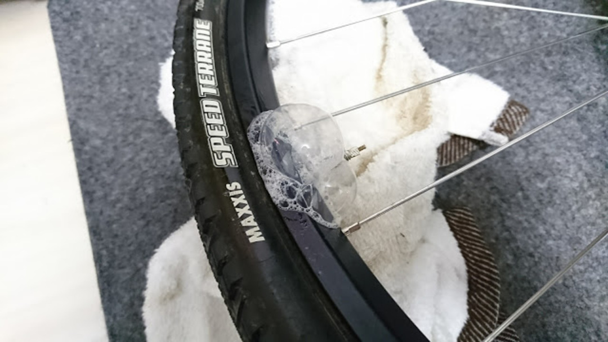
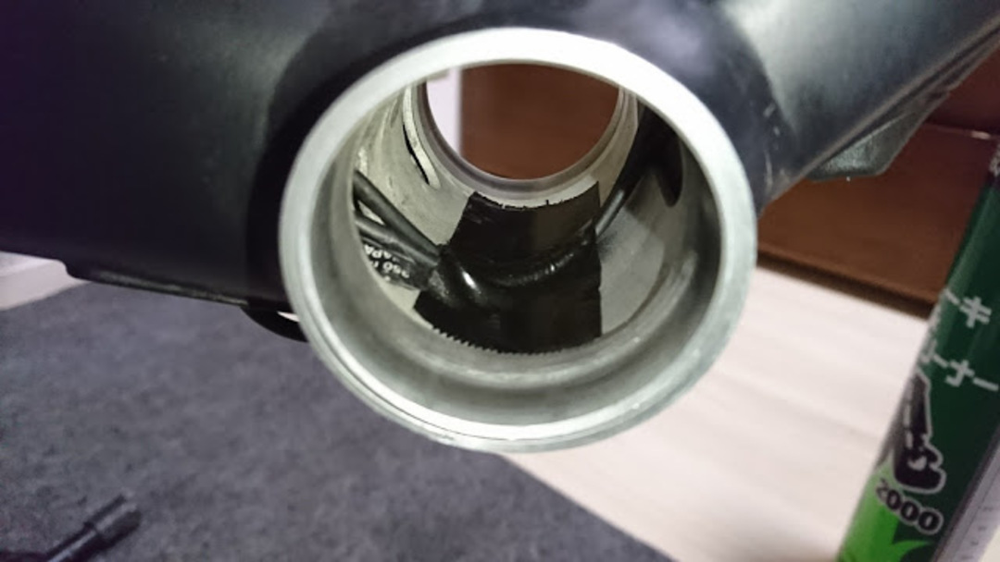

なかなか空気漏れの収まらなかったバルブ付近だが、利用するシーラントを多くしたらあっさり空気抜けが許容範囲に収まった。写真はダメだったときのやつ。

締まらない結末だがチューブレスレディなのでシーラントをケチってはいけないということだろう…

ダクトテープは自転車の組み上げにも割りと使えるので1本あって損はしないと思う、安いし。

やっぱりタイヤはIRCかな。聞くところによると、ロード系のチューブレス基準はBST-RとETRTOがあって、タイヤとリムの設計がずれているとうまくいかないことが多いらしい。

MAVICからロードUSTが出てきたことだし、これを機に統一して欲しい…MTBもUSTの方が安心感あったし。

現実的にはチューブレスレディ規格とお付き合いしていかなければならないと思うので、今まで使っていたNotubesのシーラントをもっと良いものに変えることにした。

同じく<a href="http://amzn.to/2eshsPc" target="_blank">NotubesのRace Sealant</a>も検討したのだがせっかくだしいい噂のある<a href="http://amzn.to/2xP3z1x" target="_blank">Caffelatex</a>をチョイス。

泡状になってサイドやリム側まで回り込んでくれるとの謳い文句。ついでにNotubesと違って中性らしいので、リムやテープへの攻撃性も低い。

<LinkBox isAmazonLink url="https://www.amazon.co.jp/dp/B002YMJKT4/" />

<LinkBox isAmazonLink url="https://www.amazon.co.jp/dp/B00OD5F95Y/" />
