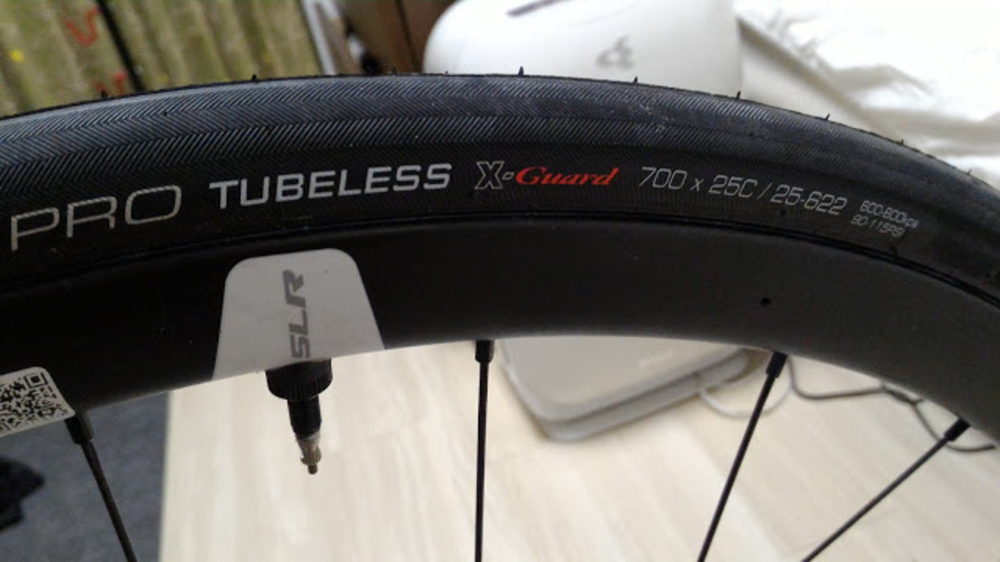
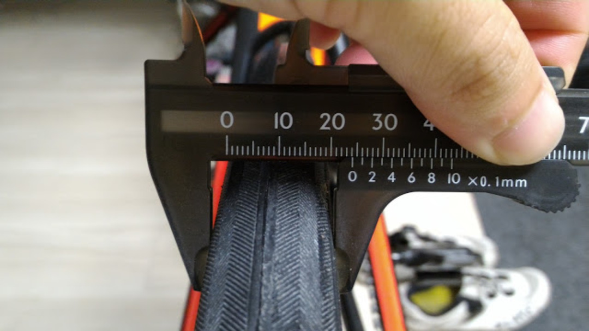
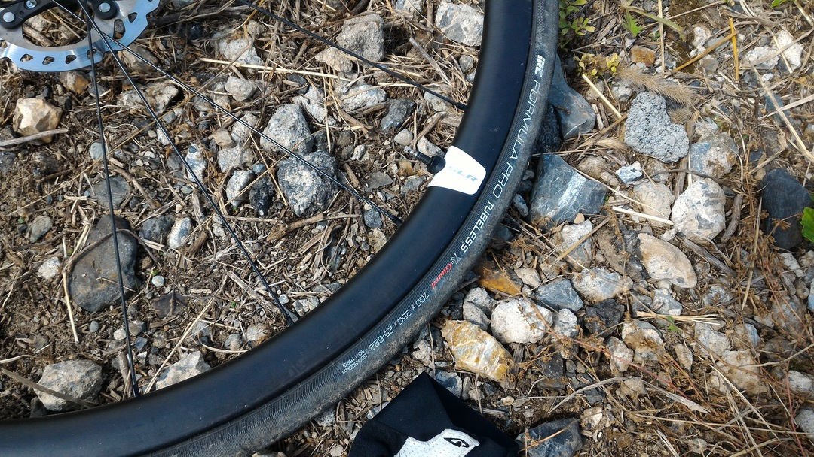

### もうパンクしたくないです…

春のグラベルクリテで<a href="/2017/05/2017.html" target="_blank" rel="noopener">パンクの嵐に遭った</a>ことで基本のタイヤ幅を上げることに。ロードチューブレスに関しては安心と信頼の IRC から高耐久タイプ<a href="http://amzn.to/2fohzsh" target="_blank" rel="noopener">Formula Pro X-Guard</a>の 25c をチョイス。

こいつはモデルチェンジ前 25c なのに 27mm 近く膨らむというタイヤだったが、新型はそうでもないということで 25c をチョイスした。おそらく TCR のクリアランスは 28c タイヤが限界だと思うのでやや安全策。

新型、25mm もありませんでした…

秋のグラベルクリテはパンクせず保って欲しい…

前回使った<a href="http://amzn.to/2ycgwTI" target="_blank" rel="noopener">Formula Pro RBCC 23c</a>に比べてビードがかなり固く。装着には比較的難儀した。

IRC チューブレスの中で一番簡単に装着できる<a href="http://amzn.to/2ybpjFz" target="_blank" rel="noopener">SERAC CX</a>シリーズの硬さを 1 とすると RBCC は 3、こいつは 10 といったところ。

それでも何日もかかるということはなく、30 分あれば前後交換出来る程度だが前腕が棒のようになったので楽に装着をしつつ、エアボリュームを稼ぐために次回は<a href="http://amzn.to/2ybj057" target="_blank" rel="noopener">RBCC の 28c</a>をチョイスしようと思う。

高耐久タイヤをいつ使い潰すのかと考えるとだいぶ憂鬱…積極的にグラベルコースに飛び込んで摩耗させるしかないか。

### 追記：グラベルクリテ秋の陣で実戦インプレ

X-Guard を買う最も高いモチベーションだったグラベルクリテ秋の陣にいきなり投入。

尖った小石混じりのコースは試走のスピードでも容赦なく参加者のタイヤを貫いていく、パンク地獄のコース。大抵のレースではパンクとラップアウトで 7~8 割がリタイヤに追い込まれるまさにサバイバルレース。

春に痛い目を見た反省から、空気圧は 7BAR に設定。かなりゴツゴツくるが、パンクでレースを失っては元も子もない。

一周 800m ほぼ全域グラベルのコースで、参加したのはインターミディエイトクラス（20 周）。前回パンクの憂き目を見たが、今回はノーパンクで見事完走。最後に差されたものの 3 位をもぎ取ることができた。

数限りない小石を弾き飛ばしたが、タイヤは完全に無傷。素晴らしい耐久性だ。

通常のライドで通るグラベルはここまでひどくないだろうし、平均スピードが 30km/h に迫ることもないので、リム打ちさえしなければそうそう穴が空くことは無さそうだ。

<LinkBox isAmazonLink url="https://www.amazon.co.jp/dp/B01DOZEV02/" />
