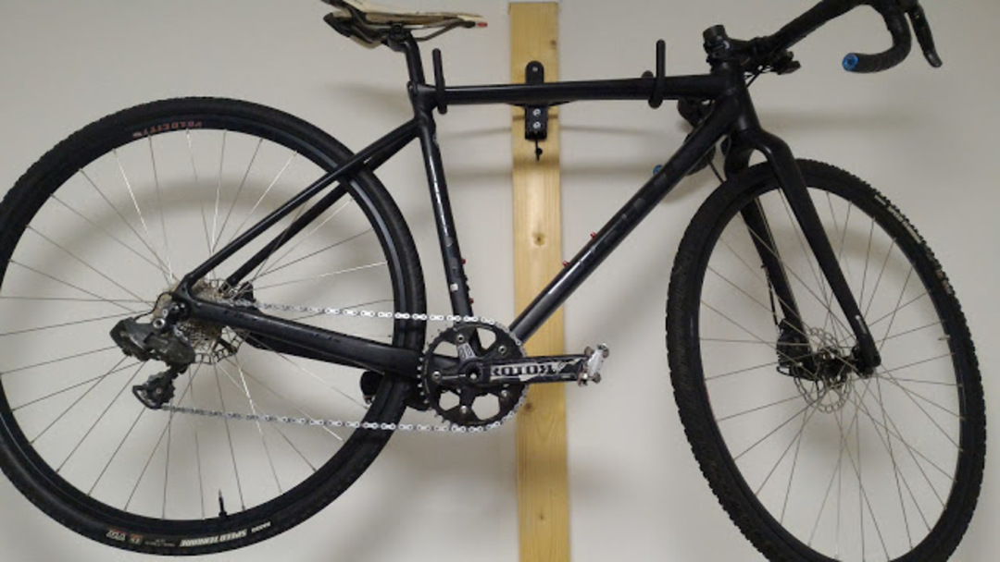
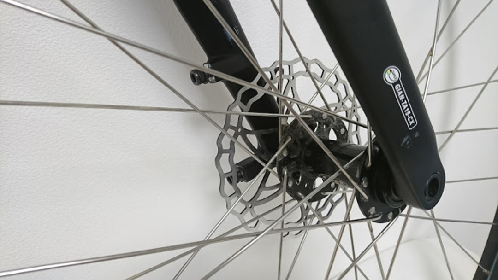
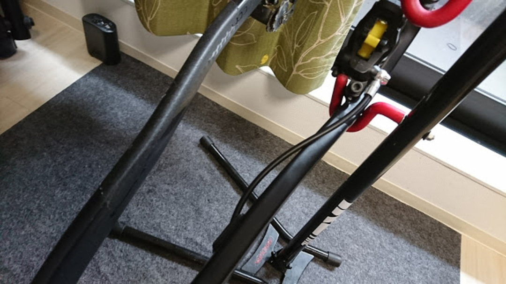
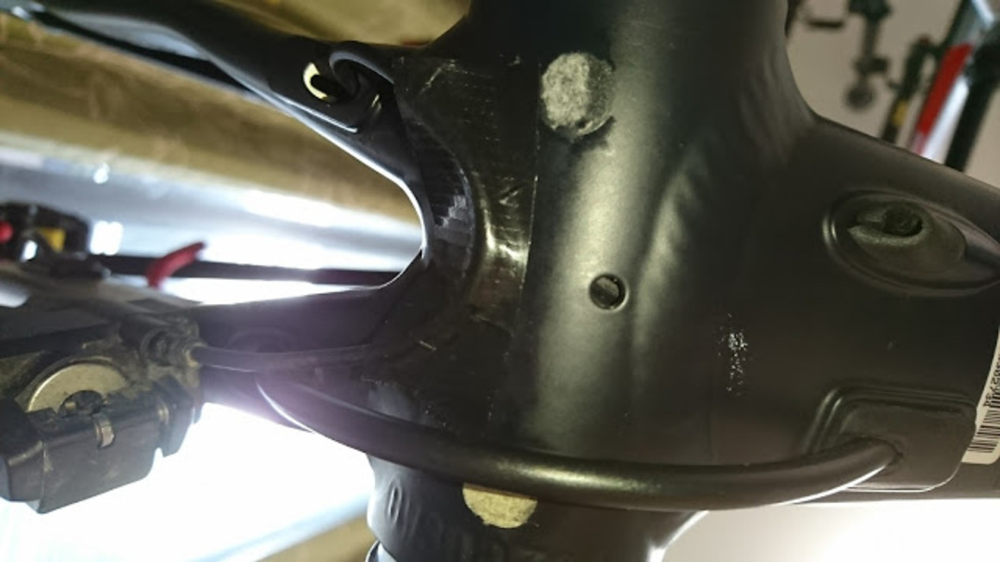
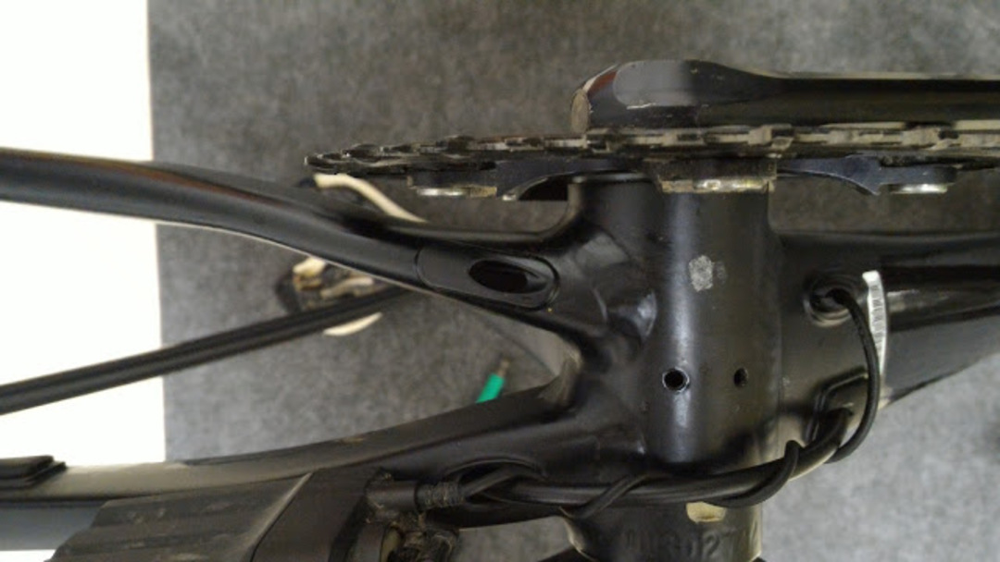
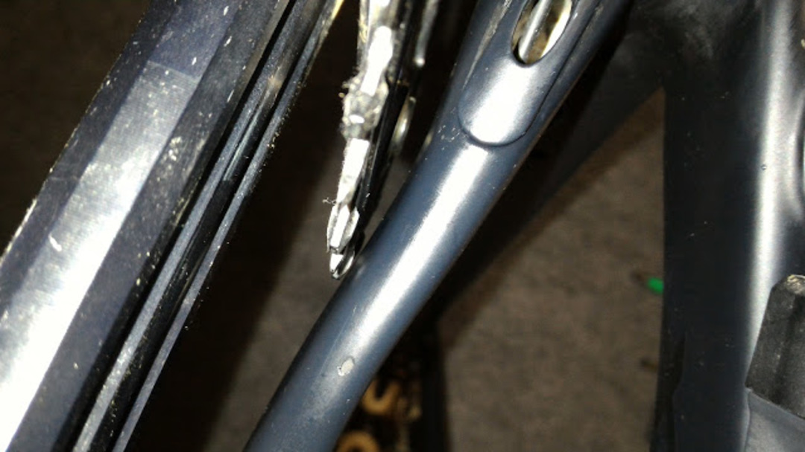
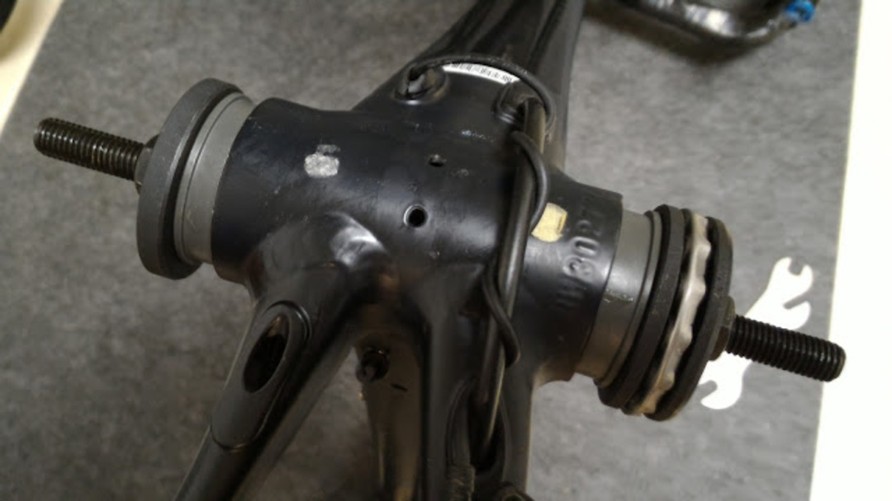
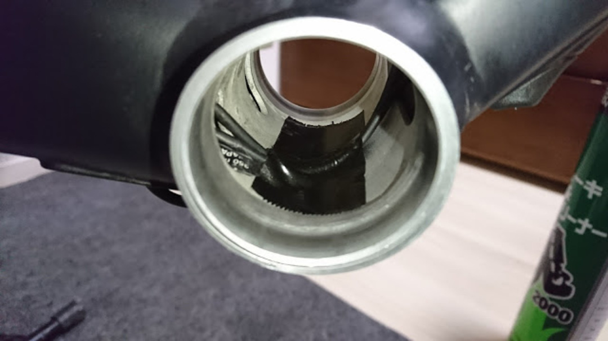

### 年式の古い新車

TCX SLR SSの具合がとても良いので、メインのCXバイクもTCXに変更しました。

中古で都合の良い出物があったので、そちらをポチッと。

唯一フレームセットの設定があった2014モデルです。

フロント15mmスルーは当時衝撃的でしたね。

勝利の方程式である油圧ディスク＋ Di2で組み上げたところ、仕様上迷うところや想定外の作業があったので備忘も兼ねてメモ。

### ポストマウント 140mm ローター

今でこそディスクロードのおかげで140mmローターは当たり前ですが、こいつは数年前から140mm設定がデフォルト。フラットマウントなんて無い時代のフレームなので、「ポストマウントのブレーキキャリパーをアダプタ無しで装着すると140mm」という非常に珍しい仕様。

ここは知っていたので特に迷いなく最軽量クラスの[ASHIMA Ai2Rotor][1]をチョイス。64gという超軽量激安ローター。CXなので制動力はそこまで良くなくても気にしない。

Amazonには<a href="http://amzn.to/2eHadCZ" target="_blank" rel="noopener">前のモデル</a>が売ってますけど、[ebay][1]がおすすめ。

### リアのオイルライン・ケーブルライン

リアのブレーキホースはダウンチューブに内蔵されたのち、BB下で1回出てチェーンステーに再度挿入される内装式。

この挿入時だが、フィキシングボルトやバンジョーが付いているとフレームの穴を通ることができない。つまり外したブレーキについていた**ブレーキホースの再利用は不可能**だった。

また、Di2の配線にも癖がある。昔ながらのチェーンステー下外装マウントがあるバイクなのだが、左側はオイルラインの通る道でもあり、Di2ケーブルとブレーキホースを同時に通すほどの穴は存在しないので、なんとかする必要があった。

こちらは、右チェーンステーからDi2ケーブルをバッテリーに繋いだ図。テープで貼り付けてもどうも格好が悪いので、最終的にはダウンチューブから出すようにしてみた。

ケーブルはホースに絡ませている。

### チェーンリングクリアランス

フロントシングルの場合、アウター側にチェーンリングを付けないとステーに干渉する。

因みに反対側のDi2バッテリーとクランクアームについてもクリアランスギリギリである。これはどうしようもないので放置、余り好きではないが、干渉への安心感という意味では内装バッテリーの方がおすすめできる。

### BB86

ホームメカニックを悩ませる圧入BBだが、今回は<a href="https://amzn.to/3rXnLdt" target="_blank" rel="noopener">怪しい激安工具</a>を用いて組み上げてみた。

ホームセンターで売っていそうなパーツと、ベアリングを組み合わせただけの工具だが、丁寧に並行を出したあとは意外なほどスルスルと装着できた。

内装しているDi2ケーブルがなるべく接触しないように、ダクトテープでフレーム内にしっかり逃している。

残りの特筆すべき点はOD2（1-1/4）コラムという点だが、これはステム規格だけなので大した影響はなし。

<LinkBox isAmazonLink url="https://www.amazon.co.jp/dp/B07HKM3TJW/" />

[1]: http://www.ebay.com/itm/ASHIMA-Ai2-The-Worlds-Lightest-Stainless-Disc-Rotor-140mm-64g-ABE-/131992899865?epid=2058435442&hash=item1ebb63d119:g:U8AAAOSw44BYHFd1
