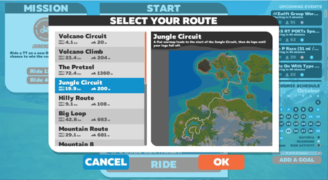
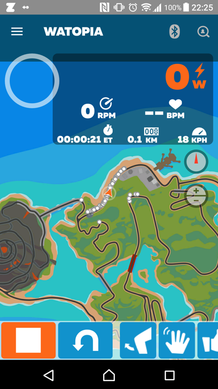
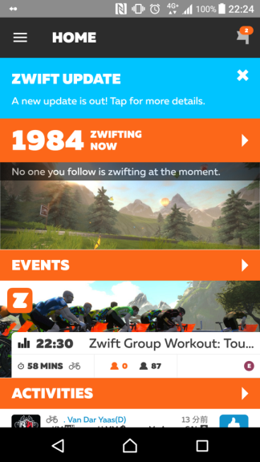

## Zwift がずいぶん変わりました

2017夏にコース追加、アプリの昨日大幅追加とかなりアップデートがありましたZwift界隈。
以前の記事がだいぶ情報古くなってしまったのでリライト。

アプリへのリンクはこちら

<LinkCard url="https://itunes.apple.com/jp/app/zwift-mobile-link/id934083691" />

<LinkCard url="https://play.google.com/store/apps/details?id=com.zwift.android.prod" />

## 最初の起動画面が MAP に

新たにMAPページが追加され、今までZwift本体画面でしか確認できなかった現在位置の確認ができるようになりました。

下部のボタンで今までコントローラーでやっていた操作（方向転換、RideOn!など）をできるようになったので、基本的にこのページだけ見ていれば良くなりました。

ページ送りが不要なのでスワイプしようとして操作ミスということもなくなりますね。

パワーやケイデンスも確認可能なのでメニューを淡々とこなすだけなら下をずっと向いていてもいいような…それではZwiftらしい楽しさはなくなっちゃいますけどね。

非ライド時の画面も、直近のイベントやフォロワーの情報を表示するようになっていて、ソーシャル機能を強化しています。

## おまけ：新コースラッシュ！！

我らがWatopiaにコース大量追加！

Volcanoコースに短距離クライムが追加され、ジャングルコースも新たに追加された模様。

ジャングルコースは地図上ではかなり遠くに行きます。
飽きが来ないように色々やってくれている運営には感謝しかありませんね。

<iframe
  width="560"
  height="315"
  src="https://www.youtube.com/embed/a4wbA7pduUI"
  title="YouTube video player"
  frameborder="0"
  allow="accelerometer; autoplay; clipboard-write; encrypted-media; gyroscope; picture-in-picture"
  allowfullscreen
></iframe>

台風で週末が潰れまくっているのでZwiftが捗ります（泣）
