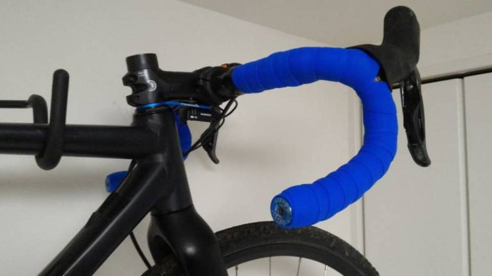
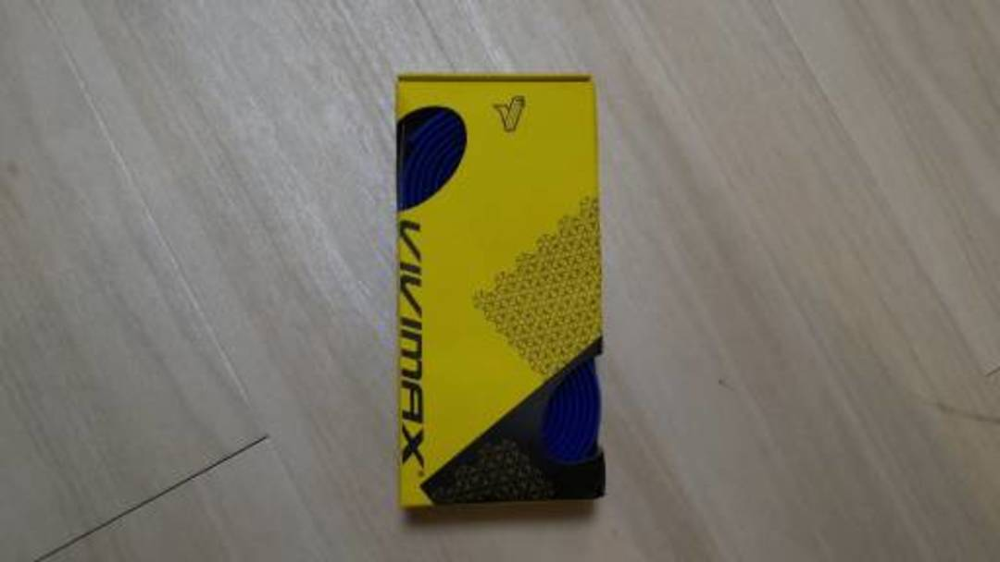

## シリコンバーテープ(グリップ)の魅力

はじめに断っておくと、私は Fizik の[クラシックバーテープ](http://amzn.to/2wQYIwn)をとんでもなく溺愛していて、耐久性と薄さ・適度なグリップ力に惚れ込んでひたすら使い込んでいました、安いし。

そんな中、今回も Fizik を使おうとウエパに赴いたところ、カゴにどっさり積まれた[T-ONE のシリコンバーテープ](http://amzn.to/2hCrLNP)が。\
なんとおひとつ 1000 円の超がつくお値打ち価格。物は試しと TCX SS 用にオレンジを購入しました。

使ってみると、両面テープのない取り付けは快適で、モチモチしっとりした気持ちいい触り心地。伸ばして使うので思ったほど厚さを感じないのも GOOD。\
なによりシクロクロスで不快な振動をだいぶカットしてくれる！\
薄いテープが好きなのはコントロール性が第一だと思っていたのですが、フワフワした握りではないのでしっかりハンドルを操作できます。

その後 MTB を買っても、シリコン熱は続き[ESI Grip](http://amzn.to/2hCrLNP)を購入します。ロンドン五輪で使用率 No1 だったのも頷けるできの良さ。\
こちらについては別途[インプレ記事](https://blog.gensobunya.net/2017/04/mtbesi-grips-brand-x-ascend-dropper-post.html)を書いているので参照。

## でもお高いんでしょう？

シリコンバーテープは高いです…T-ONE の定価はクラシックバーテープのおおよそ 2 倍。ちょっと買うのに躊躇します。\
[TNi のシリコンバーテープ](http://amzn.to/2hDcgFA)もありましたが、Amazon だとちょっと安くない…こうなったら ebay しかない！

そんなわけで購入したのが冒頭の[こちら](https://rover.ebay.com/rover/1/711-53200-19255-0/1?ff3=4&toolid=11800&pub=5575336615&campid=5338191852&mpre=http%3A%2F%2Fwww.ebay.com%2Fitm%2FVIVIMAX-2-5mm-Silicon-Road-Bike-Bicycle-Re-usable-Handlebar-Bar-Tape-Wrap-Plug%2F142225261383%3F_trkparms%3Daid%253D111001%2526algo%253DREC.SEED%2526ao%253D1%2526asc%253D41375%2526meid%253D890ccc7e3e80492fb6849836f8e0f69d%2526pid%253D100033%2526rk%253D2%2526rkt%253D6%2526sd%253D142225261383%26_trksid%3Dp2045573.c100033.m2042)。Vivimax のシリコンバーテープ。

ダイヤ目の加工がされています。

若干短くて、レバー裏に這わせることができませんでした…

感触はパターンが違うこともあってか、T-ONE ほどはモチモチしていないようです。\
振動吸収はおそらくバッチリかな。

耐久性については今シーズン CX に投入してインプレします。T-ONE はすでに 2 シーズン目ですが何も問題無さそう（劣化もなし）。\
中華を考慮して 1 シーズン持ってくれれば御の字です。

ちなみに、下の野口商会オリジナルシリコンバーテープを購入してみたところ、T-ONE とほぼ同じものと思われました。
今ならセール中なのでぜひ買うべし。

<Amzn asin="B00UE4TQJI" />
