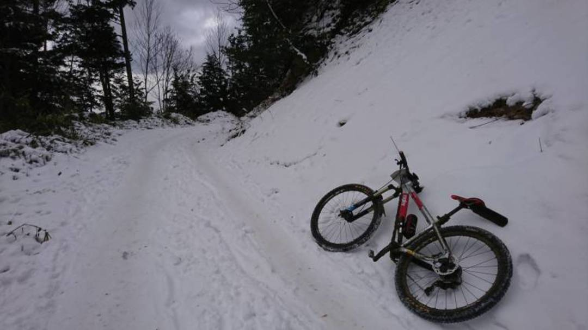
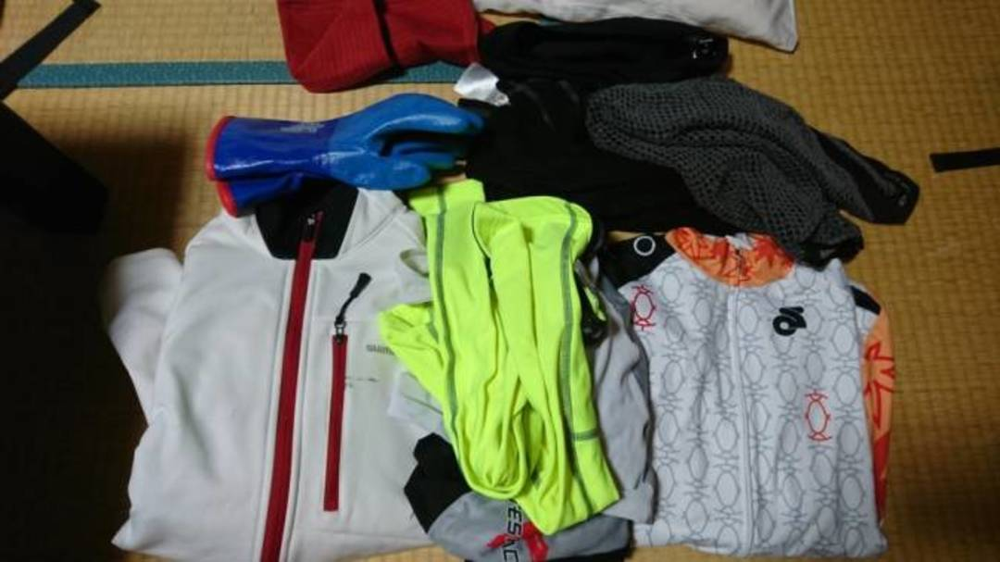
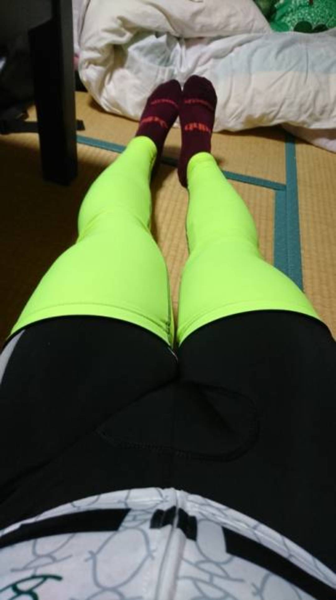

## 伝説の 2017 冬王滝

秋王滝が台風で中止となり、急遽企画された 11 月冬王滝。

当然、低気温が予想されたが現実は予想を上回る大寒波の襲来により終始氷点下の予想となる。

台風に続きこの仕打ちはまさに呪われているとしか言い様がないのであるが、当然呪われているくらいでは開催・出走はやめられない。

普段冬場はシクロクロスという短時間高強度の運動が主な活動なので、普段使わない厳寒に長時間耐えうる装備をかき集めなければならなかった。

しかも冬王滝は今回限りのイベント。大きな投資をして死に資産を作るのももったいない。

可能な限り安く、耐久性は低くくても良く、見た目は気にしない！というコンセプトでチョイスして見事 8 時間 19 分で 100km を乗り切ることができたので、伝説の記録という意味も込めて紹介していく。

基本は「汗をかかない程度に温まる」ことを考えた。汗をかくと汗冷えで死んでしまう。

## 上半身

上記が今回利用した足まわり以外のウェアセット。
一部存在感の強い品があるが、まずは上半身に着たものから紹介。

### OUTWET インナーシャツ

<Amzn asin="B01M6D0YFL" />

絵面が大変なことになっているが、一番内側で常に肌をドライにしてくれるすごいやつ。
夏はこれ一枚で OK、冬は上に冬インナーを着ることで効果を高めてくれる。

### CRAFT Active Extreme

<Amzn asin="B00DAF6AL0" />

説明不要の冬インナー。首周りまで保護されて完璧。

### チャンピオンシステム　長袖フリースジャージ

みんなだいすきチャンピオンシステム。裏がフリース素材なので温かく、フィット感も良いのでジャケットをきても動きが阻害されない

### シマノ　ウィンタージャケット（白赤）

今はなきワイズ赤坂で投げ売りされていたものを買ったやつ。

最低対応気温は 0 度だった気がする。

## 下半身

ありあわせなので見た目が最高にひどい。

ビブニッカーとソックスだけだと生足が出てしまうので、単純にレッグウォーマーを追加。

膝が二重に冷えから守られるので結果として体のトラブルを防ぐことができた。

### dhb thermolite ソックス

<LinkCard url="https://www.wiggle.jp/dhb-flashlight-thermolite-%E3%82%BD%E3%83%83%E3%82%AF%E3%82%B9-1/" />

たまたま冬用で手元にあった

### チャンピオンシステム　フリースビブにッカー

バイクロアの会場で投げ売りされていた。

パターンとカラーが相まって完全にパジャマ。

### gripgrab ハイビズレッグウォーマー

<LinkCard url="https://www.wiggle.jp/gripgrab-%E3%83%8F%E3%82%A4%E3%83%93%E3%82%BA%E3%83%AC%E3%83%83%E3%82%B0%E3%82%A6%E3%82%A9%E3%83%BC%E3%83%9E%E3%83%BC/" />

Wiggle で安かった

## 末端

今回最も悩み、かつ大成功した部分。

### ショーワグローブ　防寒テムレス

<Amzn asin="B007PLDRAC" />

シクロクロス界でも実績のある防水透湿グローブ。

1 周目はこれの下に普通のグローブを着けていたのだが、暑すぎたので結局テムレスのみで走りきることにした。

たった 1 枚のグローブだったにも関わらず、浸水ゼロ・凍傷しもやけ無し・指の感覚も失わずに済むという超高性能っぷりを見せつけた。

常に氷点下以下の極限環境でもこれさえあれば生き残れる。

#### アルミホイル

<Amzn asin="B001UMZUTS" />

アルミの熱反射を利用して靴下の内部温度を保つ。

非常に馬鹿っぽいけど(確か)Bikeradar でも紹介された実績のある手段。役には立ったものの、シューズ内がアルミホイルの残骸で汚くなるのでやめたほうがよかった。

アルミホイルで断熱を考える場合、シューズとシューズカバーの間に設置するか、もしくは[エマージェンシーシート](http://amzn.to/2zVio7h)など破れない素材になっているものを活用したほうが良い。

#### FOOTMAX シューズカバー

<Amzn asin="B00OUY1470" />

風を通しそうに見えて非常に分厚く、氷も泥も通すことはなかった。

脱いだ後のシューズは綺麗そのもの。代わりに 1 レースで洗う気が起きないほどの状態になってしまったがしっかり仕事をしてくれた。

#### mont-bell トゥカバー

<Amzn asin="B00F68ECD2" />

足回りの仕上げに使用。

効果があるかは微妙だったが、手と同じく足も完全に無事だったのでいい仕事をしてくれたはず。ロードは冬場これだけで OK。

#### mont-bell サイクルワッチキャップ

<Amzn asin="B001J2F2Z6" />

頭と耳を保護。ある程度の気温になると耳だけでなく頭も防寒しないと頭痛の元となる。

#### mont-bell スーパーメリノウール EXP.ネックゲーター

<Amzn asin="B00P0CYW02" />

ビビるくらい暖かいネックウォーマー。

今まで持っていた自転車用の薄いウォーマーがオモチャに思えるほど。暖かすぎて晴れている前半戦では使用しなかった。

後半、日が隠れて気温が低下したあとは常時装備。

## おまけ（小物）

体が冷えて、[サーモスのケータイマグ](http://amzn.to/2zVigoj)に熱いココアを入れて持っていったところ 7 時間経っても熱いままで非常に助かった。

短縮コース発表前に用意した[エマージェンシーシート](http://amzn.to/2zVio7h)は使う機会がなくて本当に良かったと思う。それくらい過酷な環境だった。
