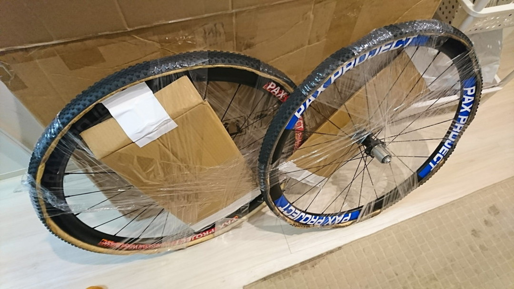
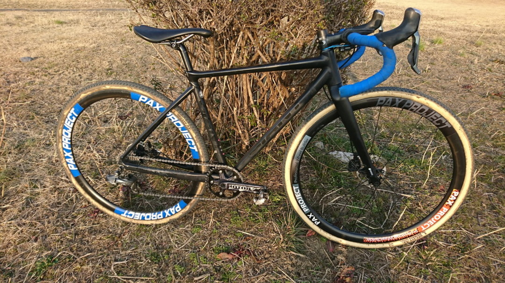
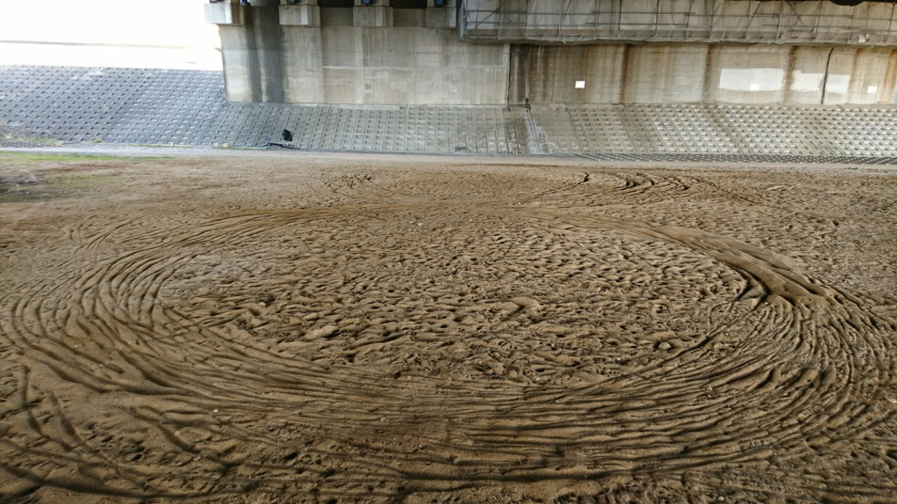

## 飛び道具との出会い

お台場の後はWNP。

福島県某所から「チューブラー、使ってみない？」との悪魔的お誘いが。

お台場でシーズンを終えた選手が丁度今年張り替えのタイヤを使っているらしく、格安でレンタルしてくれるとのこと。C1に上がったらチューブラー試したいと、常々ツイートしていたのを把握されていたらしい。

レース前に送られてきたのはデュガス　スモールバードと前後カーボンチューブラーのセット。

早速取り付けて砂練習に乗り出す。空気圧は1.8barほど、チューブレスだとそろそろ舗装路を走りたくなくな来る空気圧。

砂エリアにたどり着くまで数km、チューブレスなら重さを脚に感じること間違い無しの柔らかさなのだが、それが全く無い。
段差はフワフワと乗り越えるが、それでいて舗装路コーナーのグリップも安心。この時点でだいぶ感動。

砂練習では砂8の字を実践してみた。チューブレスでもできた…ような気がするが少なくとも砂の時は1.6bar程度まで下げるはずなのでそれなりの空気圧でも走れることを確認。

ちなみにバッチリ疲れたので脚の無さをカバーしてくれるわけでもないし、体重移動をミスると刺さるのは変わらなかった。

この日は「チューブラーなら直線とコーナーをトレードオフしなくてもいいな…」程度の感想。

## 低圧チューブラーは…いいぞ

<blockquote class="twitter-tweet" data-conversation="none" data-lang="ja">
  

    ケーシングが変形しやすいからか低圧でも走りが軽いママなの偉大ですよね。砂はチューブレスやクリンチャーでやりたくない1.0〜1.1
    barとかのヨレヨレのズルズルにしてやっと違いが出るかも
  

  &mdash; 小山浩之™ (@0yama) <a href="https://twitter.com/0yama/status/966950721294712832?ref_src=twsrc%5Etfw">2018年2月23日</a>
</blockquote>

ほう…1.1barですか…

チューブレスでやったら即タイヤ外れる領域…

レース当日、前々日の練習から空気を足さずに走ってみた所、WNPの砂地獄を殆ど乗ってクリアできた。

測ってみると空気圧1.0bar。もちろん林間はズルズル滑るが致命的な破綻はない。リム打ちもほぼなし。

コース変更により林間セクションの段差が減っていたので、超低圧で行くことを選択。流石に1.0barは余裕が無いのでR1.1bar/F1.2barでセッティングして昼試走。いい感じ！

林間セクションで抜かれることは想定済みの割り切りセッティングだと言い聞かせることに集中。

すごく砂を乗れる…楽ちん…
チューブレス（1.5bar~1.6bar)ではちょっとミスするとリカバリーが効かないが、この空気圧だと轍の上は簡単に走れるし、ミスっても駆動力が伝わりやすいのでパワーで押し切ることができる。

結果としてラインを外して前走者を抜いたり、速度差による接触が起きてもそのままパワーで元のラインに戻ることもできる。

その代わりレーススピードの林間はだいぶナーバス。何度か脚を出さないとコケる場面があった。前半だいぶガツガツ踏んでいる人が多かったので、コースが広いことも加味してチューブラーの力を使って砂場を「休み」、後半巻き返す作戦を取ることに。

ランニング区間と砂場を使って巻き返し、キャリア最高となる36%(17/46位）でゴール！

4年越しの昇格でC1になり、底辺ゴールから66%、50%オーバー、30%台を最後に記録していい感触をもったままシーズンを終えることができた。
愛知牧場を始めとするPWRゴリ押し系のコースではリザルトが悪いので、夏に肉体改造をして来年の全日本に出られるようにしたい。

チューブラーはいいぞ。

### 機材

- Bike: TCX SLR('14) Ultegra Di2
- Tyre: Dugast smallbird 1.2Bar(F), Dugast smallbird 1.1Bar(R)
- Wheel: (F/R)PAX PROJECT carbon 30mm TU

<Amzn asin="B079NS766M" />
