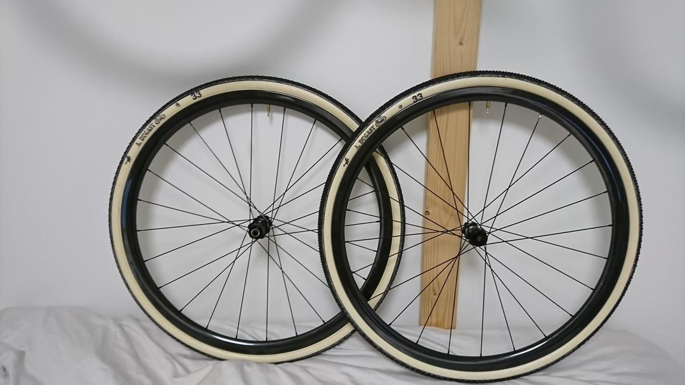
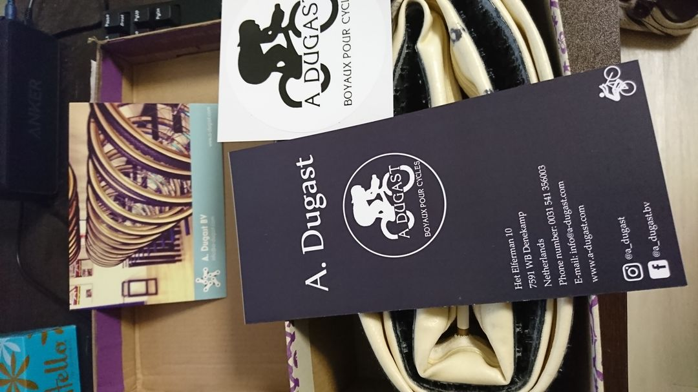
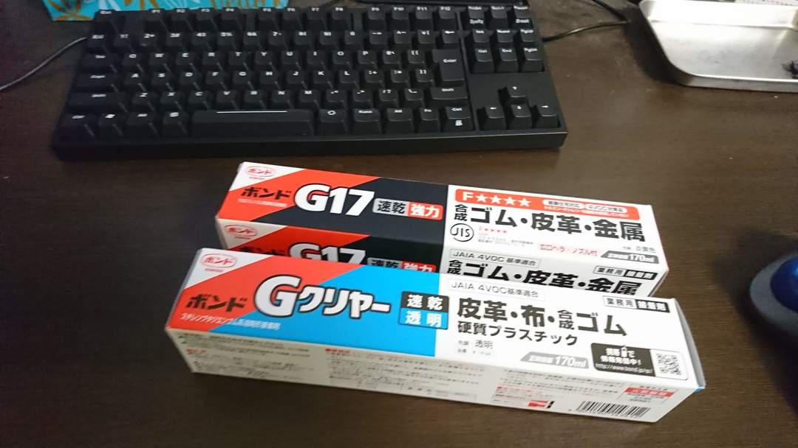
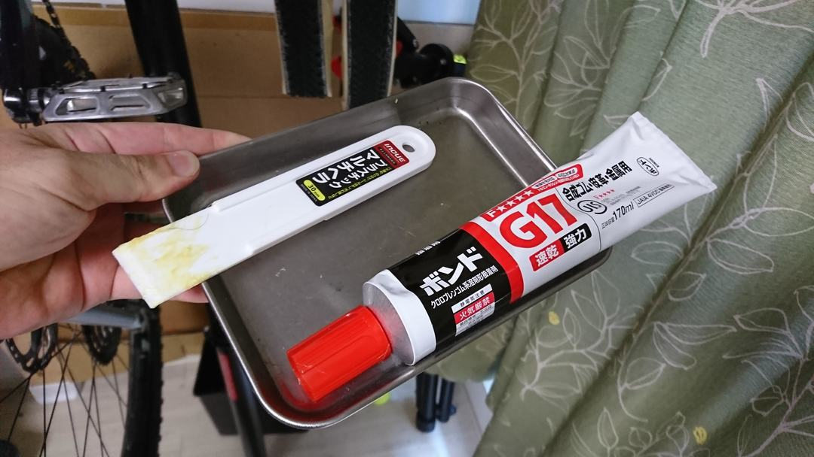
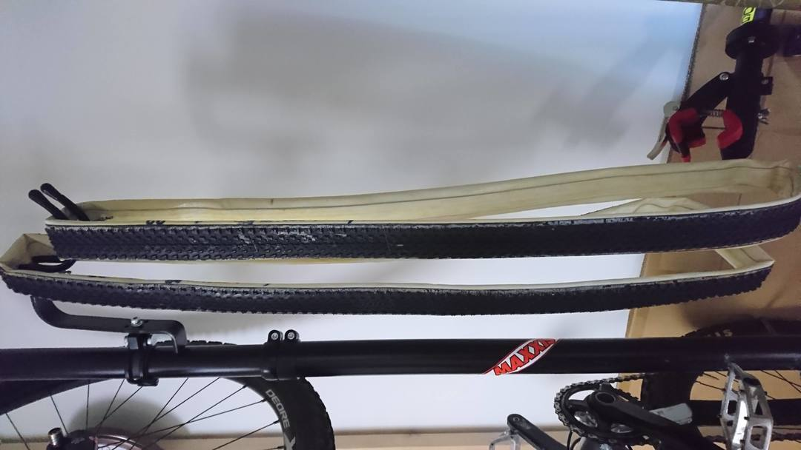
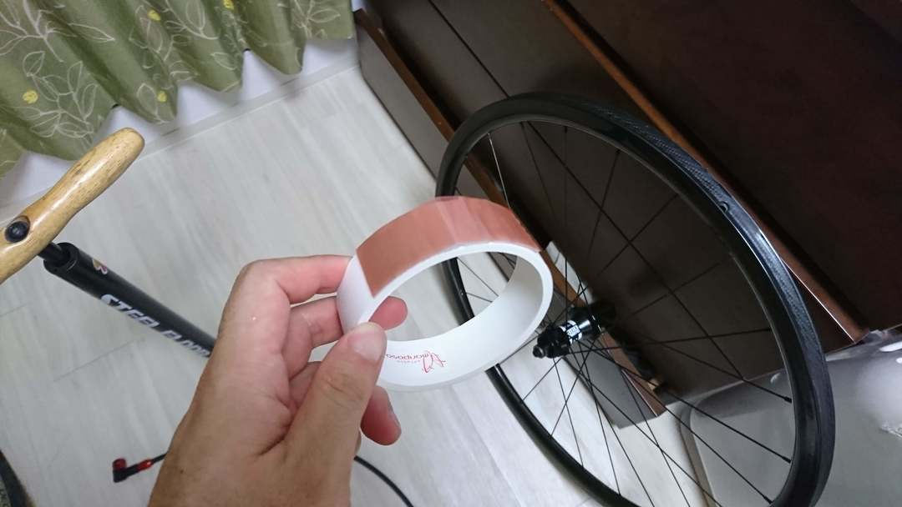
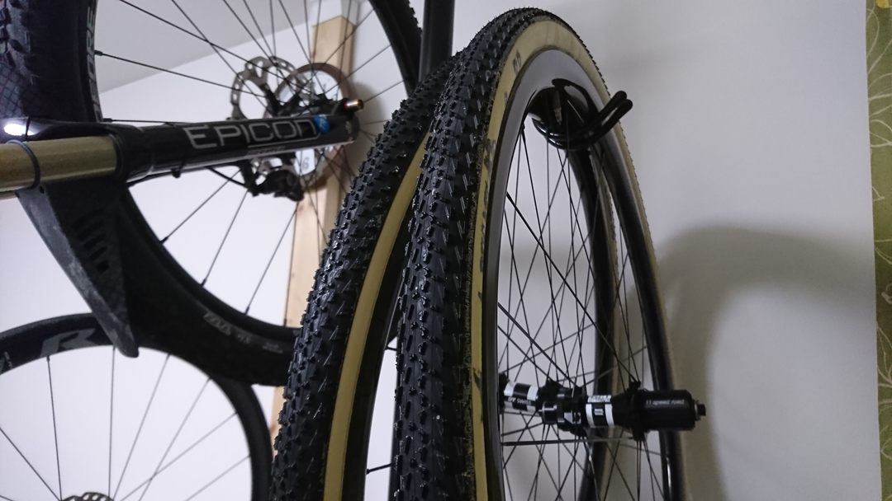

## 最後のピース

昨シーズン終わりに体感したチューブラーの世界が忘れられず…買ってしまいました。

全日本出場という目標に向けた武器、Dugast SmallBird！！！

高級タイヤを壊したくはないので、耐パンク性UPのFlying-Doctorバージョンかつネオプレンコーティングを施したものを購入。
毎回拭き掃除していればアクアシールいらず…らしい

余談だが、箱はスニーカーでよく見るタイプの保管箱に詰められてきた。おそらく使いまわしであるところにハンドメイド感が溢れている（適当）

## ホイールもあわせてどうぞ

自己最軽量クラスの1340g、テープ運用しやすいようにスポークホールなしの幅広ディスクチューブラーホイールを[某所](https://www.aliexpress.com/store/all-wholesale-products/103713.html)で調達。

ハブはDT350、スポークはCX-rayとアクスル規格に柔軟性を持たせつつ奢りまくり。ロードでもこんなに軽いホイール使ったことない。

いままでのXTホイールはスーパーマッド兼予備機として活躍してもらう見込み。

## 下準備

チューブラー貼りの達人ではない上、平日仕事のサラリーマン。

毎週レースがあることを考えると店に頼り切らずに自分でそれなりのクオリティで運用できることを最優先にする、そのためのスポークホールレス仕様。

[シクロクロスでも問題なく使えるという触れ込み](https://www.cyclowired.jp/lifenews/node/191669)のEffetto Mariposaの[チューブラーテープ](https://amzn.to/2u8o89K)を購入。
そして圧倒的人気を誇る[ボンド G17](https://amzn.to/2JeDVs9)でフンドシの下処理を行う。

とにかく水分の侵入が大敵。
なるべく身近なもので対策していく。人によってはコーキング剤を使ったりしているが、それなりに汚れそうなのでボンドとヘラで塗り塗りする作戦。

1回薄くフンドシに塗ったところで24h放置。

## 貼り付け

1日乾かしたらEffetto Mariposaの[チューブラーテープ](https://amzn.to/2u8o89K)で貼り付けていく。

ホイールの中心にフンドシの縫い目を落とす溝があるので、そこも含めてしっかり密着させる。25mm幅のリムに25mm幅のテープなので本当にギリギリ。ついでに長さもギリギリ。

仮嵌めして、丁寧にセンターを出して、ビニールテープを剥がして完成。空気を入れて1日以上放置。

最後に隙間を[ボンド G クリア](https://amzn.to/2KQCPII)で埋めていく。

幅が広い上に厚みのあるテープなので、タイヤを貼った後も側面に粘着面が残ってしまっているので、念には念を入れてここからの浸水をボンドで防ぐ。

ここまでやったら後は神頼み。

シクロクロスシーズンまで3ヶ月程度に迫ってきたことだし、体の方もチューブレスタイヤでしっかり作ってオフロードに慣れていきたい。

<Amzn asin="B000TGCY3Q" />
