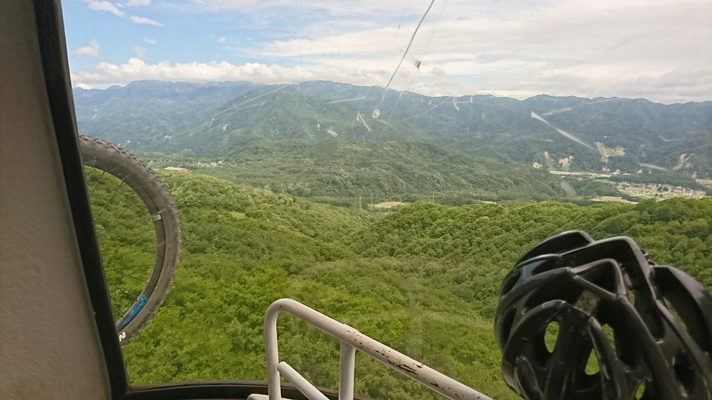
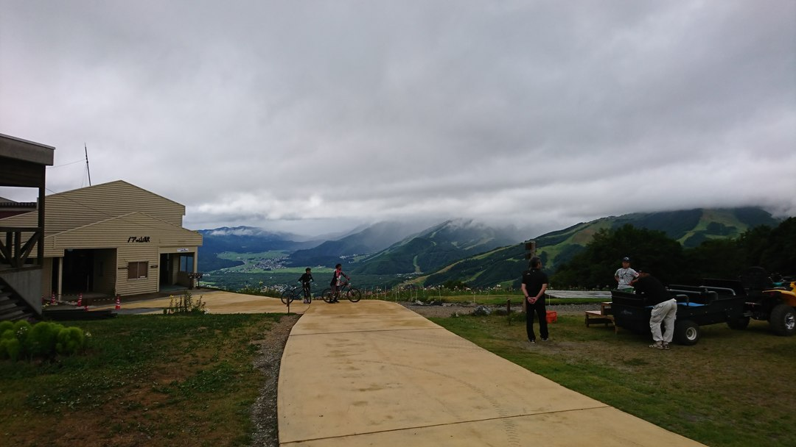
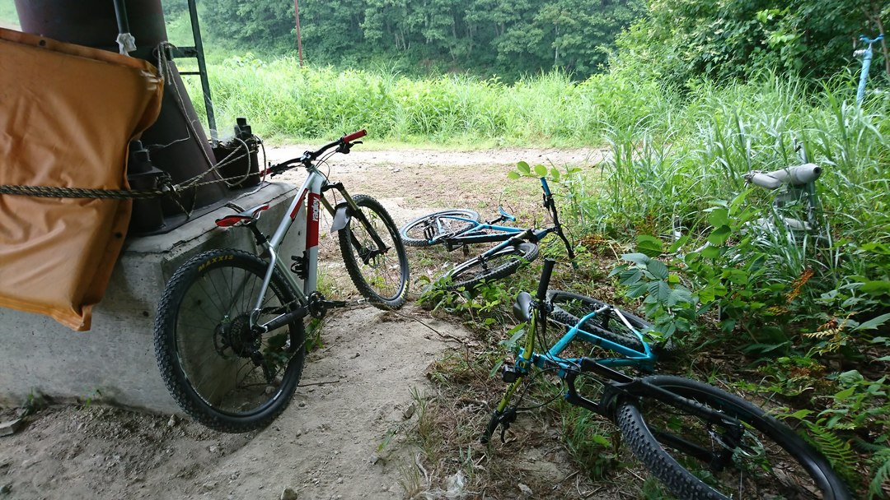
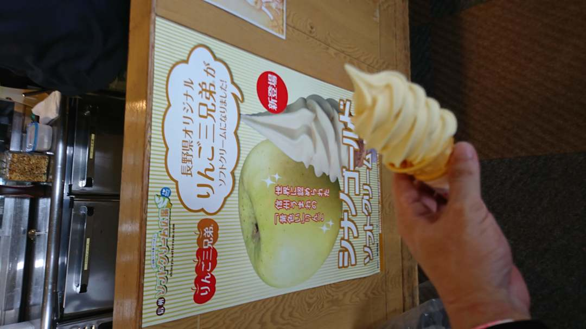

## 欠点は立地だけ、他は完璧

2017年に「復活」と称してオープンした白馬岩岳のゲレンデを利用したMTBコース。復活とはいえ、自分は前の時代を知らないので「ふーん昔もやってたんだ」くらいの感想。  
それでも、走った人が口をそろえて最高だと褒め称えるのでずっと気になってはいた。

今年もバイカーズフェスティバルでキングオブマウンテンを楽しむつもりが、種目の内容が大幅に変更となりロングトレイルではなくなってしまったため、行き先を白馬に変更。  
大阪から5 ～ 6時間もかかる遠さだが思い切って行ってみることに。

台風12号が折悪しく来襲していたが、予定より南コースを通ることになったため日曜の白馬は行けると判断。  
前日は名古屋の知人と三重トレイルで早朝遊んで台風が来る前に撤退。

翌朝白馬へ。

<LinkBox url="https://www.instagram.com/p/Blxq8Z1hft5/" />

遠い遠い…

朝は曇天で時々通り雨が降るものの、コースの大勢に影響はなし。  
通り雨が過ぎたあとも長い初心者コースでは濡れているところがほんの1セクションだけと言えばスケールが伝わるだろうか。とにかく長くて広い。

カミカゼダウンヒルという上級コースと、アルプスコースという初中級コースに別れていて、参加者全員HTだったということもあり主に後者を走る。  
カミカゼは凄まじい直滑降があるのでDHバイクだととんでもないスピードで下れそうだ。

アルプスコースは対象的にスピードが出過ぎないように作ってある。  
わざとスピードダウンさせる登りセクションもあったりして、うっかりオーバースピードということが起こりにくい。加えて根っこやガレ場も殆ど無いのでかなり空気圧を下げてもリム打ちは怖くなかった。

ちょくちょくカミカゼコースと交差する設計になっているので、物足りなかったらすぐに上級コースへ移動できるのも魅力。ラストセクションは連続バームが楽しめるカミカゼに移動したほうが得策。

疲れたらてっぺんのレストハウスでソフトクリームも頂ける。  
りんごソフトはりんごをそのままマシンで削ったかのようなりんご感（語彙不足）

長野県クオリティのミルクも捨てがたいのでミックスが正解だ、この正解にたどり着くために2回ソフトクリームを食べたことは言うまでもない。  
その他の食べ物はスキー場価格なのでちょっとお高め。

## 走った後は

ちょっと下ったところにコンビニもあるし、なんと駐車場施設内に温泉まで準備されている。  
一日中ここにいて、終わったらさぁ解散という具合。至れり尽くせりである。

大阪からも東京からもメチャクチャに遠い上新幹線も通っていないが、なんども来たくなる最高のフィールドであることは間違いない。  
DHバイクなら富士見でも楽しめるが、富士見でHTだとやや恐怖感が残る。白馬にそれはない。

<LinkBox isAmazonLink url="https://www.amazon.co.jp/dp/B072R6RB44/" />
