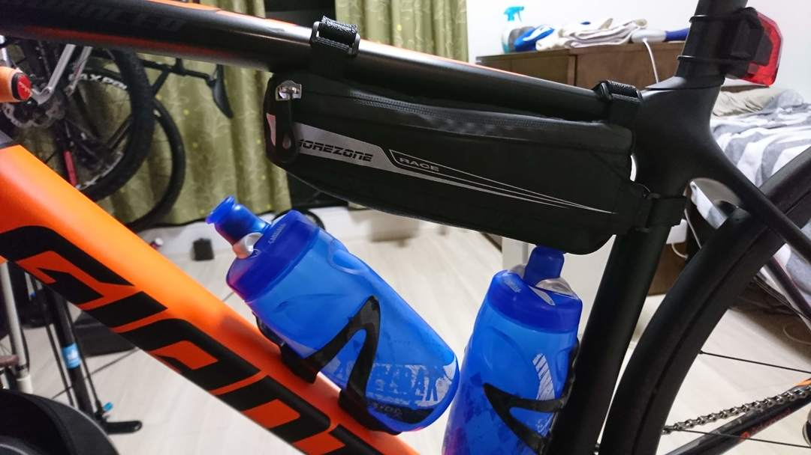
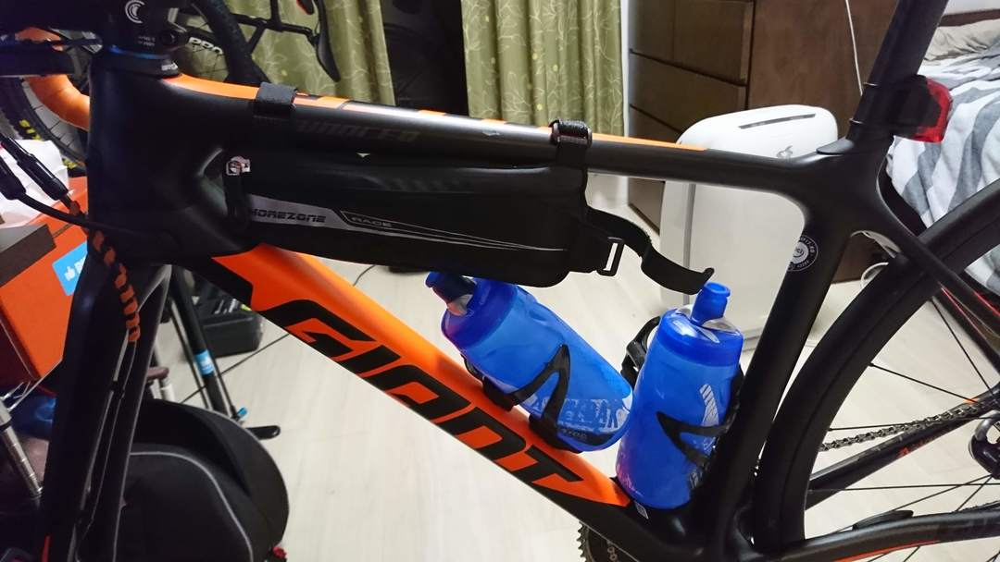
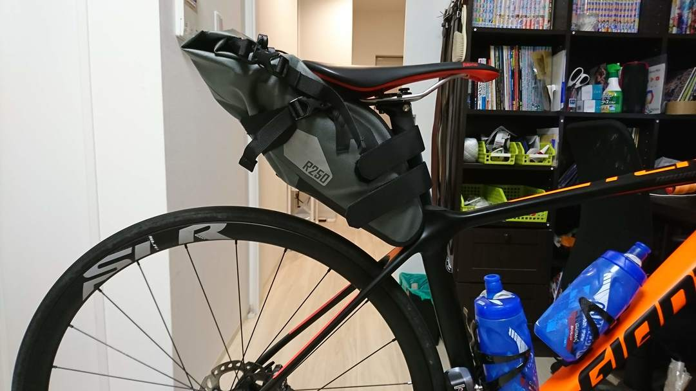

## ロードで軽宿泊旅行へ行きたい…行きたくない…？

CX シーズン前最後の楽しみを行うためにルートを検討して、前回うどんツーリングと同じく関西のメリットを活かしたフェリー旅を行うことにした。

ルートは神戸～高松～徳島～淡路島～明石。  
今回は 1 泊行程を組んだため、荷物がある程度必要になる。TCR ADVANCED PRO DISC には当然ダボ穴がないので、いわゆるバイクパッキングの装備をすることになる。

チョイスしたのがこちらの 2 点。

<LinkBox isAmazonLink url="https://www.amazon.co.jp/dp/B0747NR4HL/" />

<LinkBox isAmazonLink url="https://www.amazon.co.jp/dp/B07PW4FL2X/" />

1 泊で、今回はゲストハウスだが、将来的な北海道的なライダーハウス泊を想定して寝袋・マットくらいは装備できることを念頭に選択。

基本的な宿泊装備は全てサドルバッグに入れ、ツールや日常的な携行物をジャージと小さいバッグ類で補う構成を考えた。

## 装着インプレ

中華フレームバッグは既視感のあるカードと共に意外にも丁寧な外箱梱包をされていた。  
装着しても想定通りしっかりダブルボトル OK！GIANT の XS サイズでこれは嬉しい。

前側につかないこともない。

しかし幅が結構あって膝が結構擦れる。  
今回は容量にも余裕があるので、王滝のために購入していたこちらを結局はツールボックス代わりにすることに。

<LinkBox isAmazonLink url="https://www.amazon.co.jp/dp/B06XPW1TTN/" />

サドルバッグはディスクブレーキということもあって余裕をもって安定する場所に装着できた。

## 実走！

…の予定だったが週末が雨になったのでお預け、つらい…
