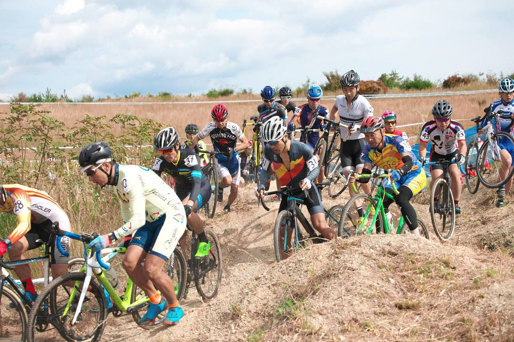
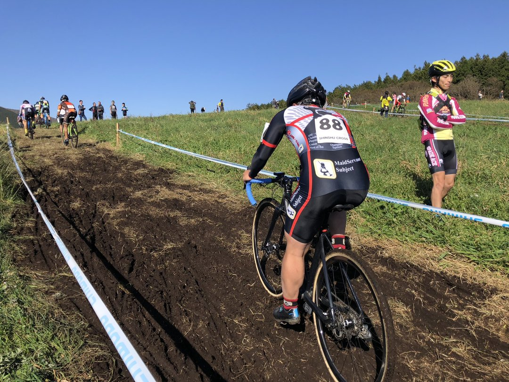
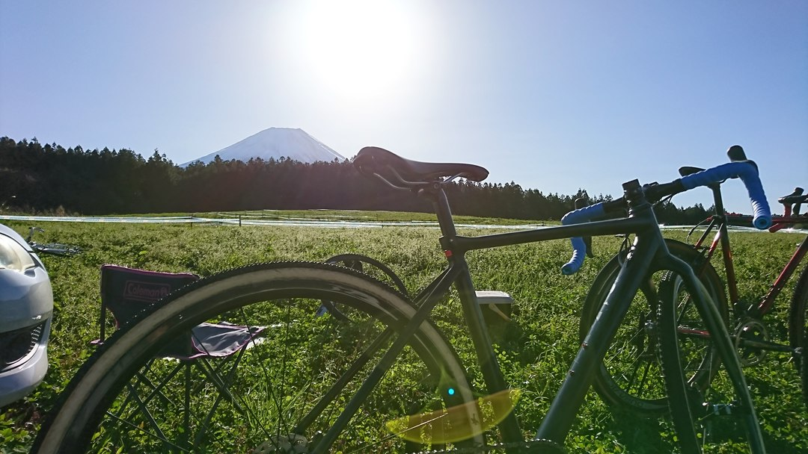

## 取り柄のないライダーでも全日本に出たい！

せっかくC1に上がったのだし、今年は関西で全日本をやるし自分の履歴書に「シクロクロス全日本選手権出場」という項目を入れてみたかった。
当然実力が突然上がるわけもないので、MTBやロードシーズンが終わる前にエッサホイサと遠征してポイントを稼ぐ算段。我ながらセコい。

全日本選手権の出場権利を得るためにはJCFポイント ≒JCXポイントを貯める必要があり、昨年と同じ基準ならJCFポイントランキング100位以内が出場権利を得る。
JCXランキングはシーズンごとだが、JCFランキングは52週ローリングポイントで決まる。JCXはU23を含むがJCFは含まない。ややこしい。

各対象レース（JCX+全日本）で50位以内に入らないと出走ポイントのみとなってしまうため、早期に開催され、なおかつ参加者が少ないと思われる、JCX #2広島・#3富士山・#4寒河江にフォーカス。
最大で7レースが算定対象となるため、この3レースで稼いだポイント＋他の4レース\*5pt(出走pt)で100位内に入るという皮算用。最低80ptで可能性が出てきて、100ptあれば100位以内は堅いはず。たしか昇格時に確認したラインはそのあたりだった。

JCFサイトが過去URLをぞんざいに扱ったせいで昨年実績の1次資料が消滅している。おのれJCF。

## JCX#2 広島

昨年度に引き続き、西日本のシーズン初戦。
毎年恒例ながら、シーズン初めにシーズン最悪の凸凹路面と対峙する。

出走人数は50人を下回っている48人。つまり出走時点で10pt以上のJCXポイントが約束されている非常においしいレースとなる。

練習時点から疑っていたが、フロントのSmallbirdが案の定製造時点からスローパンクしていたらしい。これだからハンドメイドは…
おまけにシングルトラック区間の試走で変なラインを試して前転したりとシーズン初めらしいプチトラブルが続く。

幸いシーラントで空気抜けは収まったので、前後1.5bar程度の空気圧でスタート。猪が掘り返した路面でバイクをひたすらに弾かれる40分間。
エリートトップ層がいないにもかかわらず、路面にやられて失速して早々に80%足切りを食らったものの、順位そのものは33位に食い込み27ptをゲット。

このペースで3連戦ポイントを取っていけば全日本当確ペース。

## JCX#3 富士山

想定に反して90人を越えるエントリー。
登りを含む踏みまくりコースにあえなく沈没して出走ポイント5ptのみ。

最高の景色と最高のフードにかこまれて、特に成果なし。
さわやかとソフトクリームがおいしかった。新東名のおかげで余り遠征苦もなかったことは意外。

## JCX#4 寒河江

JCXで数少ないフラットコース。
平均速度が上がるゆえに80%ルールによる足切り数が減ることが予測された。富士山で取れなかったぶん、万が一にも完走ポイント（+10pt）がほしいところ。ちなみに出走人数は55人と最後尾では意味がないが十分にポイントゲットの希望がある人数。

序盤からダート区間でも30km/hを余裕で超える超ハイペースで心臓が爆発しかけるが、こらえる。
が、地脚のなさと空気圧を低く設定したことで短い芝区間ではガンガン抜かれていく。1周目で早くも実力通りの位置に付ける。

頭の中の皮算用では残り2周か1周の段階で切られるペースだったが、ピットのキクちゃんから「完走いけるかも！」というありがたいお言葉。
そこからアドレナリン全開で踏むも、最終周回足切りスポット直前の階段とシケインでふくらはぎがピキっと攣る。見たところ足切りは始まっていないので死ぬ気で脚を回してラストラップへ。

まさかまさかの完走37位によって23+10ptというポイント稼ぎに成功。これで今年分が暫定65pt、昨年の愛知牧場を含めて70ptとなった。残りのJCX~~4 レース出走で 20pt 追加して合計 90pt~~計算間違い：残り3レース85ptが限界。
ゴツゴツとした路面に加え、石が大量に露出していることもありパンクトラブルでレースを終えた人がかなり多かったこと順位につながった。チューブラー 1.5barほどだと10回以上はリム打ちしただろうか。それでもノーパンクなのはありがたい。

いけるか！？全日本！？~~（今年の要項早く出してくださいお願いします）~~
今年もランキング100位以内が出場可能でした。

<Amzn asin="B0060GI8DE">
