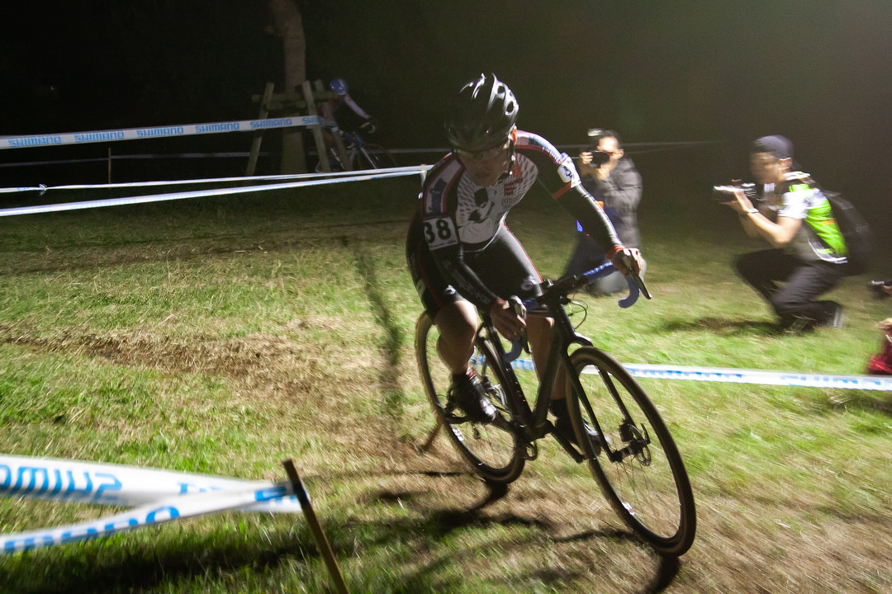

## 2018-19 スターライトクロス Men Elite 61/82

全日本前の一大イベントである野辺山の前哨戦にあたるスターライトクロス。  
とはいえ、自分の今年の目標は全日本選手権出場。野辺山は不得意なコースなのでほぼ100%出走ポイントのみの積み上げになることを考えるとこの週が実質プラスを積み上げられる最後のレースとなる。

もちろん、UCIレースとなっていることもあって非常に厳しいレースになることは覚悟の上。しかし幕張のコースは個人的には好きだし得意なコースなので全てが上手く噛み合えば50位以内を狙えると欲を出していた。

コンディションを上げるために、前週の関西シクロクロスまでは体をいじめにいじめ抜いた上で、一週間たっぷり休養して調子を上げる。  
寒河江から1週空きがあったのでそこをしっかりトレーニングに充てる作戦。

計画通りジムでフリーウェイト含む下半身筋トレをたっぷり行い、ジテツーと土日のライドとレースで追い込む。おかげで関西CXの成績は散々だったが一応計算通り。翌週はジテツーに加えてたっぷり栄養をとってアクティブレストと休息を入れる。金曜の夜に前日入り。

## 当日

友人の車で朝試走に間に合うよう会場へ、金曜日に雨が降ったとのことで一昨年のたけし城や昨年の毒泥水のトラウマが蘇ったが、あまり難しい路面にはなっておらず一安心。  
夜には完全にドライになる見込み。

試走でたっぷり激上りと激下りのラインを見極め、長い長い休憩へ。サイクルモードに行ったりカテゴリレースをガヤったりして時間を潰す。  
公式練習はウォームアップと思って少し上げ目。日が陰ってから体感気温がかなり下がったので今期から導入した[ウォームアップタイツ](https://rover.ebay.com/rover/1/711-53200-19255-0/1?ff3=4&toolid=11800&pub=5575336615&campid=5338191852&mpre=https%3A%2F%2Fwww.ebay.com%2Fitm%2F162244070914%3F_sp%3Dp2488211.m41214.l9765%26_trkparms%3Ditemid%253A162244070914)が非常に役立つ。

## レース展開

ゼッケンは38だがスタート順は58番手、当然先頭は遥か遠くなのだが、自分の目標は1つでも高い位置で80%カットとなること。  
運悪くホームストレートのガチャガチャが自分の目の前で絡んで停車という帰結になってしまいかなりポジションを落とすが、どうせシケイン後の細い部分で詰まっていることは目に見えているので落ち着いてペースを上げていく。しかし芝生がハイスピードということもあり中々ポジションが上がらない。

いや、正確に言えば自分の体調は最高だし、感覚としては自己最高に踏めている。難所前に心拍を落ち着ける余裕もあるし、パンクリスクのある段差をホッピングで通過するなど落ち着きと脱力も維持できている。今ある力を出しきってそれでも上がらないのだ。完全に地脚（ベース）の問題。

脚はどうにもならにので、激上りの担ぎや混乱をうまく使ってポジションを細かく上げる。  
ミニキャンバーで何故か順番待ちしていた人たちをごぼう抜きしたりすることはできていたが、平坦のトップスピードが遅く中々前のパックを捕まえられず、逆に捕まってからテクニカルエリアで抜き返す展開が続く。ずっと60 ～ 65番手で3周進行したところでピットから80％スタートのお知らせ。ゴール前でやるようなもがきを連発して2人ほど抜き返すも4周完了前で無念のカット1番手。

61位ということで、AJOCCポイントは0、JCXポイントも最低限5ptの取得となった。  
ナショナルランキングは寒河江終了時点で105位なので、完全に他人の出欠席次第となった。いわゆる自力出場消滅状態。

自分より上位の人が何人ツール・ド・おきなわに参戦しているか？格好悪いが気になっている…全日本マキノいきたいなぁ

<LinkBox isAmazonLink url="https://www.amazon.co.jp/dp/4594072968/" />
