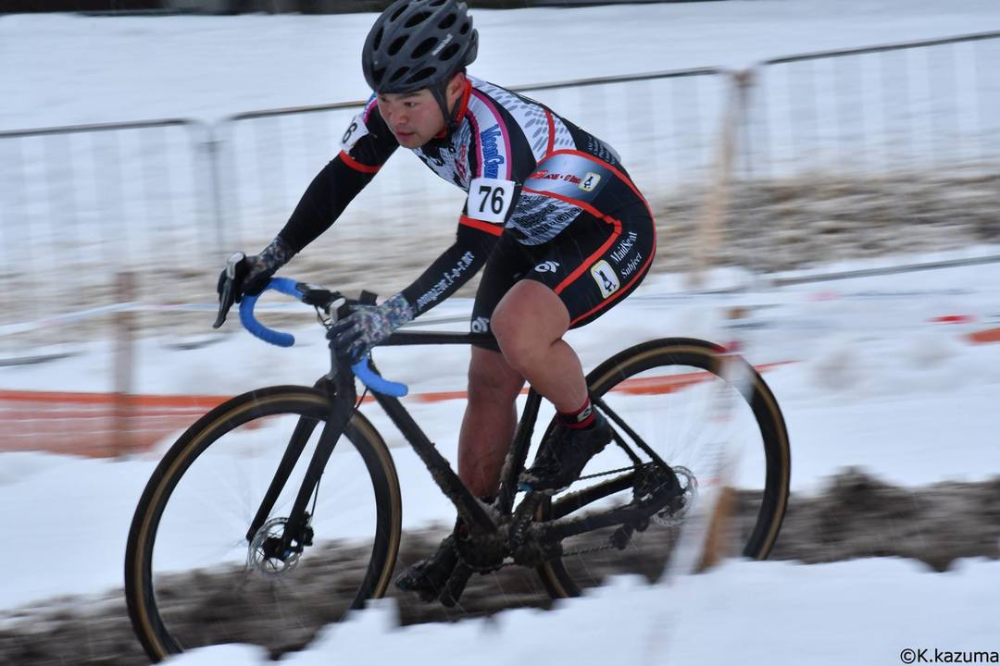
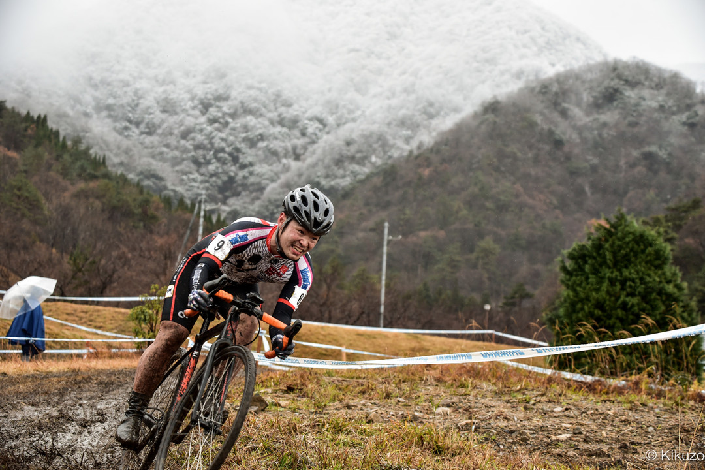

今年の目標は全日本出場と決めていた。

主に財布へのダメージが大きい努力の結果、幸運にも95位で全日本エリート男子への切符を手にすることに成功し、シングルスピードとエリート男子に出場！所属チームであるメイドさん学科としては2年ぶりのシクロクロス全日本レースとなりました（前回はそらまめさんのU23）

## シングルスピード

人生でこの先走るかどうかもわからない全日本選手権、せっかくならとことん楽しもうとシングルスピードにもエントリー。

雨が降りしきるコンディションの中、翌日に風邪を引いたら何のために頑張ってきたかわからないので、シューズカバー・ウィンタースーツと持てる限りの防寒を投入。こういう泥のコンディションに備えて[激安中華防水シューズカバー](https://amzn.to/2L7sLI9)を使い捨てるつもりでストックしていたのだが、なんと装着時にファスナーが破損。安物は安物なりの理由がある…と思いながら安全ピンでなんとか固定して出走。

コースに合わせたギア比のコグを用意できず、ギア比2倍で突入。優勝者であるスク水さんも同じく2倍だったがエンジンが違いすぎる。

スタートした1周目のV字キャンバーで横のライダーと交錯しハンドルが絡み制御不能のままコーステープを突き破りコースアウト。復帰後そのままポジションが安定してしまい抜きも抜かれもせず13/18位でフィニッシュ。2週間前に走ってボロボロになったコースのはずなのに、この日はニヤけまくりでもらう写真全てでニヤけている始末。翌日に地獄が待ち受けているとも知らずに…

## 男子エリート

翌日の天気は「雪」。しかもちょっとパラついているのではなく、ガッツリと10cmくらい一晩で積もった銀世界がマキノ高原スキー場に突如出現した。

男子エリートの頃にはある程度轍ができていたため、それなりに走りやすいコンディションでスタートできたものの、午前中のレースは惨たる有様だった。コース上部はほとんどランニング区間だった模様。

新雪のおかげでパンクリスクが極端に低いので1.3barという極端な低圧で出走することにした。試走したところ、新雪はワールドネイチャープラザのような砂レースと進ませ方が同じだと感じたため、砂砂したレースと同じセッティングで出走。

最後尾からのんびりスタートして何故か1コーナーで担ぎ始める中盤の人を尻目に乗車でゆるゆると隙間を縫いながら上がっていく。低圧にしたおかげで他の人が降りるところも乗車で楽々クリアできるのだが、轍以外の新雪は抵抗が強すぎてそこを走っても抜くことができず結局担ぎ行列に並ぶことに。

それでもランニングするより楽なのに…低速ペースで降りる意味がわからないなぁと心の中で思っていたらバチが当たったのか何かにBOAがあたってシューズが緩み、立て直す間にまた最後尾。そこからは雪乗車と急斜面のダッシュでポジションを地味に上げていき60番手前後を走行。

普段一緒に走れない人と同じペースで走れていることに気を良くして調子に乗っていたら何回も杭に引っかかったりコーナーをミスる。上げたポジションをすぐ吐き出す有様で完全に舞い上がっていた。雪の影響でトップのラップタイムが11分程度と大きく伸びた結果周回数は5周回となって、完走が見えている、多分ギリギリ…観客からもその手の応援が増える。

ギリギリ…完走できなかった。あと5秒速ければ最終周回に入れたのに…  
完走できそうな全日本で完走をギリギリ逃すというカルマを背負ってしまった感があるが、今年の目標は達成！来年からは完走目指して頑張るかもしれない。

そして公平優勝おめでとう。

<LinkBox isAmazonLink url="https://www.amazon.co.jp/dp/B007PLDRAC/" />
