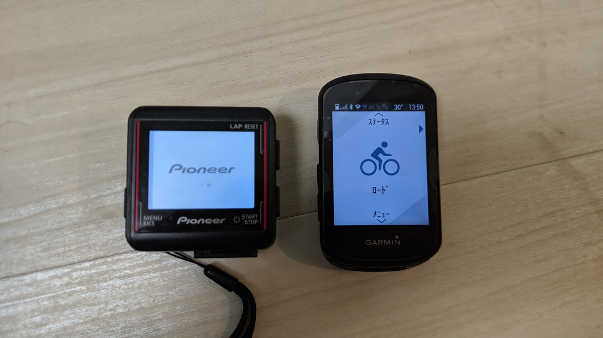
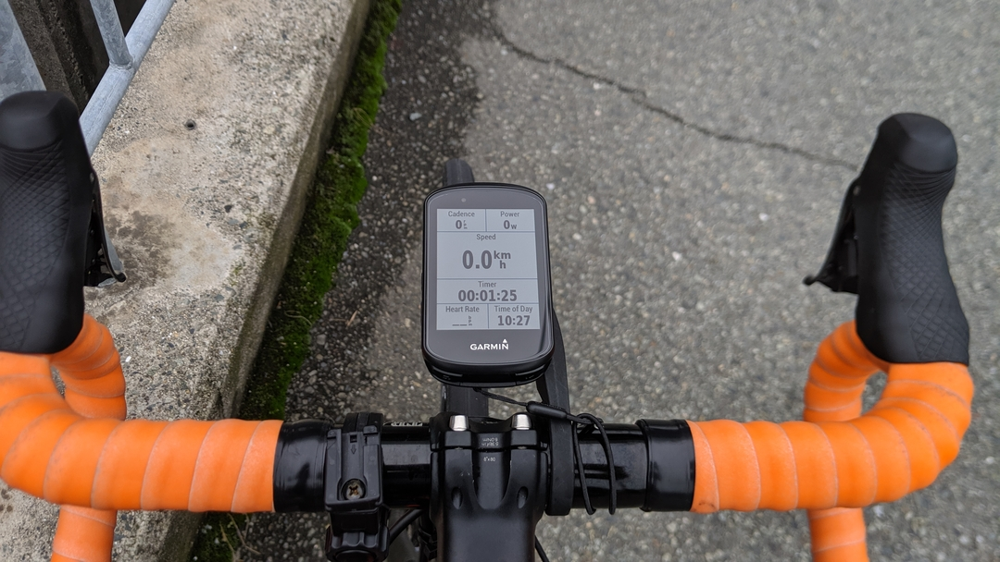
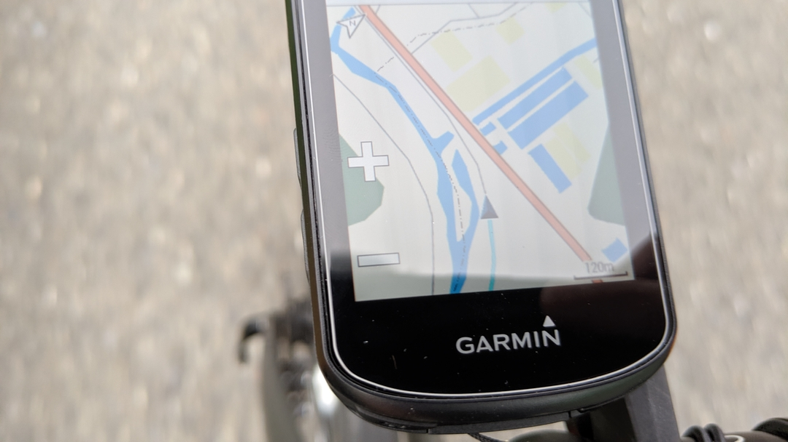
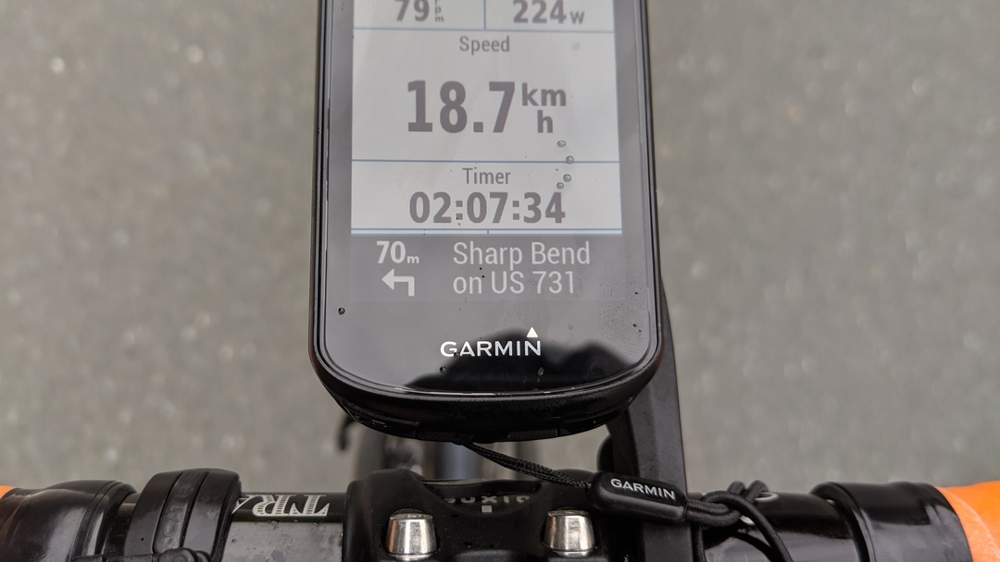
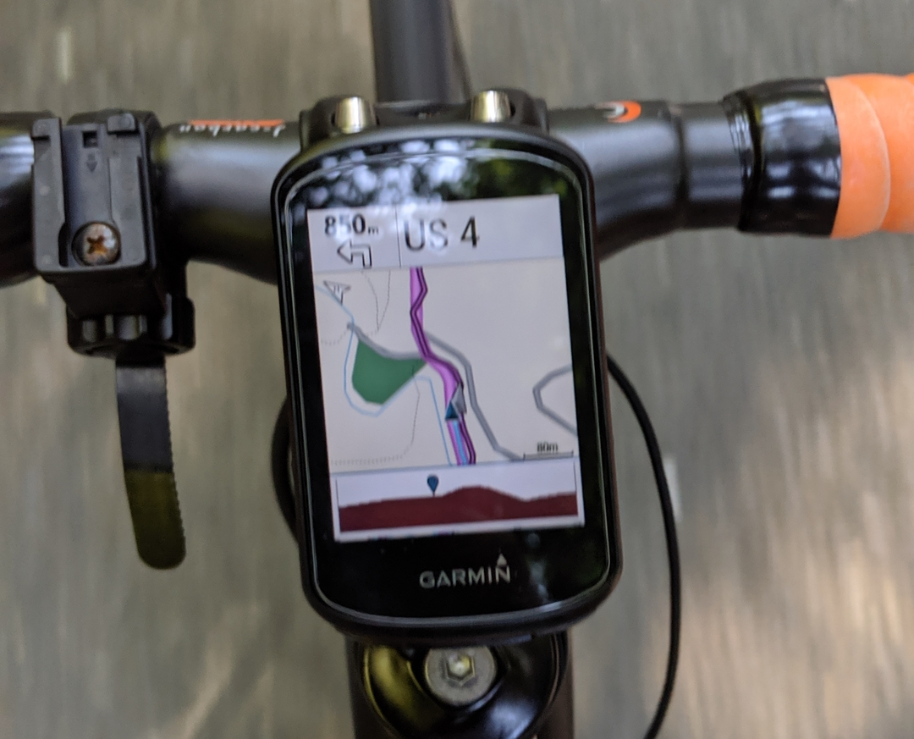
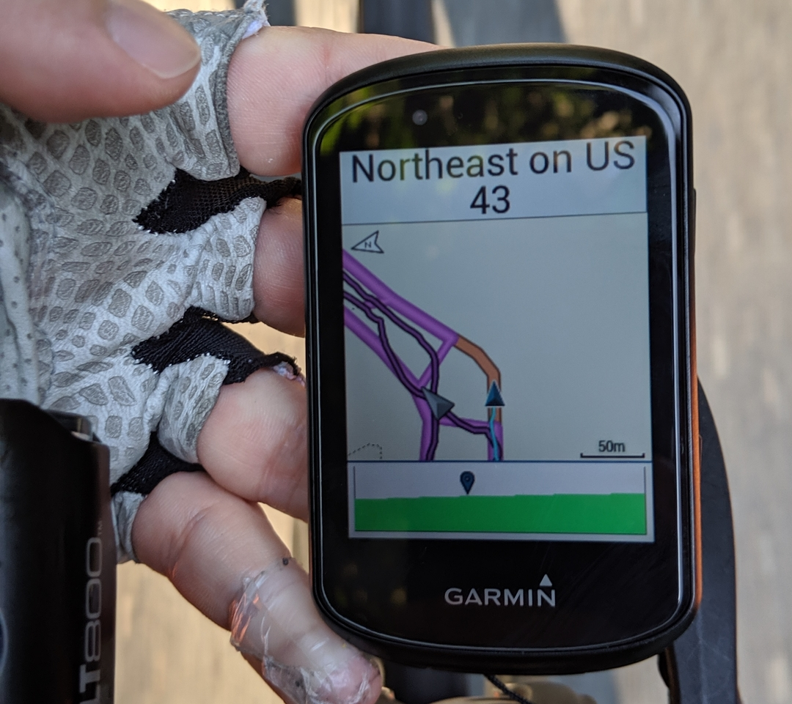
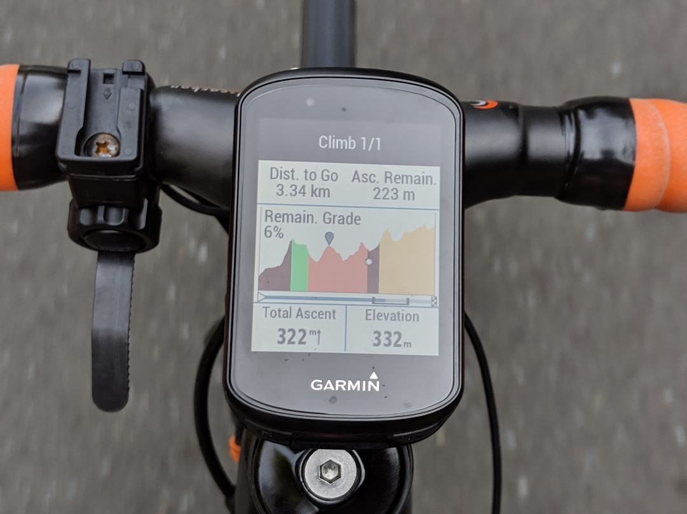

## そして GARMIN に戻る...

[Pioneer](https://amzn.to/2Z1Co5i)や[Bryton](https://amzn.to/2YZczDe)に浮気していたけれども、WEBサービスの完成度の点でGARMINにまさるメーカーはなかった。  
結局精度よりもデータをどう使うかが大事なので…

入力ベクトルデータは未だに上手く活用できる手段が考案されないし、シクロスフィアのUXは遷移が遅すぎて最低だしBrytonはそもそもStravaないとまともに機能しない。  
ライフログ用に[ForeAthlete45](https://amzn.to/33GjkIG)を買うことも決めていたので、GARMIN出戻りを決意。

MTBダイナミクスにかなり期待していることもあってEdge530を発売日にIYH！シェイクダウンがかなり遅くなってしまったがひとまずインプレを。  
(しかもMTBではまだ使っていない）

<Amzn asin="B08DD3LRH3">

## インプレ

### とにかく見やすい！

CA500を使っていた身からすると、まず液晶のクリアさに感動する。520から変わっていないと思われるがCA500から考えると隔世の感がある。

タッチパネルではないものの、汗で誤爆するのは嫌なのでこれはこれでメリットあり。ちゃんと簡単な操作でマップの拡大縮小もできます。初めて利用する機能を起動するとガイドを初回だけ表示してくれるのは最近のWEBサービスっぽいところをそのままサイコンに持ってきたようで好印象。

マップ機能はサイコンにいらないと思っていたのだが、あればあるでそれなりに便利に使える。

マップ認識で急カーブをアラート音と表示でお知らせしてくれる。登りだと鬱陶しいが初見のダウンヒルではそれなりに役に立つであろう機能。

### Route & Climb Pro

Edge530イチオシのルート関連機能。GARMIN CONNECTで公開されているルートや自分で引いたルートを取り込んで表示したり入り口までナビしたりできる。初のナビ機能だが操作はサクサクで必要十分に思える。  
ClimbProでなくとも簡単な高低差は表示してくれる（要インポート）

こちらは実走行GPSログから取得したルートを使った場合だが、誤差だらけなので曲がり角がまるで役に立たない…ナビに使うならポイント指定して引いたルートをインポートして利用したほうが良さそう。

そしてこれが目玉のClimb Pro！残り距離と残り獲得標高と登り返しの回数をすべて見せてくれる心折設計のヒルクライムツール。

とはいえ、ルートを予めインポートして、走行中にナビを手動でONにする必要があるためツールの実況画面のように登りに突入したら自動認識して起動してくれるわけではないのでまだ改善の余地ありと感じた。  
ひとまずこの見た目だけでテンションが上がるのでまぁよし。

### バッテリー持ち

バッテリー持ちは最高。6時間ほどのライドを2日連続で行って帰ってきてもまだ余力あり。毎日充電せずとも週末終わったら充電！くらいのペースでよさそう。

#### 2020/2 追記

バッテリーセーバーモードがすごい。バッテリー半分以下でスタートしても7時間程度のライド中安心して使っていられます。

バッテリーセーバーモードの場合、アクティビティは記録しつつ、通常ライド中は画面が消えます。それでいて、ルートの通知や急カーブの警告・スマートフォン通知のときだけ画面点灯してお知らせしてくれます。むしろライドに集中できてロードに乗るときは常時バッテリーセーバーを使ったほうが良いかもしれないレベル！

<Amzn asin="B08DD3LRH3">

## 総括

正当進化したEdgeという感じ。500 ～ 520の間のアップデートより520->530のほうが機能的にアップデート幅が多かった（というよりこの間サイコンの機能的進化がバッテリーに偏重していた用に思える）ので、ここに来て「ライドのサポート」ツールとしてより進化したギアとしての印象がある。**ついでだから充電端子を USB type-C にすれば完璧だったのに**

MTBダイナミクスは見ていて楽しいので、トレイルとパークで試したインプレをどうぞ。

<LinkBox url="https://blog.gensobunya.net/post/2019/11/edge530_mtbd/" />

スマートアラート機能もすごい

<LinkBox url="https://blog.gensobunya.net/post/2021/08/edge_smart_alart" />
