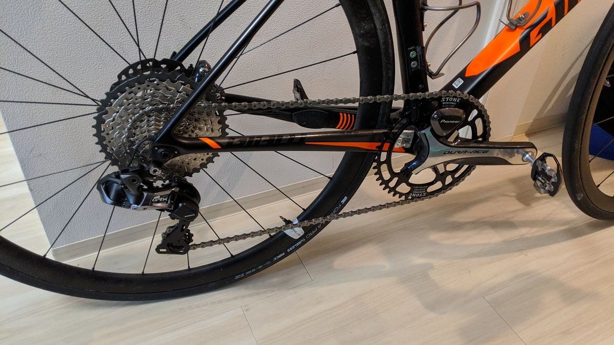
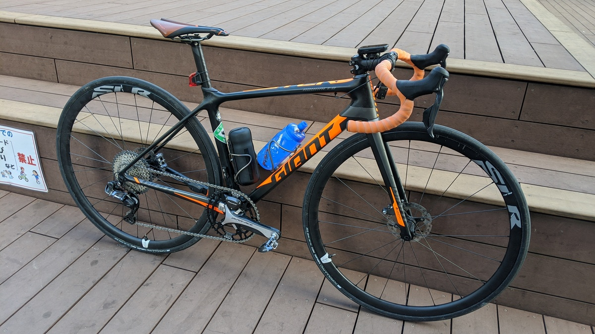
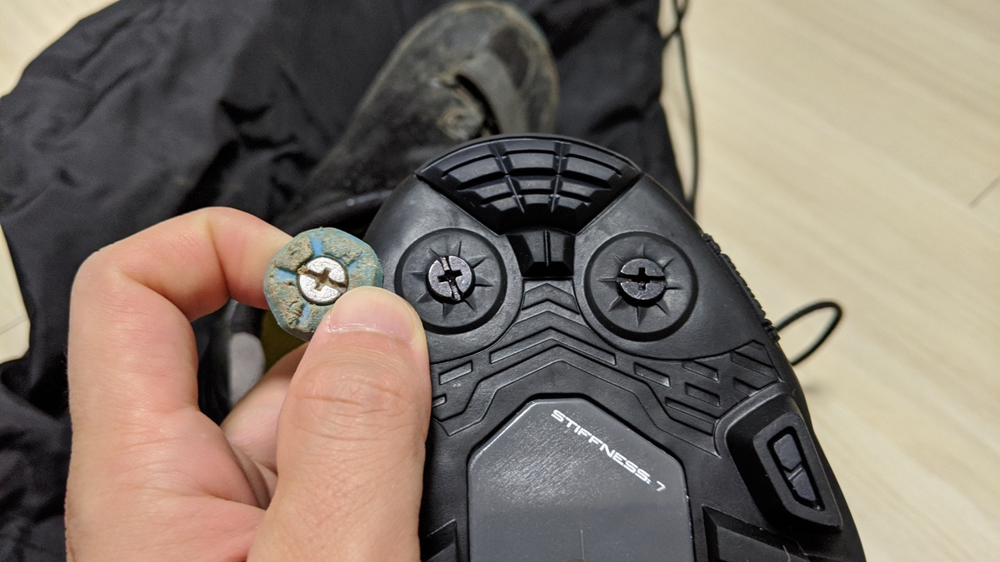

先日の[記事](/post/2020/01/tcr_allroadize/)の通り、ロードバイクをSPDペダルで乗るようになり、これに合わせてシューズもXC系シューズを常用することになりました。

## 最軽量ロード SPD ペダル PD-ES600

ボディが小さいだけあり、ロードバイクに合わせた際の違和感の無さはさすがです。SPD-SLペダルと同じく前が長く後ろはテンション調整機構のみになっているせいもあって先代軽量ペダルである[A600](https://amzn.to/3aWAbKM)よりロードっぽい印象です。重量もちょっと軽くなっており、最軽量という枕詞をつけられる良さも合わさってロードSPDではファーストチョイスと言ってもいいでしょう。

軸や表面の見た目はだいたい、アルテグラグレード相当です。ローグレードのスチール軸と違って六角レンチをかけたときの素材の硬さも感じます。  
シマノペダルらしく手でくるくる回るわかりやすい回転の軽さがあるわけではありませんが、しっかり前部のつま先が上を向いて止まってくれるので、クリート嵌めが失敗することは稀です。

裏側を踏んでいてもわかりづらいのはご愛嬌。SPDは表も裏も出っ張りがあるので裏面との足の裏感覚の差がありませんね。

## リーズナブルな SPD シューズ SH-XC501(XC5)

<Amzn asin="B07XNX5RLG">

このシューズの特筆する点は、1万円半ばというプライスながら、非常に軽量な点です。  
最軽量SPDシューズたるグラベルレーサーシューズである[RX8](https://bike.shimano.com/ja-JP/product/apparel-accessories/shimano-series-lsg-2020/SH-RX800.html)からの重量増はたったの33gで、片側300gを切るSPDシューズはこの2種類のみです。

上位モデルの[XC7](https://amzn.to/2SdZGiv)はBOAダイヤルが2つあることで300gを越えています。  
余談ですが、SHIMANOはほぼ全てのグレードごとにシューズの足型が若干異なる気がしますので、グレードよりフィットを優先したほうがいいかもしれません。

ロードシューズとして使う以上、剛性と軽量性が必要になってくるのですが、RX8の価格でXC501が2足買えてしまうので若干の妥協をすることにしました。何より、CX用のシューズが壊れた際に予備として投入するという役割もこのシューズなら求めることができます（RX8は完全なロードシューズ用途なので降りることが前提のCXには転用が難しい）  
青は実物がかなり綺麗でしたが、黒がAmazonでやすかったのでホイホイつられて黒を買いました…

### 耐久力最強のソール部分

普段シクロクロスで、前の世代の1グレード上にあたるXC7(SH-XC700)を利用していましたので、このソールを使うのは2足目となります。通常2 ～ 3シーズンでソールが剥がれてしまうシューズも多い中フル参戦で3年使ってもびくともしない頑丈なソールです。

XC7はスパイクピン部分に合わせる別部品が付属していましたが、XC501はネジのみです。グリップ力は若干（非常に若干）減るかもしれませんが、なくしてしまう人も多い部品なのでむしろシンプルになっていい感じというところでしょうか。

この通り、青パーツがXC501ではありませんでした。

## 実走行インプレ

40kmほど山間部を走行しましたが、剛性不足は感じませんでした。SPDシューズで公道を長々走ったりコンビニに入ったりするのは実に7年以上ぶりでしたが、思いの外快適です。  
流石に踏面の広さの差は感じますが、CXで慣れているので違和感はありませんでした。  
なによりアパート玄関のタイルで滑る心配がいらない！意外にも一番のストレス軽減ポイントでした！

ペダルキャッチは上から嵌めるというよりも、上死点にあるペダルを蹴り出したままの脚の回転に合わせると、クリート面を合わせやすく簡単に嵌められます。この辺はシクロクロスですぐペダルキャッチする練習をしていた結果か…と思ってましたがSPD-SLのクリートを引っ掛ける動きとほぼ同じでした。

要するにロードと同じ感覚でペダルキャッチするとうまくいきます。意図した設計なのか偶々なのかはわかりません。

デュラエースやXTRペダルほど高くなく、この軽さと感覚と、歩きやすさを考えるとツーリング派やオールロード用の鉄板選択肢になるのではないでしょうか。よく乗り降りをするのであればXTR/XTの両面SPDのほうがストレスは少ないと思います。

<Amzn asin="B07BWC3Y1N">
