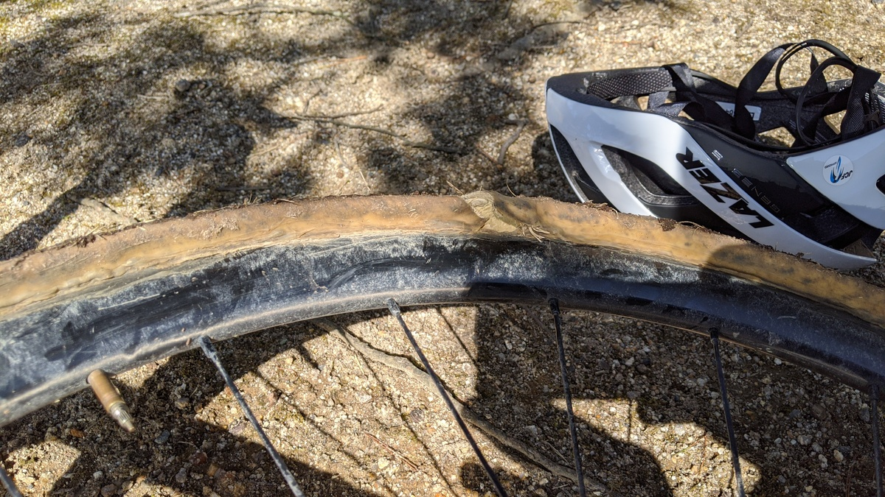
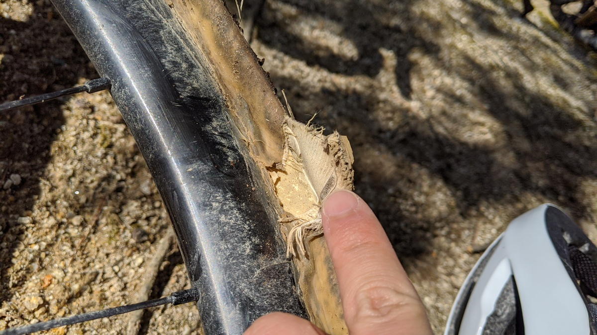
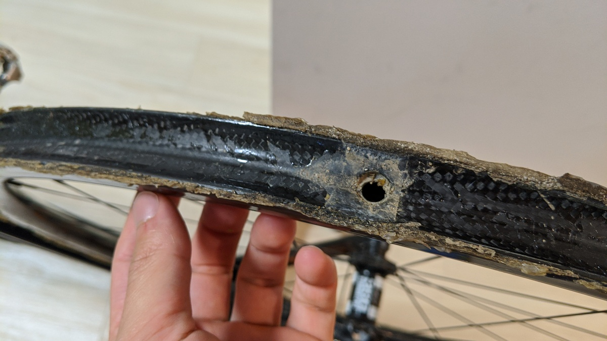
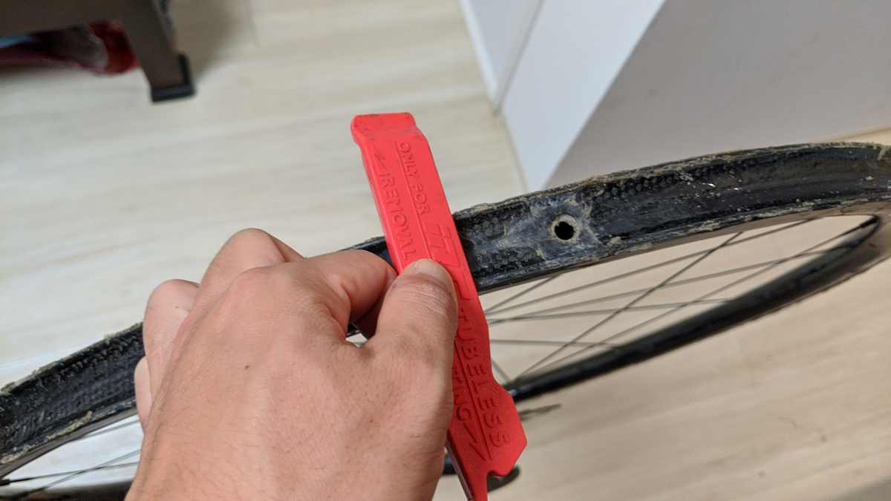
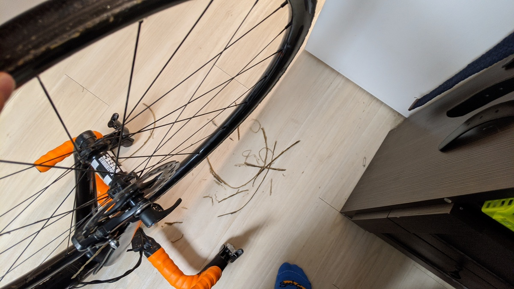
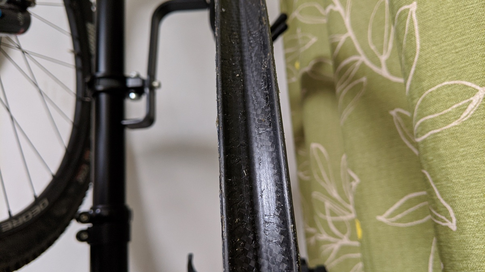

[2 年前に貼った](/post/2018/07/cxtublar/)タイヤがついにシーズン最終戦、関西シクロクロスROSEゴルフクラブの試走中にサイドが破裂してお亡くなりになりました。

このタイヤは[Effeto Mariposa のチューブラーテープ](https://amzn.to/2TsLgLL)で貼ったのですが、見事にタイヤの寿命まで粘着力を維持してくれた計算になります。素晴らしい。

タイヤは内部のラテックスチューブごとサイドのケーシングが破れるように破裂していました。高圧入れたロードタイヤがパンクしたような音と共に…  
通常ならラテックスチューブは生き残りそうですが、シーラントで何度かスローパンクを直していたのでケーシングに張り付いていたのかも？

リムセメントのように1シーズン経ったらもう信頼できないというわけではなく2シーズン丸々運用できたのは非常に良い結果だと捉えています。施工もかんたんですし。

<Amzn asin="B0168TBGR2" />

## タイヤ剥がし・リム掃除

通常、リムセメントでタイヤを貼った場合はこの工程がとても面倒ですがテープなので剥がすだけです。

ただし、さすがCX向きのテープだけあって横向きにタイヤをいくらねじっても引っ張っても全く外れる予感がしません。潔くマイナスドライバーでバルブの反対側から発掘を始めます。一部完全に剥がれたら、あとは力技でもっていきます。

タイヤを横向きにねじって剥がすのではなく、外周（遠心力の働く方向）に引っ張るようにすると面白いように簡単に剥がれていきます。

テープは完全にフンドシ側に残って、リム側には僅かな糊と隙間を埋めた際のシリコンコーキングが残るのみとなりました。

シリコンは簡単には落ちてくれないので、カッターナイフとタイヤレバーで残存部分を切り取ったり削り落としたりしてリムを掃除します。
手間はかかりますが、そんなに難しい作業ではありません。

リムからシリコンコーキングを剥がしてきれいになりました。手順はわかったので、大体1時間もあればここまでもってこれるかと思います。ここまでキレイになればすぐにでも新しいタイヤを貼れますね。

## テープ跡からの考察

さて、2シーズンほぼ全てのレースをこのタイヤで走りましたが、結果的にテープにほぼ泥水が侵入していることはありませんでした。

唯一の例外として、バルブ穴付近だけテープをカットして貼り始めた部分から泥水が侵入して剥がれかけていることを確認しています。サイドのシリコンコーキングは一部裂け始めて防水性があやしくなっている箇所はあったのですがそちら側は浸水したようには見えません。

上記の事象から、サイドからの侵入より、リム穴からの水分侵入がタイヤの剥がれる主要因なのでは？という仮説が立ちました。自分はリムホールレスのホイールしか無いので気にならないのですが…来シーズンからタイヤはタイヤサイドの部分のみコーキング材を塗って、リムとの隙間は埋めないことでサイドのコーキング有無の違いに関して検証していこうと思います。

<Amzn asin="B0168TBGR2" />
