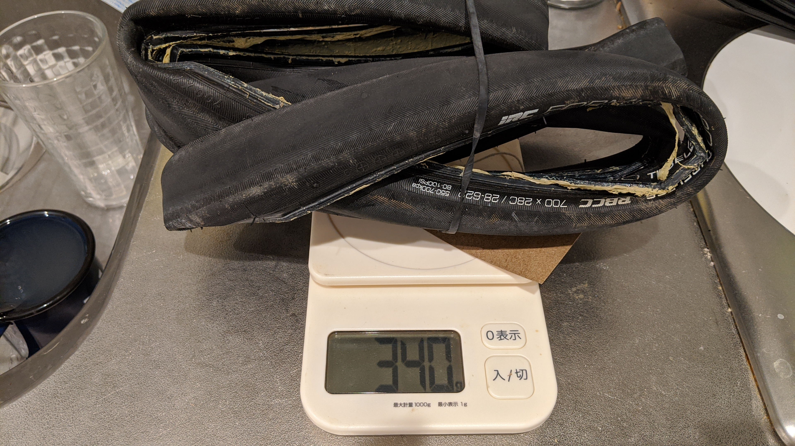
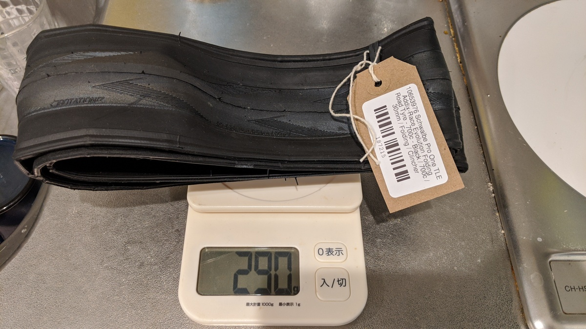
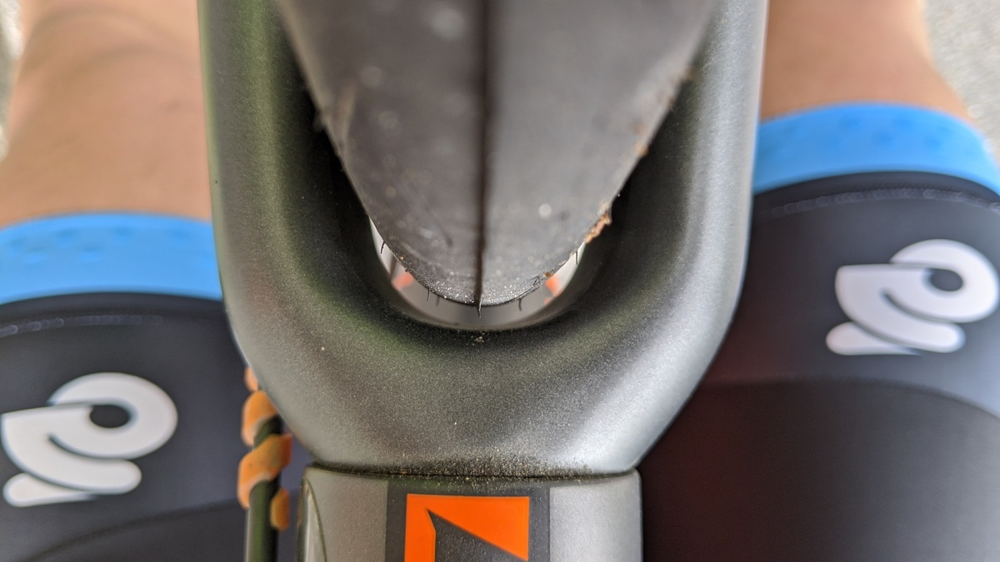
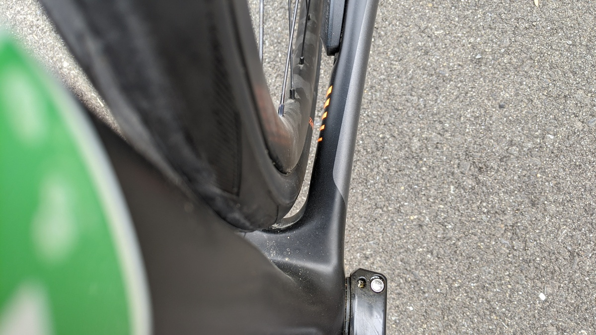

周辺で、最近のロードチューブレスレディはいいぞという声がよく聞こえてきたので、今まで使っていたIRCの[Formula Pro TL RBCC](https://amzn.to/3eJaIWs)からSCHWALBEの[PRO ONE Tubeless Easy](https://www.amazon.co.jp/dp/B07WPV58SC/?tag=gensobunya-22)へ交換することにしました。

<Amzn asin="B07WPV58SC">

結論から言うと、過去使ったどのチューブレスロードタイヤよりも、測って軽く乗って軽くグリップもしっかりという神タイヤです。2021年現在で定価12000円するだけのことはある。

PRO ONEはロードレース向けのタイヤですが、昨今のタイヤ幅・リム幅の拡大傾向に伴ってかなり広いタイヤ幅をラインナップしています。

TLEはいわゆるチューブレスレディのことで、シーラントの使用が前提です。

## 装着

装着そのものは素手であっさりと嵌まりました、チューブレス（以下TL）からチューブレスレディ（以下TLR）になったので、触った感じはかなりタイヤが薄くなりました。重量もRBCCが28cでシーラント付着した状態で340gあったのに対して、PRO ONE TLEは新品状態でわずか290gです。

完全なTLタイヤであるRBCCは気密性についてシーラントが不要なのですが、今はホイール側がほぼTLRになっているので結局シーラントの利用が必要です。昔はチューブレスでリムテープ不要のホイールが結構あったんですけれどね…

[Formula Pro TL RBCC 28c](https://amzn.to/3eJaIWs) (外した際についていたシーラント込）は340g

[PRO ONE Tubeless Easy 30c](https://www.amazon.co.jp/dp/B07WPV58SC/?tag=gensobunya-22) 新品で290g

## タイヤクリアランス

現行の2021年モデルTCRはディスクブレーキモデル32c対応がウリですが、自分のTCR ADVANCED PROは1つ前の世代なので、そんなにクリアランスが広くありません。

フロントクリアランスは、上・左右ともに結構ギリギリです。

リアはそれなりにクリアランスがありますが、それでも2〜3mmといったところ。

写真ではわかりにくいですが、2mmほど左右と垂直方向のクリアランスが確保できています。ISO的には4mmの左右クリアランスが必要な中、2mmは現実的なホイールの歪みを考慮した限界にほぼ近いクリアランスでしょうか。

これは完成車付属のホイールを使っていますが、今話題のZIPP 303sやENVE Foundationのようなグラベルタイヤも履けるようなロードホイールの場合はさらにタイヤ幅が広がってしまうので30cは履けないでしょう。20mm以上のリム内幅のホイールはエアロダイナミクスも考慮した28cが最適になるかと思います。

## 走行インプレ

ライダーの体重は64kg、ビード上げした直後なので、推奨空気圧MAXの5.5 barで乗っています。いつもの峠道を走行。

PRO ONE TLEは重量的にも体感的にもかなり軽快です。

RBCCはこれに比べるとかなり重く（使っている28cは公称320g）、直進安定性が高すぎて、ハンドルが取られる感覚がありました。久しぶりのロードバイクということもあり、住宅街の激坂で軽くダンシングをしていたら2分ほどのセグメントでPRをゲット！

また、路面ギャップをほぼ無効化できるので、28cだったRBCCがかなり固いタイヤに思えてきてしまうほど。やはりというか、エアボリュームは正義です。ただでさえ安心だった下りがさらに安心。

もちろんRBCCの乗り心地が悪いわけではないのですが、軽いホッピングで障害物を越えるときの着地でPRO ONEがしっかりエアボリュームで衝撃吸収してくれるのに対して、RBCCは変形がほとんど感じられませんでした。肘や膝で衝撃吸収をするのですが、PRO ONEではジャンプの程度によってはそれすら不要なほどです。

## ライバルはグラベルキング？

290gという30cとは思えない軽量TLRタイヤであるPRO ONEですが、実は32cで300gを切るTLRタイヤが存在しています。

<Amzn asin="B07D6X5DYX">

グラベルキングのチューブレスレディバージョンは幅広かつ同重量です。グラベル向きなので、当然耐久性に振ってあるため用途によってはPRO ONEより適しているかもしれません。何より国内流通で安く手に入る点がGoodです。色もアメサイドカラーが選べますしね。

TLRタイヤを使ってしまうと、純TLタイヤは重いし固いしなんだったのか…という気持ちにさせられてしまいます。

今はETRTOの再定義もされて、リム規格も安定してきたと言えるので数年前のような相性問題に悩まされることも減っていると思います。事実、今回もインフレーターを使って一発でビードが上がりました。（インフレーターの普及によってフロアポンプによるビード上げを考慮しなくなったのかもしれませんが…）

もちろん、これら2つのタイヤはそもそもターゲットとしているライディングが違うので単純比較してしまうのもおかしいのですが、太いタイヤを求める人は恐らくエンデュランス能力を気にしている人が多いのでは？

太いタイヤが履けることの多いディスクロードのタイヤは、軽快さとグリップのPRO ONE, 耐久性のグラベルキングという観点で軽量TLRタイヤの定番になりそうです。

<Amzn asin="B07WPV58SC">
