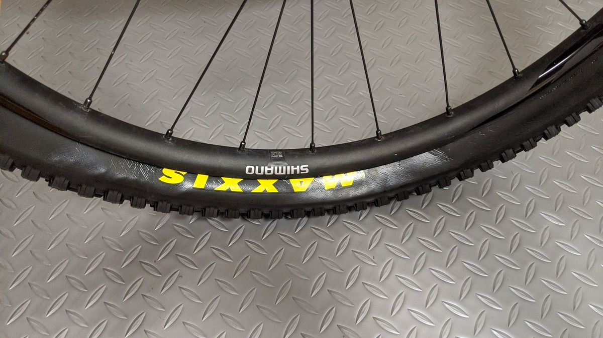

トレイル兼ゲレンデバイクに装着していた [Maxxis High Roller II](https://www.wiggle.jp/maxxis-high-roller-ii-62a-60a-exo-tr-650b-%e3%83%95%e3%82%a9%e3%83%bc%e3%83%ab%e3%83%87%e3%82%a3%e3%83%b3%e3%82%b0%e3%82%bf%e3%82%a4%e3%83%a4)が振れ振れになってしまったので、代わりのタイヤを注文しました。

タイミングが悪く、自分が使っているEXOサイドのものが在庫しておらず、DDサイドのものしかありませんでした。

そのため、後輪にも使っていたAggressorがいい感じだったことも踏まえて[Aggressor の DD-TR モデル](https://www.wiggle.jp/maxxis-aggressor-mtb-wt-%e3%82%bf%e3%82%a4%e3%83%a4-tr-dd)を注文。ふじてんでシェイクダウンしたので軽いインプレを書いておきます。

## そもそも EXO と DD の違いって？

MaxxisのMTBタイヤは同じ銘柄でも星の数ほどモデルの種類があり、非常に混乱します。

大雑把に言うと「コンパウンド」「対応リム幅」「サイドウォール」「タイヤ径」の4つによってモデルが分かれており、EXOやDD
DDという種類はサイドウォール加工の差となります。

詳しくはMaxxis USAの[Bike technology](https://www.maxxis.com/technology/bike-technology)を参照するのが早いです。

image from [Maxxis.com](https://www.maxxis.com/)

EXOはサイドにインナーの対パンク層が仕込まれており、軽量性を保ったままサイド経由のパンクを防いでいます。ただし、ロックセクションではサイドカットに対する耐性が不十分であり、サイドウォールの切り傷や摩耗が起きると書かれています。

image from [Maxxis.com](https://www.maxxis.com/)

DD(正式名称DoubleDown)はブチルゴム層をインナーのビード寄りに追加しています。エンデューロレース向けのサイド加工で、ダウンヒルタイヤ並みのタイヤサポートと保護を提供しているが、比較的軽量であることを謳っています。

### そのほかの Maxxis タイヤ見分け方について

タイヤ径は説明不要だと思いますが、最近は "WT" という幅広リム用のモデルを出しているので間違えないように注意が必要です。特に非対応リム幅リムにこのワイドリム用のタイヤを履かせてしまうことはやめましょう（トレイルタイヤの場合30-35mmがワイド、XCは25-30mmリムがWTタイヤ対応です）

コンパウンドは種類がありすぎて何もわかりません…誰か教えて…

## EXO と DD の同タイヤ比較

Aggressorにおいて、DDとEXOのカタログスペックを見てみます。

| スペック        | EXOモデル | DDモデル  |
| --------------- | --------- | --------- |
| **Size**        | 27.5X2.30 | 27.5X2.30 |
| **ETRTO**       | 58-584    | 58-584    |
| **TPI**         | 60        | 120       |
| **Bead**        | FOLDABLE  | FOLDABLE  |
| **Weight(g)**   | 885       | 1,050     |
| **Compound**    | DUAL      | DUAL      |
| **MaxPSI**      | 60        | 60        |
| **Tech**        | EXO/TR    | TR/DD     |
| **Color**       | Black     | Black     |
| **Application** | MOUNTAIN  | MOUNTAIN  |

まず重量が165g近く変わってきます。DDモデルは1kgの大台に乗っており、トレイルをゴリゴリ登るならちょっと使いたくないレベル。

見た目は…使い古しのタイヤとの比較なので公平ではありませんが、DDの方はサイドがテカって見えます。ふじてんで酷使しているEXOモデルは注意書きの通り、サイドに傷がかなり入っています。

取付の際に印象的だったのは、ホイールに嵌めてからさぁ空気を入れるという段階で床においても、DDタイヤは変形が小さかったということです。

普通のトレイルタイヤだと、この際に自重でつぶれてしまい、中のシーラントをこぼすこともあるのですがまったくその予感はしませんでした。タイヤそのものの剛性の高さを予感させます。

そして、実際にこの予感は実感に変化しました。

自分の場合、シクロクロスを嗜むこともあってタイヤの変形を使ったグリップをさせるのが好きなのですが、EXOタイヤでは1.3気圧程度から高速コーナーでのヨレを感じておりそれを上手くコントロールして破綻しないよう曲がっています。いわゆる腰砕けになりかけの状態。

今回、DDモデルをフロントに履かせたところ、同じくらいの空気圧で空気圧なりの変形はしつつ、腰砕けにならない感覚があって、かなり安心してコーナーを攻められました。

シクロクロスタイヤでのチューブレスとチューブラーの違いに近く、同じ変形でも変形の質が違い、コントローラブルな感じです。（伝われ）

最後の一本は雨に降られてウェットでしたがコントロールを失うこともなく無事フィニッシュ。Aggressorのパターンが優秀なのかDDが優秀なのかはわかりませんが、非常にいい感覚でした。

さすがに1kgともなると登りトレイルで使う気にはなれませんが、フロントだけならなんとか…？ゲレンデコースではどんどん使いたいモデルでした。

<LinkBox isAmazonLink url="https://www.amazon.co.jp/dp/B01D2ZFFCM/" />
