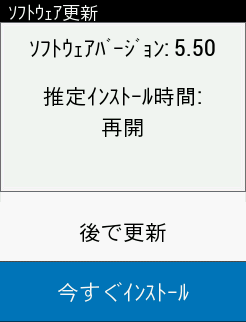

## Edge530 ASIA v5.50

7/31付で更新されていたファームウェアがうちのEdge530にも降ってきました。

ライド中でもスリープから起動したあとは例外なくアップデートの画面になるのでライド中は注意が必要…

## Release note

"Edge530 ASIA" は欧米版と違うソフトウェアっぽいのでバージョン番号も別に管理されています。なぜかASIA版のほうがバージョンが上。

<LinkCard url="https://www.garmin.co.jp/products/intosports/edge-530-bundle/#updateTab" />

> 1. 屋内ライドの改善  
>    ・GPS が利用できない場合 WiFi または Bluetooth を使用して時刻を補正するように改善  
>    ・屋内トレーナーメニューに“フリーライド“モードを追加  
>    ・屋内トレーナーアクティビティ中のデータ項目内に勾配設定を追加  
>    ・屋内トレーナー検索用のリマインダー通知を追加  
>    ・屋内または仮想アクティビティで LiveTrack が自動的に開始されないように変更  
>    ・屋内ライド時にライトネットワークを生成しないように改善
> 2. ClimbPro の改善  
>    ・セグメントページの高度項目に勾配色を追加  
>    ・ClimbPro 作動時に目的地への所要時間データ項目を頂上までの到着予想時間を表示するように改善  
>    ・Garmin Connect から転送されたコースで ClimbPro が正しく動作しない問題の修正  
>    ・ClimbPro ページでのカテゴリーカラーが間違っていた問題の修正  
>    ・短いクライムだと検知されなかった問題の修正
> 3. マウンテンバイク機能設定をすべてのアクティビティプロフィール設定に追加
> 4. 栄養・水分補給表示の最低走行時間設定の追加（設定＞アクティビティプロフィール＞栄養補給/水分補給＞最低走行時間）
> 5. マップ上アクティビティ軌跡のカラーカスタマイズ機能の追加（設定＞アクティビティプロフィール＞ナビゲーション＞地図＞履歴ラインカラー）
> 6. GPS 補足が頻繁に失敗してしまう問題の修正
> 7. デバイス Bluetooth フレンドリーネームに“BLE”と“BT”追加し、区別できるように改善
> 8. デバイス同士のワイヤレスデータ転送が失敗してしまう問題の修正
> 9. ナビゲーションでラウンドアバウトがあると正しくナビができない問題の修正
> 10. 道路外のポイントへナビゲーションを実行すると非常に長いルートを作成してしまう問題の修正
> 11. ルートプランナーオプションの“往復”が正しく機能していなかった問題の修正
> 12. 天気データに関する修正
> 13. ナビゲーション実行時の転換点表示の改善
> 14. LiveTrack 自動開始通知をアクティビティ中 1 回のみ通知するように改善
> 15. LiveTrack の UI 改善
> 16. HR/パワーゾーンのリセット時にゾーンのみをリセットし、最大 HR や FTP はリセットしないように改善
> 17. トレーニングプランのカレンダーページ月/週切り替え UI の改善
> 18. ワークアウト完了時にアラート音が鳴らない問題の修正
> 19. Garmin セグメントの予測時間が間違っていた問題の修正
> 20. キーボード入力が原因でデバイスがシャットダウンしてしまう問題の修正
> 21. 長いコース名に関する問題の修正
> 22. デバイスがロックしてしまう問題の修正
> 23. GPX 変換に関する問題の修正
> 24. 安定性の向上

屋内ライド機能の改善が多いですね、あまり使っていない機能なのでコメントはできません…

残りは新世代のウリであるClimb PRO関連がメインで、ほかは小さな機能改善とバグフィックスです。

地味に、「マウンテンバイク機能設定をすべてのアクティビティプロフィール設定に追加」が面白そうです。グラベルライド中に、専用のプロフィールを使ってもジャンプ等が検知できるようになりました！

ハッキング事件もありましたが、エコシステム含めて優秀なサイコンはGARMIN一択になっているので頑張ってほしいところです。

<Amzn asin="B08DD4H38R">
