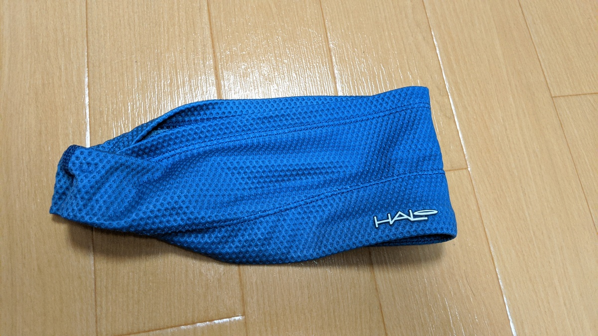
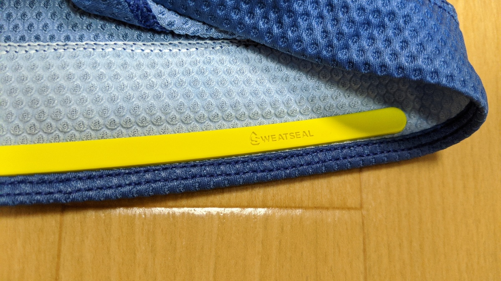
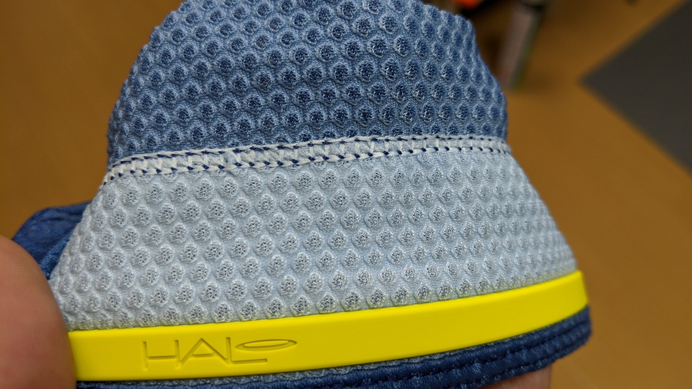
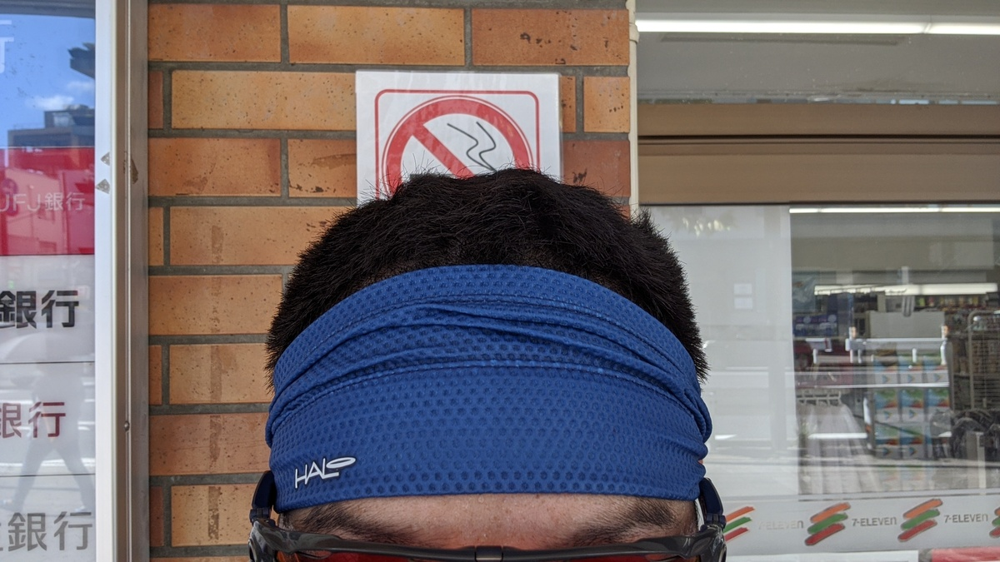

Halo Headbandは一般的なヘッドバンドの内側にシリコンを配置して、汗が目に流れ込むのを防いでくれる機能を強化したヘッドバンド。

自分は汗っかきなので以前購入を検討したことがあったが、イベントブースで試着した際に頭の大きさに合わないことがわかったり、Amazonレビューで保水が限界に達すると普通に目に垂れてくるという書き込みもありその時は購入しなかった。

最近トレイルライドに力を入れたこともあって、顔の前面に垂れてくる汗のうっとうしさが増してきたので再度検索してみたところその両者を解決したと思われる新モデルがあったので購入してみた。

## 購入

購入したのは、[Halo BANDIT JP](https://www.amazon.co.jp/dp/B084ZG18JW/?tag=gensobunya-22)というモデル。

ジャパンフィットモデルを謳っていることと、幅が10㎝ に拡大されていることで汗の保持能力が上がっている。また、一部の "Air" がつくモデルは凹凸のある素材を採用していて、いかにも汗の蒸発を促しそうな見た目をしている（特にメーカーから記載されてはいない）。

自分が購入したのはAir Abyss Blueというカラー。

<Amzn asin="B084ZG18JW">

## 使用レビュー

テストの日は最高気温35度、GARMIN調べだと路上の気温は最高40度というひどい暑さの日。

普段であれば1㎞ 走ったころから顔が汗まみれになってしまう気温だが、テストには最適な日。13時スタートだ。

### 1 時間経過

明らかにアイウェアの中に汗が侵入してこない。

普段はおでこのあたりをグローブで何度拭いても垂れてきてアイウェアを汚したりするのだが、それどころか吸った汗をうまく蒸発させてくれるので、額に当たる風に若干の涼しさを感じる。[LAZER GENESIS](https://www.amazon.co.jp/dp/B0824HR9NL/?tag=gensobunya-22)のエアフローがいいこともあるが、額の部分に穴が開いているSpecializedのヘルメットだとより効果がありそうだ。

## 2 時間経過

流石に熱くなってきたので、頭に水をかけてみたところ保水力の限界を越えてしまったようで前から水が垂れてきた。

Haloバンドを使っているときは、水をかぶるのは後頭部だけにして前は汗の蒸散による気化熱に任せた方がよさそうだ。絞ったらかなり水が垂れた。

## 3 時間以降

日が傾いてきたこともあって汗はもう垂れて来ず。日が暮れた後はむしろ暑くなってしまうので脱いだ。

結局、この日のライドでアイウェアのレンズ部分に汗がかかることはなかった。ヘッドバンドがある前提の冷却プランを考える必要があるものの、期待していた効果はしっかり出てくれたので、あとはシクロクロスレースなどでどういった挙動になるか確認したいところ。

<Amzn asin="B07P5C596H">
