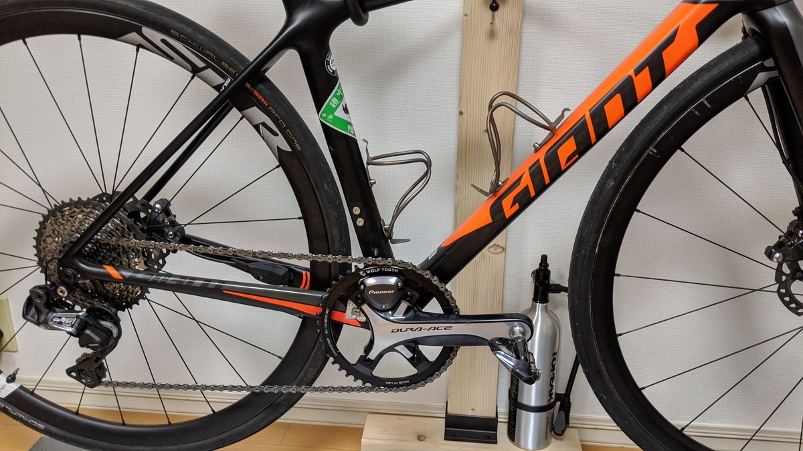
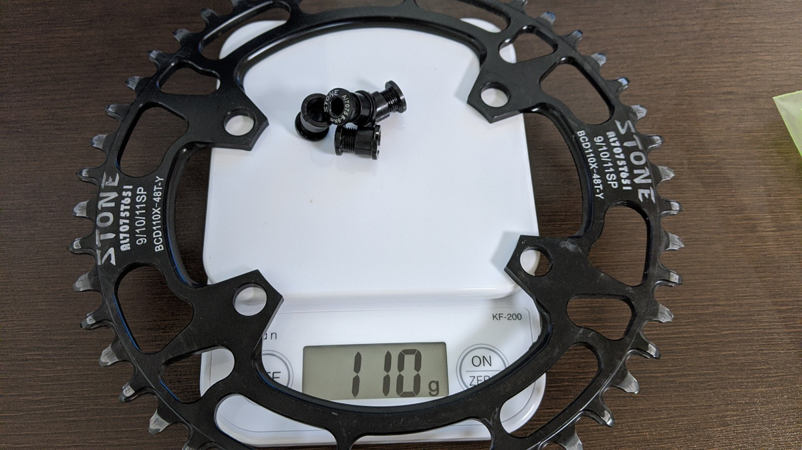
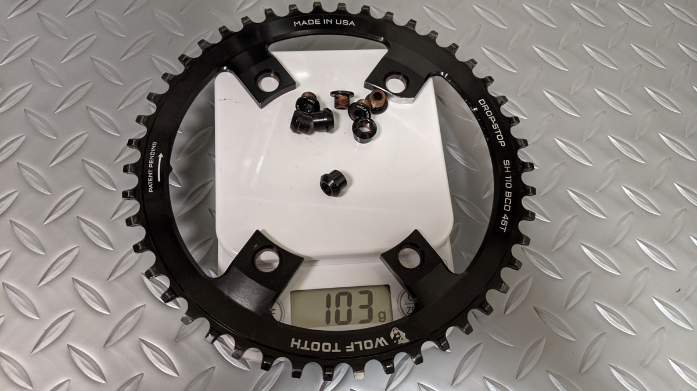

## フロントシングルロードの難しさ

48Tでフロントシングル化したTCR、もちろん今までのギア比を考慮して山岳ライドでも通用するようなギア比を選択していました。

ですが、2700m UPのライドに参加して見事撃沈。計算ではギアが足りるはずだったのですがどうにも脚が回せず…タイヤの太さによる周長UPやたすき掛けによる抵抗？など要素はいくつか考えられますが事実なのはギアが足りていなかったということ。

翌日には前回の反省を活かしつつ46Tのチェーンリングを手配しました。

## オフセットは重要

選んだのはシマノ4アーム用のWolftooth drop stopチェーンリング。

インナー側にわずかにオフセットしているのと、スッキリしたデザインが特徴。

STONEのチェーンリングに比べると、肉抜きの方針が大きく違います。アーム部分がオフセットしているのでWolftoothのほうが大きく穴が空いています。

重量は、チェーンリングボルト込でSTONEが110g, Wolftoothが103gとWolftoothの僅差勝利。歯数分？

## インプレ

穴が大きくなったので洗車がさらにやりやすくなりました…！

という冗談はさておき、全体的に音鳴りが減りました。オフセット分だけロー側の音鳴りが減るのは想定内ですが、なぜかトップ側も静かに。このあたりは歯の形状が聞いているのでしょうか？さすがフロントシングルの大御所といったところ。

経験上、中華チェーンリングよりウルフトゥースのほうが2倍近く長持ちするので、コストで言うとトントンのはずです。

<LinkCard url="https://www.wiggle.jp/wolf-tooth-110-bcd-%e3%83%81%e3%82%a7%e3%83%bc%e3%83%b3%e3%83%aa%e3%83%b3%e3%82%b0" />
