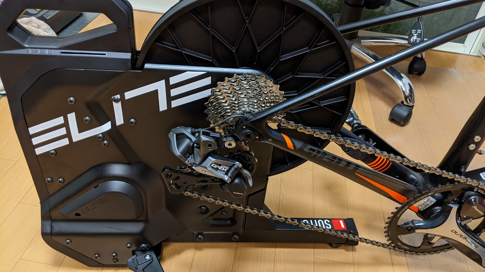
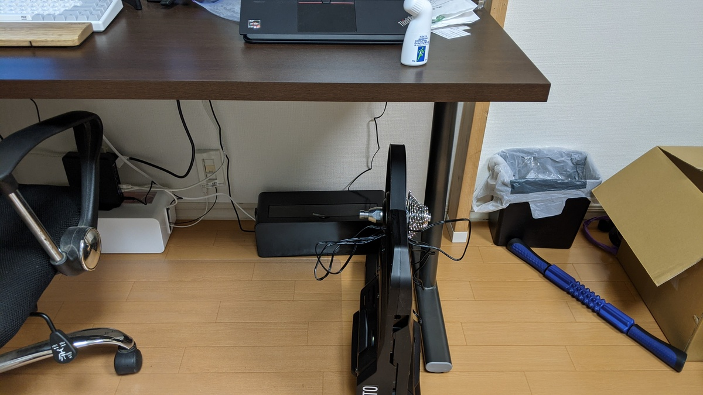
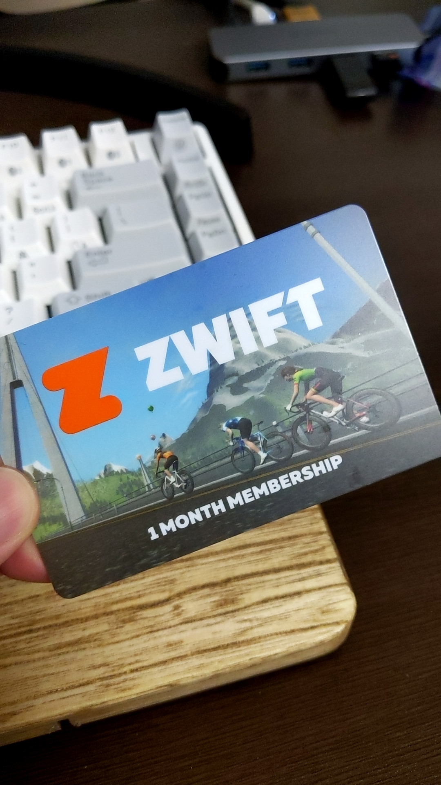
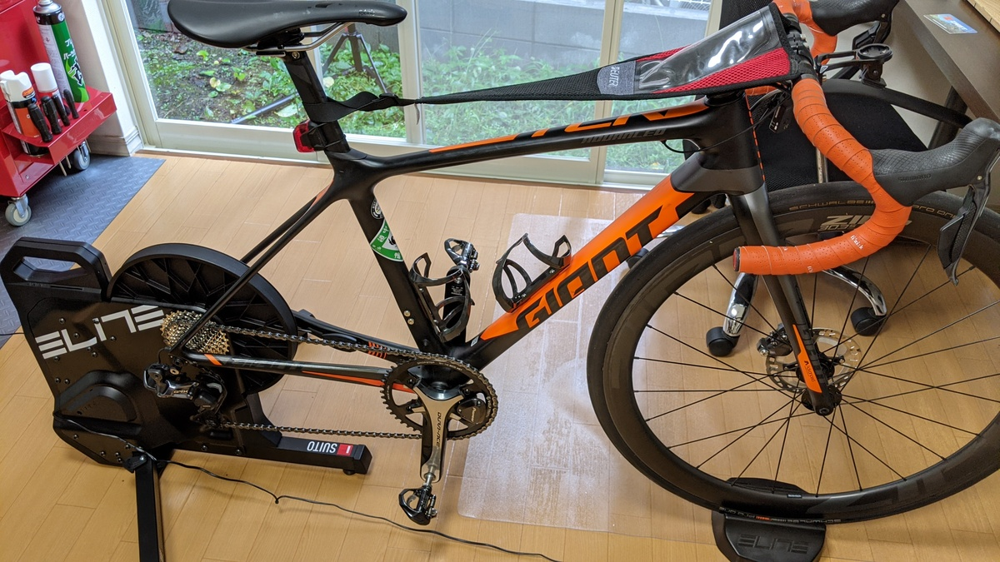

以前は FEEL CYCLE でシクロクロス前の体づくりと維持をしていたが、今年はコロナ禍であまり人との接触をむやみやたらに増やすのもどうかと思って Zwift を再開することに。

FC の会費を考えれば、スマートローラーの価格など実質無料！なのだが保管場所は湧いてこないので、保管に便利そうな Elite の[SUITO](https://ck.jp.ap.valuecommerce.com/servlet/referral?sid=3171302&pid=887657037&vc_url=https%3A%2F%2Fshopping.yahoo.co.jp%2Fproducts%2Fz79dtn4n2v)を購入してみた。

<LinkBox
  url="https://shopping.yahoo.co.jp/products/z79dtn4n2v"
  linkurl="https://ck.jp.ap.valuecommerce.com/servlet/referral?sid=3171302&pid=887657037&vc_url=https%3A%2F%2Fshopping.yahoo.co.jp%2Fproducts%2Fz79dtn4n2v"
/>

## 特徴

1. 単体 PM・各種センサー機能
2. ERG モード対応
3. PM ブリッジ機能（パワーメーターリンク）
4. コンパクトな収納と静音性

Zwift はレースよりもトレーニングで使いたいので、重視したのはスマートローラー 1 つでバーチャルライドが完結する点。

パワーメーターはもちろん、ケイデンスも特殊なロジックを用いてセンサーレスで読み取ってくれる。BT と ANT+両方に対応しているので PC 側の準備もどちらかに対応していればよく、非常にシンプル。ERG モードも対応しているので、バーチャルライドのトレーニングに必要な機能は一通りそろっている。

価格としてはエントリーモデルになるので、パワーメーターそのものの精度はそこまでよろしくないらしい。また、スマートローラーと実走を併用しているとパワーメーターの誤差による修正が必要になる場面が出てくる。

Suito では、この問題の解決としてバイクについている PM のデータをスマートローラーが中継して送信するという機能が備わっており、常に同じパワーメーターの測定値でリアル・バーチャル両方のライドをこなすことも可能。

今の自分にはあまり必要がないが、[パワーメーターを比較してしまうほどパワートレーニングを真面目にやっている人](https://skmzlog.com/2020/08/17/4iiii-precision-2/)なんかには有用そうだ。たぶん。

収納時は足を折りたたみ、机の下に収納できる。ハンドルもついているので作業も楽々。

間取り上リビングのど真ん中にローラーが来てしまうので、邪魔な時にこうして仕舞いやすい形になっているのは非常に助かる。

## おまけ

Zwift と Elite のトレーニングプラン 1 か月分のトライアルがついている。Zwift に関してはありがたく頂いた。

## インプレ

漕ぎだしてまず感じたのは圧倒的な静かさ。

自分が Feedback の[ポータブルトレーナー](https://www.wiggle.jp/feedback-sports-omnium-%e3%83%9d%e3%83%bc%e3%82%bf%e3%83%96%e3%83%ab%e3%83%90%e3%82%a4%e3%82%af%e3%83%ad%e3%83%bc%e3%83%a9%e3%83%bc%e3%83%88%e3%83%ac%e3%83%bc%e3%83%8a%e3%83%bc)以来のローラー購入で、かなり世代が空いているというのもあり、近年のローラーの進歩に驚かされた。脚の細さにやや不安を感じていたが、剛性感も問題なし。

まずは Zwift Workout の Miracle をやってみたのだが、ERG モードがデフォルトで ON になっていたため、期せずして ERG モードのワークアウト体験をすることに。

ERG モードはターゲットパワーに収まるよう、現在のケイデンスに対する負荷トルク量を自動的に変更してくれる機能。言葉で書くとわかりづらいが、要するに「常にターゲットパワーでペダルを回す」機能だ。

Zwift 初期に「頭を使わなくてもパワトレができる！」という記事を書いた覚えがあるが、その感想すら時代遅れに思えるほど「何も考えずにパワトレができる（2020 年版）」といった具合。以前はメニューのターゲットパワーに対してシフトチェンジやケイデンスアップをして自分でパワーを合わせる必要があったが、ERG モードで人間が考えるのはケイデンスの維持のみである。

半面、自分の脚に合わないメニューをやると、パワーが多すぎて回せない → トルクが重くなる → ますます回せなくなる、という負のスパイラルに陥るので適切な FTP 設定が必要になるのだが…

この影響で、ERG モード中に足を止めるとトルクが最大になってしまい再度漕ぎ出すことが難しくなってしまう、という現象も起きる。メニューがキツいと感じた場合や逆にヌルいと感じた場合も対応しないと時間を無駄にすごすことになりそう。

以上の理由もあり、スマホ側のコントローラーはほぼ必須。中華製品の[スマートフォンポケット付きスウェットガード](https://amzn.to/3j4nKR3)を使って手元でコントロールしている。

ERG モードによるトルク変動は数秒～ 10 秒ほどのラグがあるので、1 分以内の出力変化があるタバタのようなトレーニングには不向き。場合に応じて使い分けが必要そうだった。

## まとめ

精密なパワーを求める人には向かないかもしれないが、それもパワーメーターリンクにより解決できるので、保管場所が限られている人向けのスマートローラーとしては価格もこなれていて非常に良いように感じた。

<PositiveBox>

- 有名ブランドのスマートローラーとしては低い価格帯
- パワーメーターリンクによる実走行時と同じパワーメーターを利用可能
- 収納時の圧倒的なコンパクトさ

</PositiveBox>

<NegativeBox>

- 内蔵パワーメーターの精度がハイエンド機種に比べて劣る
- 脚の開きが少ないので、高パワーでもがいた時の安定感にやや欠ける

</NegativeBox>

<LinkBox
  url="https://shopping.yahoo.co.jp/products/z79dtn4n2v"
  linkurl="https://ck.jp.ap.valuecommerce.com/servlet/referral?sid=3171302&pid=887657037&vc_url=https%3A%2F%2Fshopping.yahoo.co.jp%2Fproducts%2Fz79dtn4n2v"
/>
