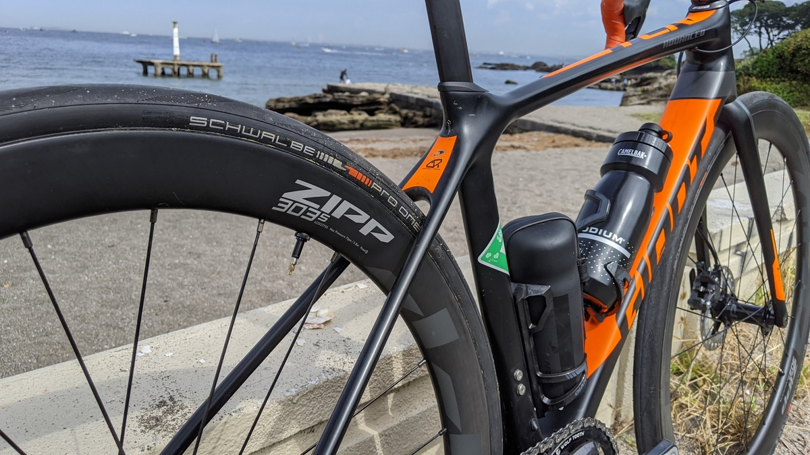
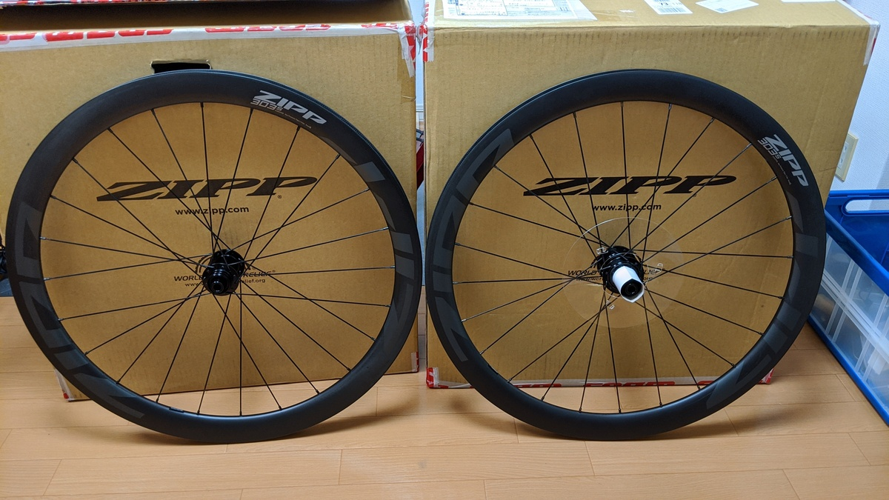
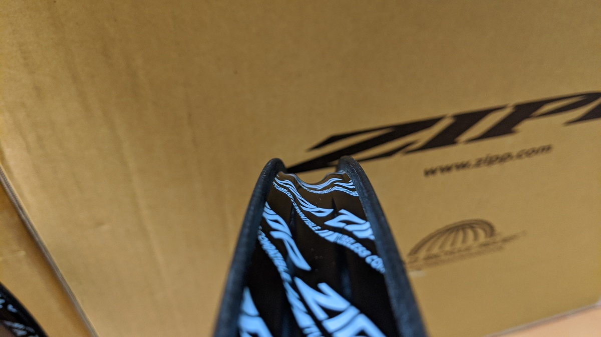
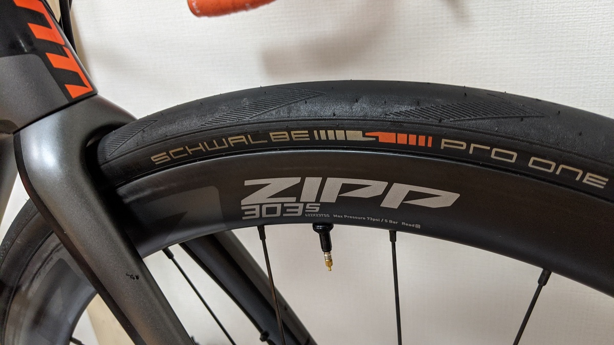
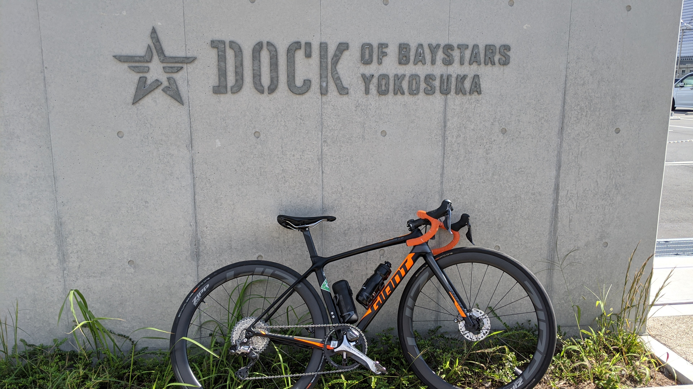
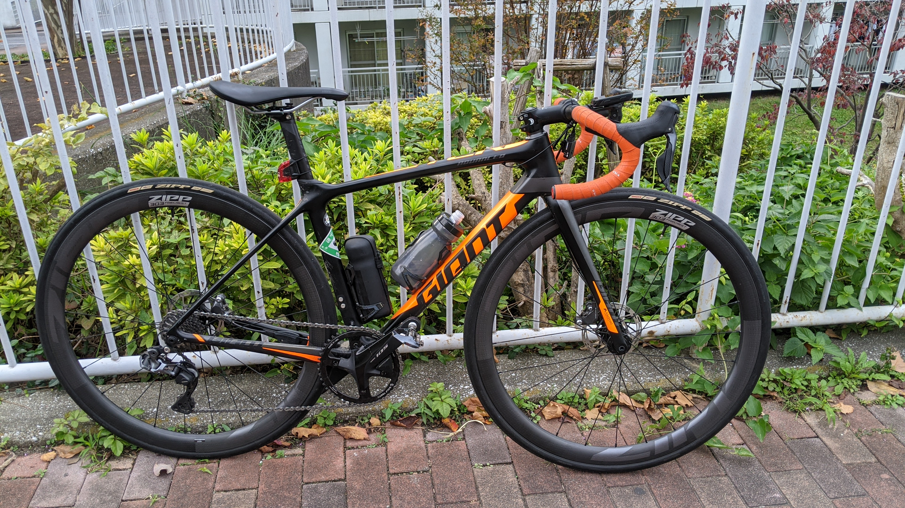

完成車付属の SLR1 ホイールをグラベルライドで破壊したあと騙しだまし使って足掛け 3 年、ようやく新世代のスタンダードになりそうな潮流がきたので最新のホイールにアップデート！

フックレス＋幅広リムの[ZIPP303S](https://paypaymall.yahoo.co.jp/store/qbei/item/pc-810594/)を購入しました！

## ディスクロードのホイール回想

[初代 TCR Advanced PRO disc のインプレ](/post/2016/10/tcr-advanced-pro-disc_2nd/)でも述べたように、第 1 世代ディスクロードとも言うべき世代のディスクロード用ホイールはお世辞にもよくありませんでした。

増えたスポーク数により悪化したエアロ性能、前評判ほど変わらなかったリム重量など…熱問題の解決により、安心してラテックスチューブが使える程度の変化しか起こりませんでした。

SLR1 はカーボンホイールなので重量に関してはアルミのディスクロード用ホイールのネガを解消していましたが、特筆すべきところもないホイールでした。

しかし 3 年ちょっと経ち、更なるリムとタイヤの幅広化による空気抵抗・路面抵抗の低減というアプローチが為され、今では 28c がスタンダードになろうとしています。そして MTB で普及しだしたフックレスチューブレスを取り込んだことで大きくホイールも軽量化しました。

[GIANT](https://www.giant.co.jp/giant21/showcase/slr-wheelsystems/), [ENVE](https://www.cyclowired.jp/news/node/322217), [ZIPP](https://www.cyclowired.jp/news/node/323522)の 3 社がフックレスカーボンチューブレスのディスクロード用ホイールを投入し、圧倒的な軽さを手に入れました。

ロード用ホイールは高圧に耐える必要があったため、重量をそこまで削減できませんでしたが、これまでの幅広化により徐々に常用空気圧を減らしており、フックレスホイールではタイヤのエアボリュームを更に上げられます。

そのため、ロード用タイヤでは今まで考えられなかったような空気圧（3 ～ 4 気圧台！）での運用が推奨されており、リム構造の単純化も相まって、かなりの軽量化を果たしています。

## First impression

モデルとしては 302 の後継、つまり ZIPP の中ではローグレードなので、ZIPP の代名詞でもあるリム表面のディンプルはありません。

公称ではペア 1530g なので、SLR1 比でリムハイトが+15mm にもかかわらず、およそ 100g 軽量化されています。

フックレスのストレートリムウォールは新鮮ですね。MTB でもまだ使ったことはありません。

今回利用したタイヤはシュワルベの[Pro one evo TLE](https://www.wiggle.jp/schwalbe-%e3%82%b7%e3%83%a5%e3%83%af%e3%83%ab%e3%83%99-pro-one-evo-%e3%83%81%e3%83%a5%e3%83%bc%e3%83%96%e3%83%ac%e3%82%b9%e3%83%95%e3%82%a9%e3%83%bc%e3%83%ab%e3%83%87%e3%82%a3%e3%83%b3%e3%82%b0%e3%82%bf%e3%82%a4%e3%83%a4)。手持ちの都合で 28c だったり 30c だったりします。

<LinkBox
  url="https://store.shopping.yahoo.co.jp/qbei/pi-634536.html"
  linkurl="https://ck.jp.ap.valuecommerce.com/servlet/referral?sid=3171302&pid=887657037&vc_url=https%3A%2F%2Fstore.shopping.yahoo.co.jp%2Fqbei%2Fpi-634536.html%3F"
/>

30c のタイヤを装着すると、ややタイヤの方が大きくなります。リアは 28c なのでほぼツライチになりました。28c が最もエアロ性能が高くなるらしいです。

## RIDE Impression

三浦半島を雑に一周しましたが…平地がめちゃくちゃ速いです。

エアロ効果もさることながら、路面抵抗も少なくなっているというのは体感できます。Strava の PR も平坦区間で総ナメですので、気のせいではなく速くなっています。感覚的には 1 人で走っているのに、少人数トレインくらいの巡行しやすさを感じます…すごい。

軽くてエアロ性能がいいので、ちょっとした丘や本当に少し上っているような局面での失速がほとんどありません。しかも振動カットの効果が高く、本当に疲れない！

新型 303 firecrest がこれよりいいホイールというのがちょっと信じられないくらいです。これよりいいホイール作れるんだ…（試乗できたので記事末尾に比較インプレ追記しました）

なお、この日の空気圧設定は [ZIPP のツール](https://axs.sram.com/tirepressureguide)を利用して算出しました。

<blockquote class="twitter-tweet">
  

    今日はZIPP様の言う通りにしてみる{" "}
    <a href="https://t.co/zGvgx5JEjk">pic.twitter.com/zGvgx5JEjk</a>
  

  &mdash; ゲン (@gen_sobunya) <a href="https://twitter.com/gen_sobunya/status/1312197246050398209?ref_src=twsrc%5Etfw">October 3, 2020</a>
</blockquote>

なんと前後 4 気圧以下！

ちなみにこのホイールの最大空気圧は 5 気圧となっています。

## 欠点: ビード上げがとても大変

走行性能はとんでもなく高いことがわかったのですが、それと引き換えに後輪のみビード上げに四苦八苦しました…

ロードチューブレスはもう 10 年近く使っているので、装着・ビード上げにはかなりの自信があったのですが……過去最大の苦しみを体験しました。（尚、フロントはフロアポンプであっさり上がったので製品公差によるものである可能性が高いです）

シーラントは[Effetto mariposa caffelatex](https://www.wiggle.jp/effetto-mariposa-caffelatex-%e3%82%bf%e3%82%a4%e3%83%a4%e3%82%b7%e3%83%bc%e3%83%a9%e3%83%b3%e3%83%88-1000ml-)を使い、リム内部には石鹸水を塗布して作業しています。
インフレーターは TOPEAK の[tubibooster X](https://amzn.to/3nj5GF2)での経験です。[tubibooster X](https://amzn.to/3nj5GF2)のレビュー記事はこちら。

<LinkBox url="https://blog.gensobunya.net/post/2020/06/tubiboosterx/" />

<LinkBox isAmazonLink url="https://www.amazon.co.jp/dp/B07XHGM23B/" />

1. 前のホイールで利用していた手持ちの Schwalbe PRO ONE TLE(現行モデル) 30c をフロアポンプで空気入れ
2. 同タイヤをインフレーター（仏式）で空気入れ
3. 同タイヤを バルブコアを抜いてからインフレーター（米式）で空気入れ(ここでタイヤ側の不良を疑って新品を発注)
4. 新品の Schwalbe PRO ONE TLE(現行モデル) 28c を使いフロアポンプで
5. 新品タイヤをインフレーター（仏式）で空気入れ
6. 新品タイヤを バルブコアを抜いてからインフレーター（米式）で空気入れ
7. 社外品のチューブレステープをもう一周巻いてインフレーター（米式）で空気入れ

ここまでやって何とか上がりました。さすがにおかしくないか？ということでショップともコミュニケーションも取って不良品かどうか調査しましたが、一応ビードの位置を慎重に調整すればビードが上がるということで、正常品の範囲内との判断になっています。

バルブコアを抜いてビード上げをすると、当然ポンプを取り外した際に空気が抜け、その際にビードが落ちてしまうことがありますが、それも含めて走行中にビードが上がっているのなら問題ないとのことです。（代理店公式回答）

自分の環境でも、ビードを丁寧に中央付近にそろえておいてホイールを浮かせた状態で(重要)インフレーターを使えばビードが何とか上がったので、これ以上は何も言いませんでしたが流石に次回はタイヤを交換する際は[安くて厚めのチューブレステープ](https://www.wiggle.jp/prime-%E3%83%81%E3%83%A5%E3%83%BC%E3%83%96%E3%83%AC%E3%82%B9%E3%83%86%E3%83%BC%E3%83%97)を追加で巻くなどして対応するとは思います。

ZIPP のタイヤを使うといいよ！と言われたけど[Cyclowired のインプレ](https://www.cyclowired.jp/news/node/323522)ではインフレーターすら歯が立たなかったらしいですし…

ちなみに ZIPP 自身は推奨タイヤというものを出しておらず、フックレス構造に対応しているタイヤを使ってね！と言っています。

[サポートページ](https://sram.zendesk.com/hc/en-us/articles/360050355593-What-tubeless-tires-are-compatible-with-Zipp-s-new-MY21-new-logo-303-S-and-303-Firecrest-disc-brake-wheels-)で、「タイヤメーカーがフックレスで使える」ことを明示したメーカーとして

- Zipp - Tangente Speed RT25, R28, and the Tangente Course G40 gravel tire
- Schwalbe
- Rene Herse
- Pirelli
- Goodyear
- Panaracer(NEW!)
- Specialized: SW Turbo RapidAir in sizes 700x26\*, 700x28, and 700x30
  - \*303 Firecrest hookless rims are not compatible with the 26mm tire

これら 7 社が挙げられています。（2021/2 update）

経験上、タイヤが太ければ太いほどビードは上げるのが簡単になるので、今年発表されたような「32c が入る！」といったロードバイクでは太めのタイヤと組み合わせた方がいいかもしれません。タイヤ装着が楽に越したことはないですし、チューブレスレディタイヤならば太くなっても重量ネガが目立ちづらいです。

とはいえ、早々にチューブレステープの重ね巻きを選択しなかったことが問題でもあるので、上がらない場合はサクッともう 1 周巻いてしまえばこんな苦労はしませんでした。

チューブレステープは消耗品で、へこんできたら交換する必要があるので家に在庫を持っておくことをお勧めします。

<LinkBox isAmazonLink url="https://www.amazon.co.jp/dp/B08QCHSTC7/" />

## まとめ

走行性能は折り紙つきですが、タイヤによっては装着に苦労するので頑張れる人向き？

グラベルロードでも使えるリム幅ですので、高速化を狙いたい人には特にお勧めできます。グラベルロード用のタイヤなら装着も比較的マシになるはずです。

(2021 年追記)タイヤ交換時はおなじ[Pro one evo TLE](https://www.wiggle.jp/schwalbe-%e3%82%b7%e3%83%a5%e3%83%af%e3%83%ab%e3%83%99-pro-one-evo-%e3%83%81%e3%83%a5%e3%83%bc%e3%83%96%e3%83%ac%e3%82%b9%e3%83%95%e3%82%a9%e3%83%bc%e3%83%ab%e3%83%87%e3%82%a3%e3%83%b3%e3%82%b0%e3%82%bf%e3%82%a4%e3%83%a4)を使ったのですが、今度は簡単に上がりました。個体差だったようです。

同じホイールを使っている人に何回か話を聞く機会がありましたが、今回のインプレはタイヤの性能もかなり寄与しているようでした。Pro one の太いタイヤは人気があって高価ですが、値段を出すだけの高い性能が感じられます。

TLR タイヤを使うなら、これかグラベルキングの無印でしょう。

<LinkBox
  url="https://store.shopping.yahoo.co.jp/qbei/pi-634536.html"
  linkurl="https://ck.jp.ap.valuecommerce.com/servlet/referral?sid=3171302&pid=887657037&vc_url=https%3A%2F%2Fstore.shopping.yahoo.co.jp%2Fqbei%2Fpi-634536.html%3F"
/>

<LinkBox isAmazonLink url="https://www.amazon.co.jp/dp/B089K4WB54/" />

<PositiveBox>

- フックレスリムによるエアボリュームの増加、それからくる乗り心地と低走行抵抗
- 国内実勢価格 15 万円程度、海外で 10 万円前後で買える競争力の高い価格
- 当然に低い空気抵抗

</PositiveBox>

<NegativeBox>

- 対応を謳うタイヤの少なさ
- チューブレス特有のビード上げ問題

</NegativeBox>

## 2020.11.8 追記 303Firecrest の試乗をしたので比較インプレ

ワイズロードの試乗会で [303 Firecrest](https://store.shopping.yahoo.co.jp/hobbyride/zipp-wh-1015.html) を自分の自転車で試す機会があったので、乗り比べてみました。タイヤは ZIPP の TANGENTE Tubless です。

店の近くにある練習で使い慣れた坂を使ったため、タイヤとホイールのみの変更での感想となります。

### 平坦区間

303S とあまり変わらず。若干の登りの際に失速する量が 303S よりも少ないかも？エアロと重量どっちかのおかげか。

### ゼロ発進

剛性感が 303S より高いので、気持ちよく加速していく。フリーの爪も 3 爪から 6 爪になったので掛かりが良い。

### 登り・下り

303S になったバネ感が消えシャキシャキと登ってくれる。

### スプリント

試していないが、登りの剛性感を見るに気持ちよく加速しそう（想像）

### 総評

303S → 303 Firecrest の変化はかなり乗り込んでいる場合にしか数値に現れなさそう。ロードレースで加減速を頻繁にする局面では明らかに 303FC のほうが有利だろうと想像はできる。とはいえ、フックレスチューブレスによる疲労の軽減は 303S でも十分恩恵を受けられます。

それと、ZIPP のタイヤはあまりよくないですね…Pro One に比べるとゴムの塊のような硬さですし、Continental タイヤのようなコンパウンドの踏ん張りも感じられません。

