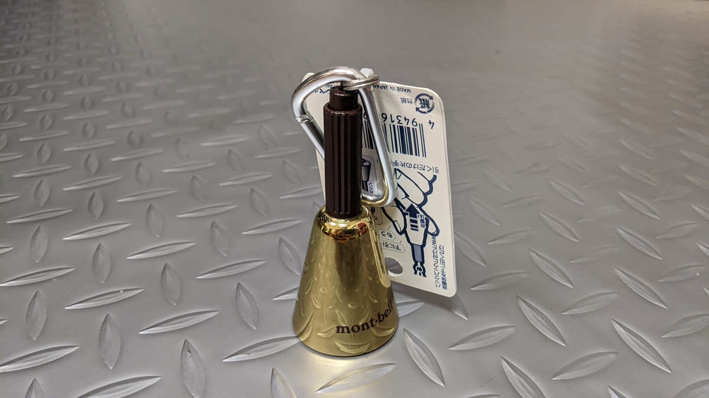

## トレイルでの存在アピール

トレイルライドでは、ハイカーに後ろから接近した時などは降車して追い抜かしているのだが、それでも自転車を持って「失礼しまーす」と声かけするととてもビックリされることが多い。

ラチェット音とかブレーキ音もしているはずなのだが…驚かすのは本意ではないので対策を考えていたところ、キャリアの長い MTB 乗り複数人から熊鈴をおすすめされたので自転車で使えそうなものをチョイスして買ってみた。

## オンロードでは鳴らない、ロッキングベル

買ったのはこちら、mont-bell の[トレッキングベル サイレント](https://webshop.montbell.jp/goods/disp.php?product_id=1124447)。

自転車本体につけるのではなく、トレイルライドでは常用しているバックパックなどにカラビナで付けて利用する想定。どうしても自転車につけたい場合、[Timber MTB Bell](https://www.amazon.co.jp/dp/B01G810KEK/?tag=gensobunya-22)というものがある。どちらも、ベルを固定して鳴らないように設定することができるギミックが付いている。

ベル本体を下にひっぱると固定が ONOFF される単純な仕組み。オンロードのアプローチ中は固定したまま、トレイルに入る前に鳴るように設定すれば最低限のストレスで運用できそうだ。

モンベル製はゴールドカラーのみだが、別のカラーが欲しい場合は、OEM 元と思われる[東京ベルのラインナップ](http://www.tokyobell.co.jp/item_list22.html)がおすすめ。こちらはいくつかのカラーパターンがあるほか、別モデル([TB-K2](https://amzn.to/328skXV)~[K4](https://amzn.to/3oRrit1))も含めると、ベルト取り付け・音量・ベルの形状・カラーなど幅広いバリエーションから選ぶこともできる。

<Amzn asin="B00CXHBQH4" />
