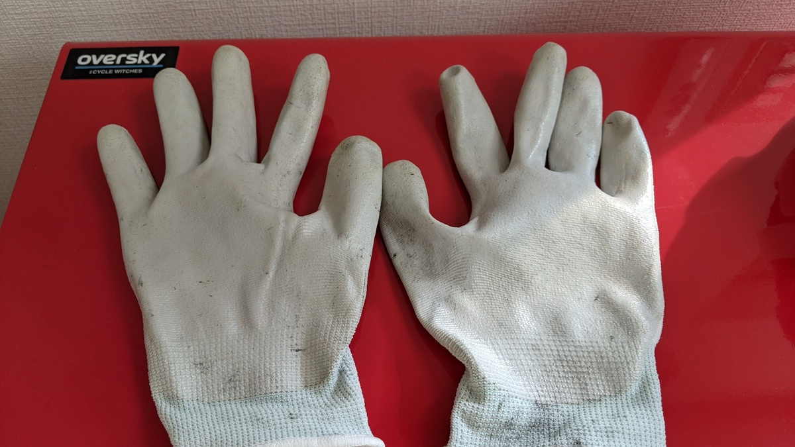

## でかいツーボックスはいいぞ

自転車用品のちょっとした余り、工具、汎用小物などなど…自転車趣味をやっていると兎に角小物が増えていく。

今までは、みんな大好き[スーパーボックス](https://amzn.to/3624bDB)や、[カラーボックス](https://amzn.to/38duDwu)にためこんでいたのだが、いい加減分散しすぎてしまい、どこに何があるのか分からなくなってきたのでオールインワンで処理することができる[AP ツールチェストセット レッド TC766](https://www.amazon.co.jp/dp/B072Z4JKLQ/?tag=gensobunya-22)を購入した。

<LinkBox isAmazonLink url="https://www.amazon.co.jp/dp/B072Z4JKLQ/" />

## なんでも入る大きさ、保管場所は少し注意

これを選んだのは、適度なサイズ感（幅約 60cm）と高さから来る圧倒的収納力。

箱に入っていない中古パーツや、パーツクリーナーのストックを工具と共にまるごと飲み込んでくれた。\
まとめ買いした大阪魂を 10 本ほど放り込んだ上に、ワックスやらクリーナー・シーラント類を入れられる下のキャビネットは圧巻。キャスターで邪魔な時移動できるのも大きい。

もちろん、暑くなる場所に放置するとよろしくないので日陰保管が必須となるほか、このチェストだけで 11.5kg ＋工具・ケミカルの重さが加わり合計 20kg 近い重量物になる。
フロアマットには後が付くこと間違いなしなので、固い場所に置くかシートが必須になる。

## 作業用手袋

[すくみずログ](https://skmzlog.com/2020/08/24/%e3%82%b7%e3%83%a7%e3%83%bc%e3%83%af%e3%82%b0%e3%83%ad%e3%83%bc%e3%83%96%e3%80%80%e7%b5%84%e7%ab%8b%e3%82%b0%e3%83%aa%e3%83%83%e3%83%97/)でもおすすめされていた[ショーワグローブ No370 組立グリップ](https://www.amazon.co.jp/dp/B007OYQXQ0/?tag=gensobunya-22)を使っている。この記事をみるまではテムレスを使っていたこともあったが、テムレスより薄くて使いやすい。

汚れた後も、手袋をつけたまま[AZ 洗いま専科](https://amzn.to/386Xt1y)で洗って乾かせば許容範囲まで綺麗になるので手入れも楽ちん。

<LinkBox isAmazonLink url="https://www.amazon.co.jp/dp/B007OYQXQ0/" />

## 小物入れに Amazon ギフト券の箱

Amazon ギフト券の[ギフトボックス](https://www.amazon.co.jp/dp/B07RW4G3MF/)に、小物入れに使えそうな金属ケースがあるのを発見したので、利用している。5000 円以上のギフト券購入が必要だが、箱自体は無料なのでおすすめ。

裏側が透明で中身が確認できるようになっているほか、内部には緩衝材もある。

## レース用の持ち出し工具セットが欲しい！

こうして自宅の整備セットを作った結果、全工具が外に持ち出せる状態ではなくなってしまったので、遠征用の厳選工具セットを作る必要が生じるデメリットが発生した。

レース現場で必要になる工具は意外と多くないので、こんなツールロールバッグを使ってスマートに持ち歩ける範囲で準備しようと思う。

<LinkBox isAmazonLink url="https://www.amazon.co.jp/dp/B002UGHMBW/" />
