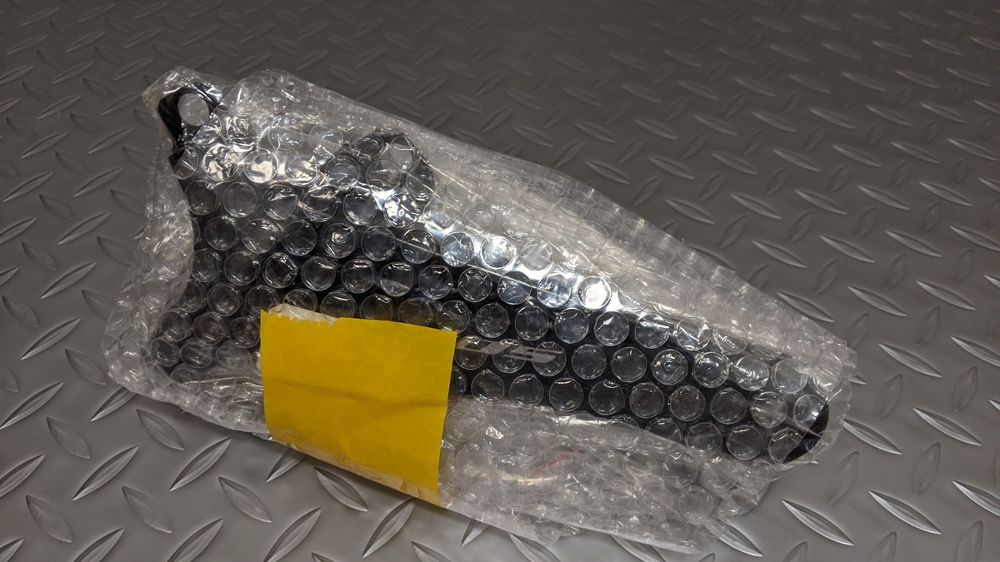
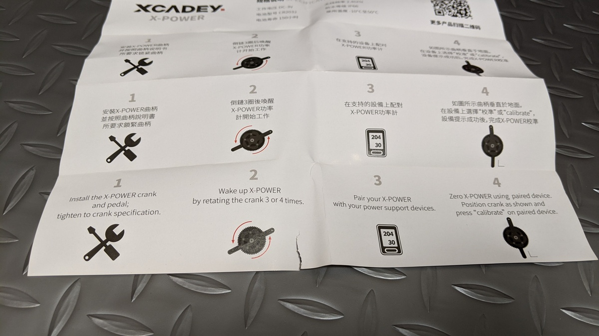

AliExpressでよくみる中華パワーメーター筆頭であるXCADEYの右クランク単体を購入した。

総評としては「久しぶりに中華製品の醍醐味を味わったぜ…」というところ。

## XCADEY のパワーメーターラインナップ

ラインナップは[公式ショップ](https://xcadey.com/shop/)を見るのが分かりやすい。

左側クランク単体・スパイダー・両側システムが大きな区分で、補修パーツ扱いで右だけのメーターも販売しているというのが公式のラインナップ。

左側クランクはバッテリー式がメイン。

<LinkCard url="https://s.click.aliexpress.com/e/_AprDnl" />

<LinkCard url="https://s.click.aliexpress.com/e/_A4DPRH" />

AliExpressのセラーには、公式に存在しない謎の右クランクメーターも。何故か両側PMの最新版は自分が右側を買った後にAliExpressから姿を消し、しょっぱなから不穏。

## Unboxing

梱包はプチプチにくるまれただけの手軽なもの。中身は冒頭の精密ドライバーとUSBケーブル、説明書のみ。

USBケーブルは専用充電端子となっている。マグネット接続だが、磁力はそれほど強くない。

説明書はあまりにも役に立たなくて笑う。ちなみにQRコードを読んで公式に行ってもこれ以上の情報はない。

本体の出来は…見た目上悪くない。むしろひずみゲージと本体の接続にケーブルを露出させていたパイオニアよりすっきりしているとすら言える。

充電中は赤LEDが点灯し、外すと青と緑のLEDが1回点滅する。その後も青いLEDが定期的に点灯するが、これが何を意味するのか説明書がないので全くわからない。まぁ、点灯していれば起動しているということは判別できる。

## 装着・テスト

マグネットレスシステムなので、フレーム側への加工は不要。右側PMにこだわった理由のクリアランスも当然バッチリ。ウルフトゥースのチェーンリングボルトの方が大きく張り出しており、実質どんなフレームにも使えるだろう。[Edge530](https://amzn.to/362FR4i) とのペアリングもつつがなく終了。

余談だが、検品が終わって装着ができてもAliExpressの"Received"を押してはいけない。完全に動作することを確認してから受領する。

まずは適当な登りで動作を確認してみる。信号や下りでパワーが0になるタイミングのないセグメントが最適。

あっ…これはおかしいですね…**パワー値出してません**ね…

## ファームウェアアップデート戦争

Disputeボタンを押しつつ、なんとか使えないかとファームウェアアップデートを確認してみる。ソフトウェア側が原因であれば、アップデートで直る可能性はある。

XCADEYのアプリをダウンロードして、クランクを回してパワーメーターを起動するとデバイスリストにパワーメーターが表示されるようになる。

…

……

なるほど、**XPOWER-L**と表示されたデバイスがある。買ったものは2XPOWERのRなんだけど、本体にも2XPOWERって書いてあるし…

ググってみると、Firmware Updateのボタンを長押しすると別機種のファームウェアをインストールできる模様。とんでもない仕様だ。別機種のファームウェア書き込んだら普通壊れると思うが、そもそも別機種のファームウェアが出荷時点で入っているとは思わなかった。

さっそく2XPOWER-Rのファームウェアを書き込んでみる。ちなみに、何故かアプリとのペアリングは充電をした後端子を外したタイミングでないと上手くいかない。

ファームウェアアップデート自体は1分ほどで終了。すると、サイコンとの接続がうまくいかなくなった…ので、別機種のファームウェアを試してみる。

いくつか試すうちに2XPOWER（左右表示なし）のファームウェアをインストールしたら、パワー値が半分になった（なるほど）。それだけならいいのだが、Androidアプリからパワーメーターとペアリングできなくなりにっちもさっちもいかない事態になってしまった。

この段階では自力でどうしようもないので、サポートを頼ることに。Facebook/Instagramとメールが連絡先に指定されていたので全チャンネルにコンタクトしてみたところ、Facebookから最初に返答があった。

たぶん、ハードリセットする本体ボタンとかあるだろうと思っていた、この時は。

要約「iPhoneアプリから接続してね！他の方法はないよ！あっ、ファームウェアをインストールするときは**XPOWER-R**のやつを使ってね！」

色々ツッコミたいが、iPhoneは持っていないので友人宅で接続とファームウェアアップデートを実施。これは無事成功。中華製品でAndroidよりiPhoneが優先されることあるんだ…

自宅では気が付かなかったが、このXCADEYアプリ、パワーメーター以外の製品とペアリングしてもあたかもパワーメーターとペアリングしたようにふるまうことがある上、アップデートがフリーズしてもダイアログの裏で色々操作できる。テストしてるのか不安になる。

## 修正後動作確認

サポートの言う通り、違う機種のファームウェアを当てたのでひとまず動作確認したところ、出荷時ファームウェアで確認されたデータ欠落は今のところ起きていない（ように見える）

肝心のパワー値はSuito比で5%くらいハッピーメーター。どちらが精度の高い値なのかはわからないが…

"Pair Dual-sided"というメニューがあるということは、両側を買った後はデュアルパワーメーターとして使えるのだろうが、その際に2XPowerでないファームウェアでペアリングできるのか怪しい。

ひとまず使えるようにはなったが、中華製品らしいお付き合いが必要になりそう。

## スパイダーや左クランクは比較的信頼できる？

ここからはただの妄想なのだが、購入した右クランクが早々にストアから消えたり、4iiiiなどの有名どころや他の中華セラー（MageneやSIGEYI）がつい最近まで右クランクPMを商品化していなかったことを考えると、右クランクはひずみゲージと本体が一体化できないなどの制約から開発が難しい？ような雰囲気があるように思える。

一体化していればいいという点であれば、スパイダー式のレビューが意外と外れ個体でない点にも合点がいく。左クランクのPMを買うならおとなしく4iiii製品を買った方が信頼性も高いし値段も大して変わらないので左クランクの中華製品を買う意味はほぼない。スパイダーは価格的な優位がある。

ただ、グラベルバイクのようなクリアランスが狭いバイクだったり、欧米海外通販で無い長さのクランク長を選択できたりと右クランクオンリーにもニッチな場所で意味があったりする。クランクの右側だけを調達するのは大変だけども左だけならかなり安く調達できたりもする。

## 覚悟があるなら独身の日を待て

11/11はAliExpressで盛大なセールが開催される。SIGEYIの[スパイダー式](https://s.click.aliexpress.com/e/_A8c2uT)やMeganeの[デュアル PM](https://s.click.aliexpress.com/e/_AlRWLp)がセールとなるので、覚悟と理解があればチャレンジしてみてはいかがだろうか？おすすめはしないけども。

<LinkCard url="https://s.click.aliexpress.com/e/_A8c2uT" />

<LinkCard url="https://s.click.aliexpress.com/e/_9JzEFV" />
