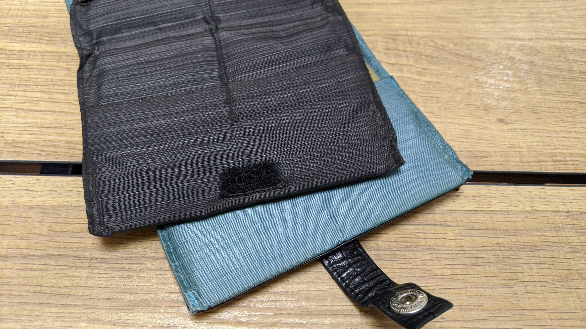
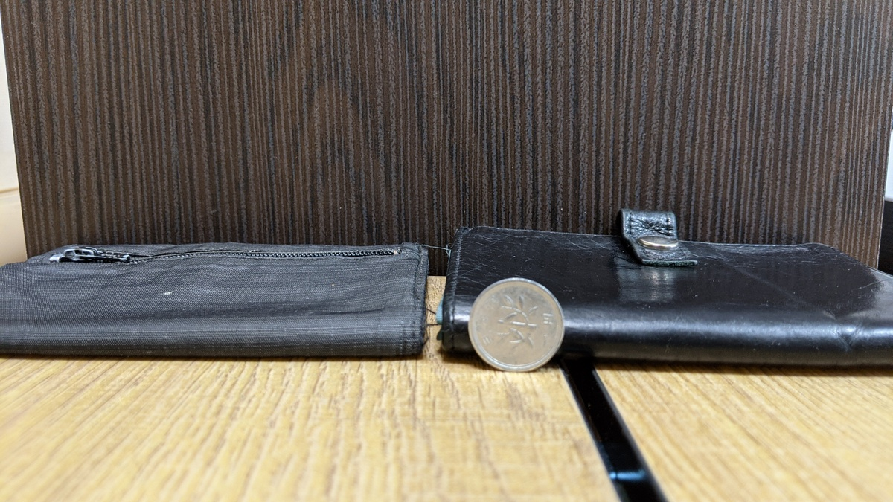
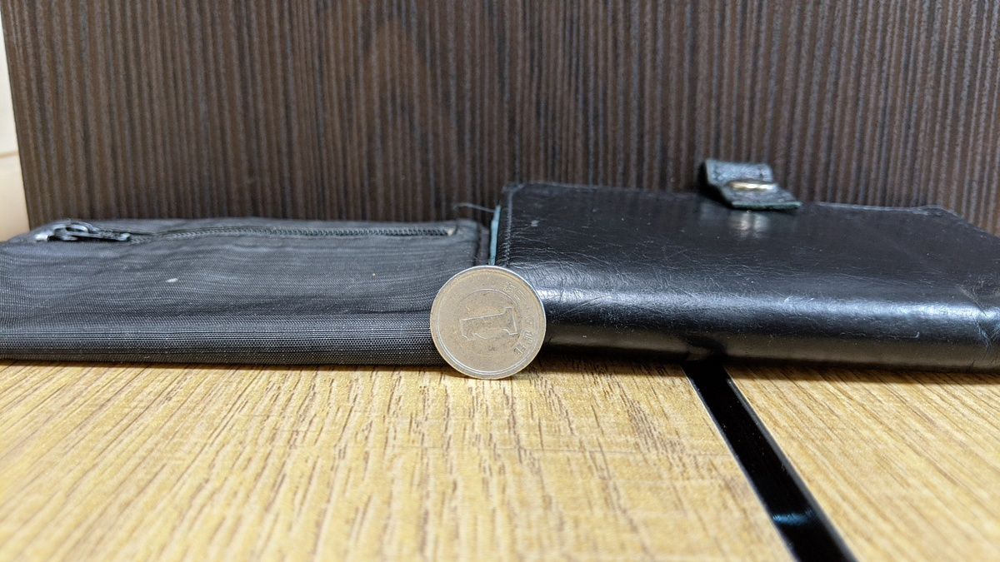
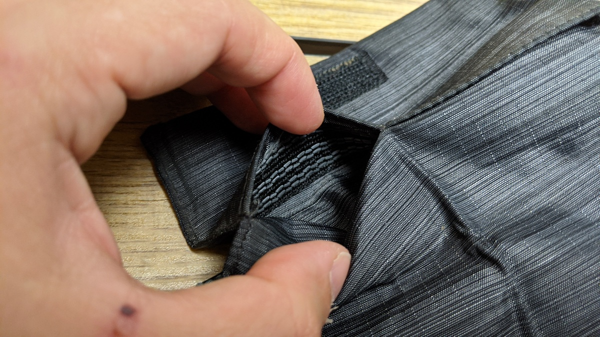
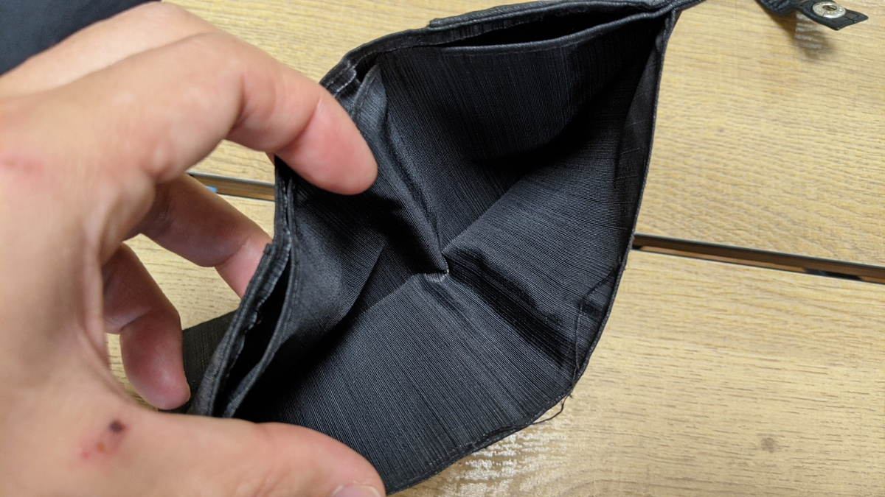
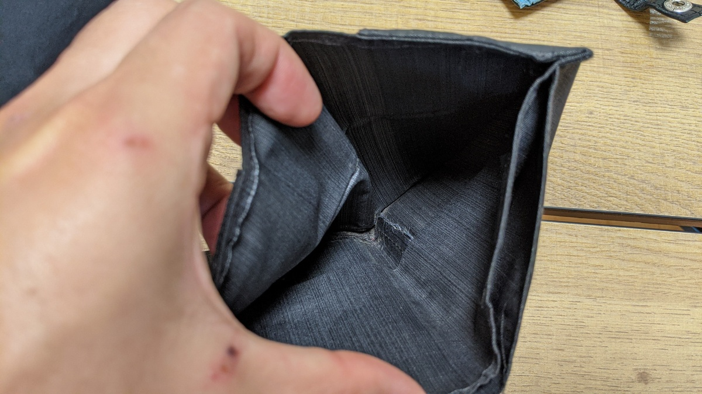

自転車の乗るとき、財布をどうしているだろうか。

自転車用の防水財布を持つ、ジップロックにそのまま入れる、フレームバッグやサドルバッグにそのままいれるなど、様々な手段があるとは思う。

自分の場合、自転車用財布（ジップロック含む）は保険証などの入れ替えが億劫だし、普段の所持金を分散させたくないという思いがあるのと、バッグにいつもの財布を入れるというのは駐輪時にうっかり忘れる可能性が否定できないので、あまりやりたくないと考え、ジップロックに入るサイズの小さな財布を普段から使うという方針に落ち着いた。

とはいえ、日常使いできる機能を持った薄型財布は世の中にそう多くはない。ライドに出かける際は現金しか使えない場所に行くことも多いし、普段から使うなら定番の店のポイントカードなども忍ばせておきたい。

幸いにも、自分はこの要件を満たす財布を手に入れることができたのだが、「薄型　財布」で検索しても一向に情報が出てこないので、布教のためにレビューを書く。

## 機能性に富んだ薄型財布メーカー Allet

<LinkBox url="https://www.all-ett.com/" />

これがお気に入りのメーカー、Alletだ。特殊な耐水ナイロン製の財布と、表面にレザーをあしらったモデルの大きく2つの製品ラインがあり、それぞれRFIDスキミングの防御機能を持ったパスポートの入る財布から、小銭入れ別体型、コインも入るタイプなど多数の製品を出している。

薄さと機能もさることながら、価格も非常に安いのが特徴。ナイロン製のCoin wallet（カード12枚と札入れ2箇所、小銭ポケット付き）がたったの35ドルだ。

<LinkBox url="https://www.all-ett.com/products/nylon-coin-wallet" />

現在愛用しているレザータイプのものと、ナイロンタイプのものを見比べていきたい

## Coin wallet レビュー

いわゆる2つ折りタイプの財布。ボタン留めのモデルはディスコンになってしまい、基本はマジックテープ留めとなっている。ややダサいが、サイズも薄さも稼ぐことができる。

上が中身がない状態の厚さ。語るまでもないが、完全にペラッペラである。布自体が薄い他、重なりも最小限であるようにできている。

下はレザーウォレットにいつもの自分のセット（カード8枚・コイン10枚ほど、札・会員カード類）を含めた状態。どんなポケットにもするっと入る厚みに収まっている。

## 機能性

特筆すべきは薄型ながら、様々な工夫で使いやすくなっていることだ。

まず、カードのポケットは4つあり、それぞれのポケットに複数枚を入れる運用を前提としている。ただ、カードは滑り落ちないようにカードポケットの内側にゴム製のすべり止めが縫いこまれている。これによって、カードが財布の中で滑ったりすることがなくなる。

また、2つの札入れ部分にも工夫がある。浅いポケットと深いポケットが組み合わせてあり、浅い側はお札がちょうどよく収まり、深い側にはカードポケットに入りきらない紙の会員カードや、名刺の余りなどを縦に入れるとちょうどよいサイズで、幅の広い1万円札や商品券などもこちらにピッタリ収めることができる。

## 使用感

服のたいていのポケットに入るほか、ジップロックのMサイズにも収まるので、自転車でも日常でも便利に使うことができる。中身も全く同じまま使い分けられるので、「あのカードがあれば…！」みたいなミスを完全になくすことができる。

欠点としては、ナイロン繊維であるがゆえに何年か使ってくると解れが出てくること。財布が崩壊するほどのものではないが、見た目を気にする場合は買い替えが必要かもしれない。薄型財布としては非常に安いので、大した負担ではないが…

そのほかにも最小限の中身になるSports walletや、極小ペンの入る財布など、様々なモデルがあるので是非見てほしい。

<LinkBox url="https://www.all-ett.com/collections/view-all" />

自分はパスポートの保管にもこのメーカーの製品を使っている。場所を取らずレザー製で見た目もよく、RFIDガードもある。

どの製品にもユースケースがしっかり考えられており、必要な機能を漏れなく詰め込んでいるいい製品だと思う。
