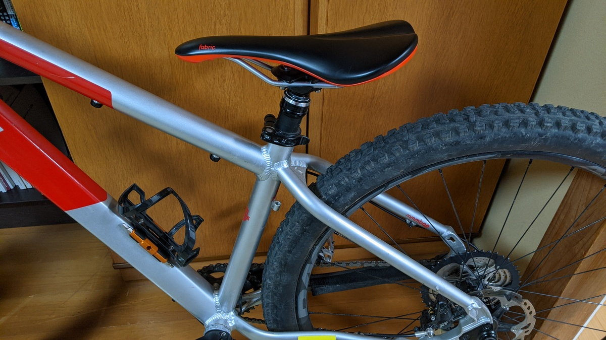
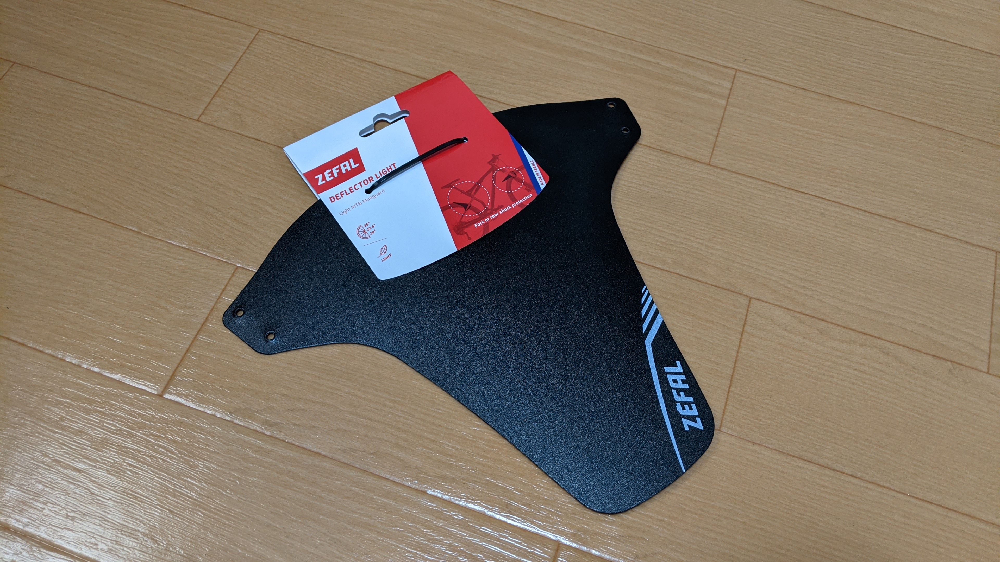
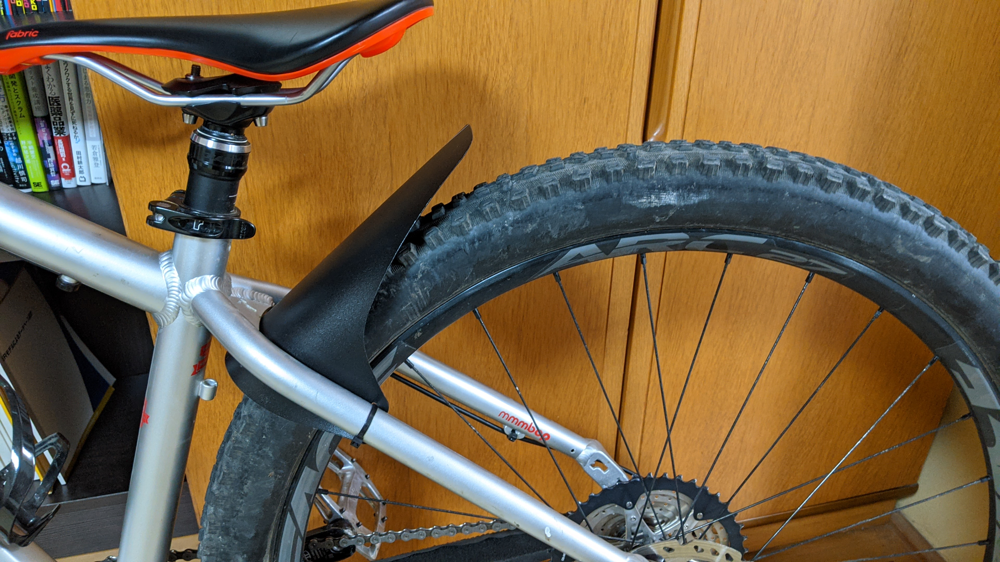

オフロードは泥汚れが付きもの。

当然、泥は機材の劣化を早めます。特に可動部はなるべく早く洗いたい。

しかし、そもそも汚れなければいいのでは…？

サスペンション周りのマッドガードはポピュラーな選択肢となり、各社様々な製品が出ています。リア側はASS SAVERが簡易泥除けとして一躍有名になり、ロード・MTB・グラベル関わらず装着している人をたくさん見かけます。

<LinkBox url="https://www.amazon.co.jp/dp/B06XHQYGKL" isAmazonLink />

しかし、ASS SAVERはその名の通り自分の尻の汚れはある程度守ってくれますが、機材はほぼノーガードです。

また、MTB乗りにとってはドロッパーポストとの相性がやや悪く、シートポストを下げるとタイヤにマッドガードを巻き込むこともあり、地味にストレスが溜まります。

写真の通り、ドロッパーポストを縮めた状態ですと後輪とサドルが近づき、段差ではねた際にタイヤが泥除けのしっぽが当たってしまいます。

## Zefal DEFLECTOR LIGHT

[Zefal DEFLECTOR LIGHT](https://amzn.to/3rYIqO9)はドロッパーポスト周りへの泥の侵入を防ぐことを（おそらく）目的として作られた泥除けです。

<LinkBox url="https://www.amazon.co.jp/dp/B00XMPQQ1W" isAmazonLink />

構造上、人体はノーガードです。（どうせウェアは洗濯します）

装着するとこの通り、見事にシートポストの根元に向けた泥だけをカットしそうな形に仕上がってくれます。

装着もこの手の樹脂ペラ泥除けと同じく、タイラップ留めです。

装着は簡単ですが、フレームへの傷を気にする人は養生した方がよいでしょう。

実走行はまだですが、構造上巻き込みはおそらくないでしょう。シートポストの上部への泥はねは避けられませんが、ウェット路面の走行場面があったら続報を記載します。
