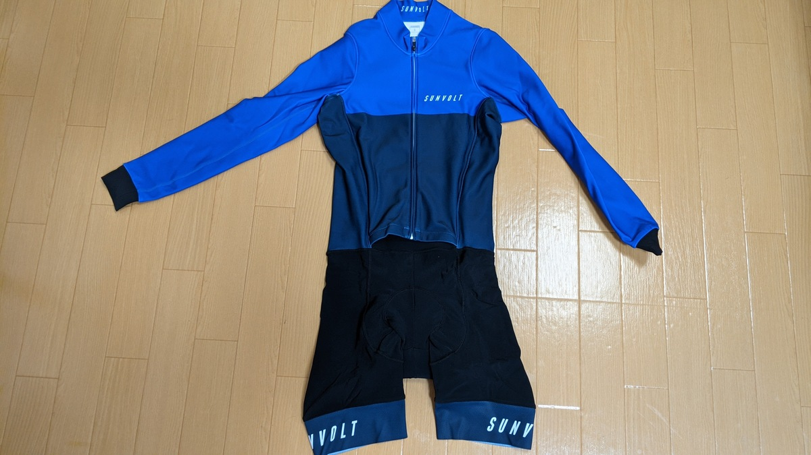
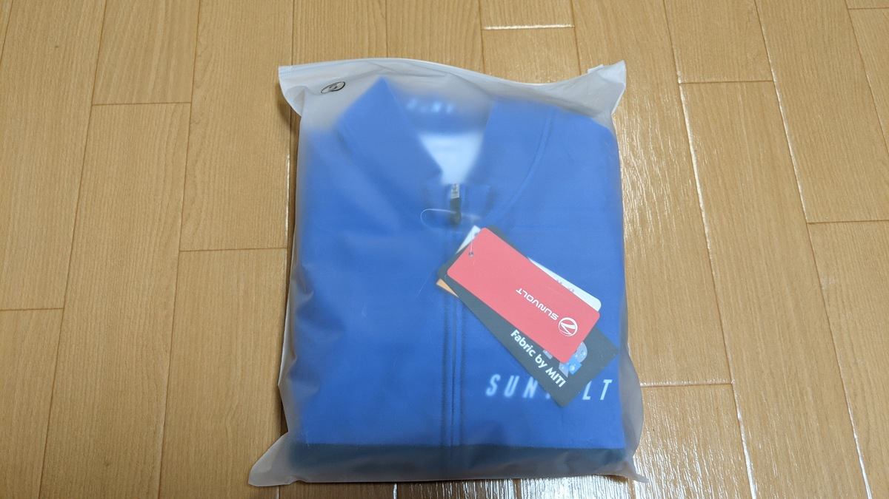
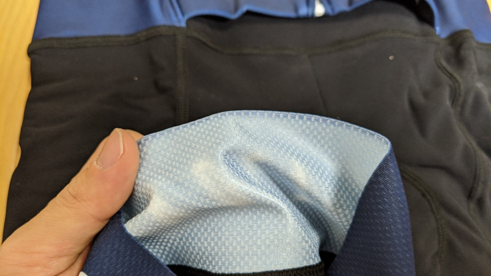
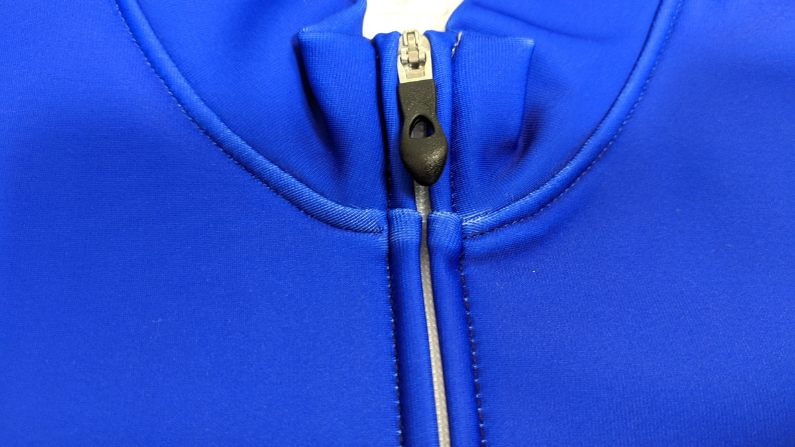
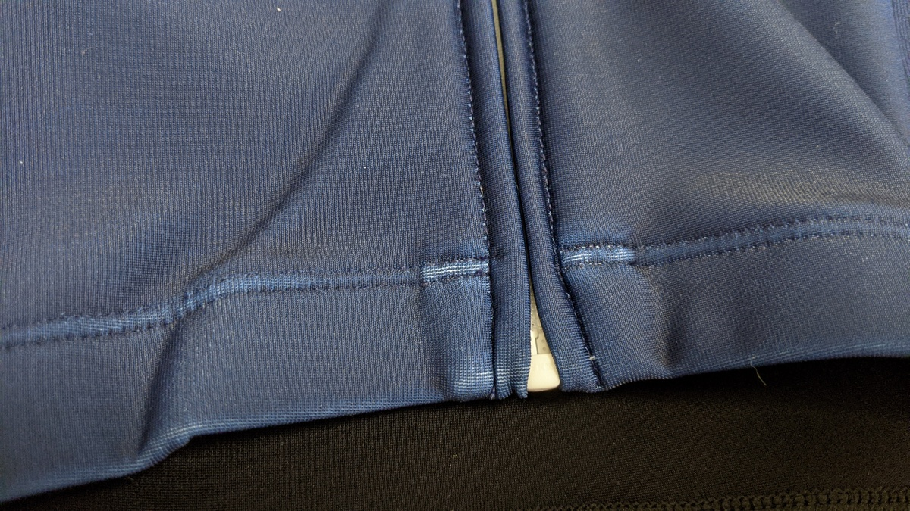

ウェアはなかなか消耗しないので、せっかく進化した素材が出てもなかなか導入できないもの。最近ようやくn年もののウェアがヘタってくるようになったので、買い替えを進めている。

2月から徐々に暖かくなってくるとはいえ、三寒四温の寒の方が週末に当たるとウィンターウェアの出番。

そんなわけで、サンボルトさんのセールに乗っかり、セパレートワンピース型のウィンターウェアである[サーモスーツ](http://sunvolt.co.jp/item/s-ride_tseo.html)をポチった。

<LinkBox
  url="https://store.shopping.yahoo.co.jp/sunvolt-store/fma2017s2f.html"
  linkurl="https://ck.jp.ap.valuecommerce.com/servlet/referral?sid=3171302&pid=887657037&vc_url=https%3A%2F%2Fstore.shopping.yahoo.co.jp%2Fsunvolt-store%2Ffma2017s2f.html"
/>

ヤフーショッピング店ではセールエリアがあるので、そこばっかり見ている。

## なぜワンピース型？

ワンピース型ウェアを練習で使う意味は色々あるが、自分の考えている利点は以下の通り。

- 組み合わせを悩まないで済む
- 上半身の締め付けが緩やか
- ビブショーツより用を足しやすい
  最後の点は、特に解説する部分もないので前の2点だけ説明します。

### 組み合わせ

これはいわゆる「決断力を無駄遣いしない」というやつ。IT業界やバリバリのビジネスマンでは1日に行使できる決断力が一定であることが知られている。

冬場のライドは朝のやる気が全て。面倒なことはなるべく無くして、「行くぞ！」という決意が鈍らないうちに準備を済ませたい。**余計なことを考えないという点**でワンピース型には利点があるという考え方。

また、**サイクルウェアはボトムスが先に劣化する運命**にあり、セット買いしても上だけ残ってしまう。ワンピース型ならそんなことは起こらず、洗濯してたたむ際も、セットを探して洗濯物の山から探し出す労力がなくなる、

### 上半身の締め付け

ビブショーツは、その構造上肩紐があるため、どうにも上半身に異物がある感覚がある。

そもそもビブショーツが当たり前だった自分には、スーツをメインで着るようになるまでこの感覚を忘れていたのだが……そこには確かに紐がある。

ワンピースの上半身はシンプルで、インナーウェアとスーツ、レイヤリングするならその上のジャケットとなるので極めて自然な感覚で着用可能。

エアロスーツのような完全な1枚型ワンピースは前傾姿勢を取ることが前提のカッティングになっているが、セパレートタイプの場合は前半身の押さえつけが少なく、直立歩行も苦にないのもポイント（これはウェアによるかもしれない）

また、昨今のウェアは薄型化が進んでいるので、夏に肩紐がジャージの上から透けてしまうということも避けられる。

## サーモスーツ インプレッション

使い勝手のよさそうな袋に入って届いた。

チャンピオンシステムのインターミディエイトジャケットより厚手の生地を使っている。その分、やや固さを感じるけれども、保温性に加え、撥水性も備えているようだ。

> 上半身部分には、ウェア表面についた水分を水滴にして分散させる DWR(耐久撥水加工)を施し伸縮性に優れたイタリア製の高機能なファブリックを採用、急な雨や雪などの天候変化にも対応します。

自分が最も重要視している裾の部分。切りっぱなしかつ薄くしなやかなグリッパーで処理されている。

ここが固いと、太腿が締め付けられる感覚があり、血流が妨げられる気がしてしまう。高級感のあるこのタイプの仕上げは完全に自分好みのもの。

素材の厚み上仕方ないが、ジッパー周りは本来の生地の色がうっすら出ていて白くなる。

### 実走インプレッション

- 気候：曇り
- 気温：10度～ 14度
- 時間：午前中

[MILLET のインナー](https://amzn.to/3pqy0W5)に、このサーモスーツだけを着て上記の条件で走ってみた。

アクセサリーはネックバフと薄手のフルフィンガーグローブのみの生足スタイル。

**着て最初に感じたことが「直立体勢の楽さ」**、ビオレーサーやチャンピオンシステムの旧ワンピースは完全なレース向けで、着た瞬間から前傾姿勢を強要されるレベルのカッティングだが、このスーツは直立姿勢でも違和感がない。

走行中に関しては、走り始めこそやや肌寒さがあるものの、体が温まってくると完全にちょうどいい暖かさに体が包まれる。**走って丁度いい暖かさ**だ。

完全防風とまではいかないが、**裏起毛の薄手長袖ジャージに比べると防風力が段違いにいい**ので、1枚でかなりの気温まで耐えることができそう。

気温が上がってくると、汗で中をかくようになったが、**汗抜けはそこまでよくない**。撥水性もある生地なので、通気性はトレードオフになっていそう。この日は前のファスナーをやや開けて対応した。

## まとめ

ウィンドブレーカーや脚のウォーマーを組み合わせることで、1枚で寒い日の様々なライドに対応できそう。

関東の真冬もこれにジャケットを加えれば対応可能と判断したので、目論見通り1枚でかなり長い期間活躍してくれそうなウェアとなった。

この調子で夏ウェアもセパレートワンピースにしたいが、まだまだジャージとビブが残っているのでローラーで使いつぶしていく予定

<PositiveBox>

- 厚めの記事による保温性
- ワンピース特有の取り回しやすさ
- 太腿グリッパーの質
- 価格

</PositiveBox>

<NegativeBox>

- ジッパーの固定力
- インナーとの相性は要考慮

</NegativeBox>

<LinkBox url="https://store.shopping.yahoo.co.jp/sunvolt-store/fma2017s2f.html" />
