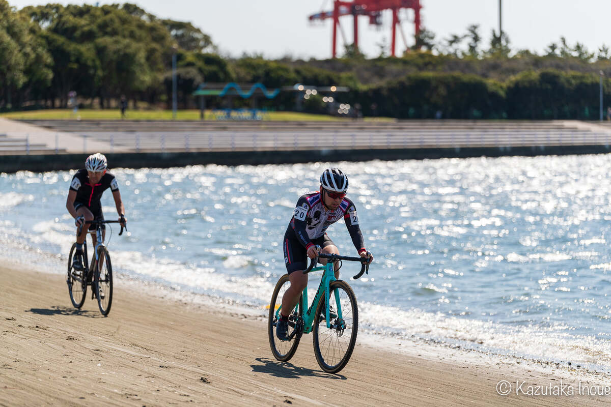
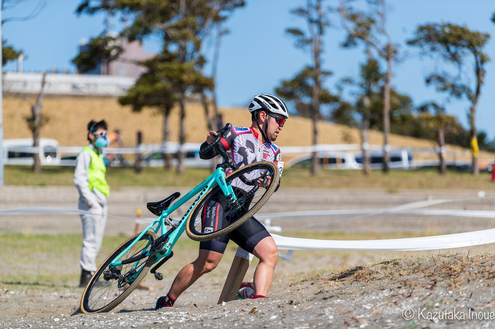

全日本選手権・ワイルドネイチャープラザから、約3カ月間隔を空けたシクロクロス千葉。

今シーズン最後のレースにして最高の順位%でゴールでき、今シーズン唯一のフルラップ完走となった。

緊急事態宣言により開催日が延期となったが、開催にこぎつけた関係者には感謝の気持ちしかない。

※茨城CX土浦は諸事情により欠席

## リザルト

18/39位（+6:17, 全10周回）

### 機材

- メインバイク
  - Bianchi ZOLDER Pro
  - Farsports CX TU + A.Dugast Smallbird 33mm (F: 1.5bar, R: 1.6Bar)

## 試走レビュー

千葉といえば砂！をアピールしていたが、前日に降った雨のおかげで朝試走では砂場全面が湿り気を帯びており、余裕で乗車可能な範囲に収まっていた。前日設営の写真では大きな水たまりができていたが、朝にはすっかり水が引いており、ごく一部の泥区間を残すのみ。言われなければ前日雨だったとわからないだろう。

そもそも、波打ち際以外はかなり草が生い茂っており、根のおかげでトラクションが効く。聞くところによると、昨年は殆ど砂場に草が生えておらず、乗車がかなり難しかったとのこと。

シケインは、下りきった後の180度ターン後に設置されており高さは30cmほど。十分バニーホップでクリアできる高さであり、シケイン後も緩やかに登って再度180度ターンするため、乗りどころに迷う降車に比べると踏み出しが早い分明らかにアドバンテージを得られるレイアウト。

降りた時のシケイン処理もC1中央値よりは速いと自分では思っているが、引き出しが多くなったおかげでそれだけに頼らなくても済むことは大きい。

泥は回避されたが、春の爆風が会場に吹き荒れている。昼までに砂場は乾き、深くなって、泥と芝エリアは逆に締まっていくことで必要なスピードが増すことが予想された。

砂セクションの難易度が低く、そこまで大きなタイムギャップを稼げるわけではなさそうだったので、芝生での上り下りをリズムに乗ってクリアできるよう、空気圧は砂コースにしては高めの1.5/1.6BARに設定した。

## レース

3列目のスタートだったが、誤って混雑する側のグリッドを選んでしまい、スタートでアドバンテージを得ることに失敗。

広いように見えて最速ライン以外を通ることが難しい丘エリアのレイアウトも相まって、最初の1周は非常にスローペースで心拍も上がらない状態で巨大なパックが大きく引き延ばされた状態。

バニーホップや砂の処理で地味にポジションを上げ、脚で負けている人に抜かれたりしているうちに、レース中盤に20番手以内で展開していた。

ローカルでポイント稼ぎしている自分には新鮮な、ゼッケンより若い位置。パックの中で単純な脚力では負けているものの、バニーホップで体力を節約しながらアドバンテージを得られたことと、砂場でのランニングに浮いた体力を充てられたことで3人パックで膠着状態に。

5周目、溜まってくる疲労で荷重が前のめりになってきて、コーナーが怪しくなってきたところで、周回後半の海岸エリアから林間に入るコーナーでスリップダウンしチェーンを落としてパックから脱落。

そこから集中力を欠いてペースが落ちてしまったものの、終盤にもちなおして後ろのパックの追走は何とか振り切り、18位を守り切ってフィニッシュ。

久しぶりとなる高強度レースに思わず倒れこみ、その後丸一日筋肉痛で腰が使い物にならなかった。

振り返ると、観客の皆さん（無観客なので他のレースの参戦者と家族程度しかいないのだが）の声援にも熱が入っており、レースでしか味わえない集中力とテンションの中「シクロクロスレースって楽しいなぁ」と思いながら走り切ることができた。シケイン周辺にカメラマンがいなかったのは少し残念だったが。

直前にTour de Zwift一気消化やHAUTE ROUTEにも参加したことでパワーはそこそこ出せていたように思う（サイコンマウントが試走で壊れてパワーが計測できなかった）

いい形でシーズンを締めくくることができたので、来シーズンまでしっかり体を鍛えなおして全日本に出られるよう努力したい。

WNPに続いて、前半同じパックにいた小林選手の動画に出演しています。

<iframe
  width="560"
  height="315"
  src="https://www.youtube.com/embed/5fbZy_f3ye8"
  title="YouTube video player"
  frameborder="0"
  allow="accelerometer; autoplay; clipboard-write; encrypted-media; gyroscope; picture-in-picture"
  allowfullscreen
></iframe>

## Photo

[Kazutaka Inoue](https://www.facebook.com/kazutaka.inoue.5)
