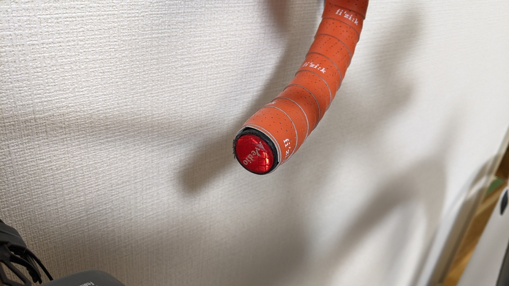

ここ5年以上ずっと使っている安全装備がある（法規上必要な装備でもある）

それがこのバーエンド型の赤色リフレクター。

<LinkBox url="https://www.amazon.co.jp/dp/B07NHGQ2NP/" isAmazonLink />

## バッテリー切れと無縁の安全装備

自転車の場合、点灯義務のあるトンネル内や夜間において尾灯の代わりに反射板で代用できる。

自動車に乗る人ならわかるだろうが、トンネル内のような薄暗いところでは自転車の視認性は著しく下がる。夕方の薄暗いタイミングでも同様。

しかし、現実問題として常時点灯でない限り、トンネル内で毎回リアライトを点灯させるのは面倒だ。そしてリアライトは場所の都合上バッテリーや電池のサイズが小さいことも多く、常時点灯の場合は結構な頻度で充電が必要になる。

そこで、自転車の見た目を損なわず、バッテリーとも無関係の反射板の出番というわけだ。自分のようなものぐさな人間はついうっかりリアライトの電池交換をサボって切らしてしまうことも多いのだが、これがあるだけで追突の恐怖がかなり緩和される。

ライトに比べると貧弱な装備に思えるが、車のような強い前照灯がある場合は下手に弱いライトよりも反射板の方がアピール力が高い。

[デイライトを考慮して 2km 先からも見えるようにしたボントレガーのライト類](https://www.trekbikes.com/jp/ja_JP/daytime_running_lights/)ほどではないが、バッテリーに依存しない手段として、最後の防波堤に最適。

## 欠点

欠点は、ラインナップが非常に少ない点。Amazonで調べてもAVEDIOと謎メーカーの2点しか見つからなかった。

<LinkBox url="https://www.amazon.co.jp/dp/B00B5AZ4KA/" isAmazonLink />
