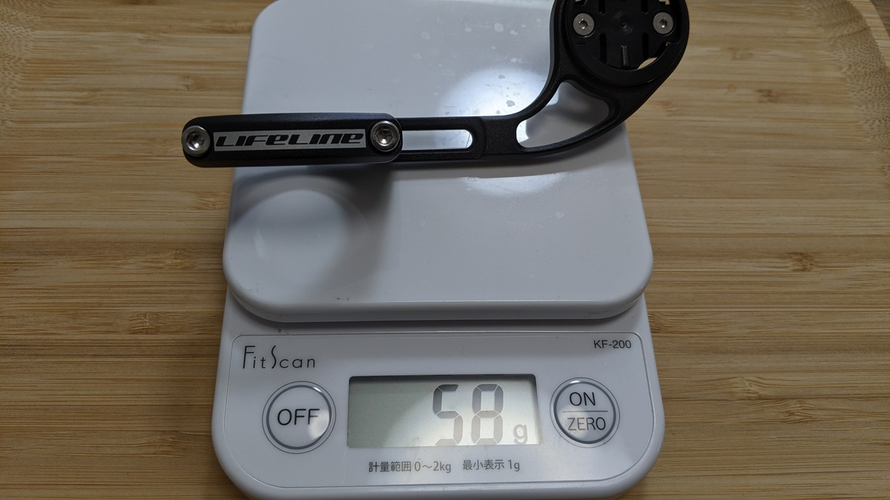

GoProを吊るすために中華ガーミンマウントの雌ネジを、ちょっと強く締め付けたらネジ切ってしまったのでWiggleでLifeline製品を買うことにした。

同じような製品が2つあったので、送料無料ラインにちょうどよかったこともあって、両方買って比較することにした。

こちらの2製品が今回のインプレ対象。

<LinkBox url="https://www.wiggle.jp/lifeline-アウトフロント-gps-コンピューター-アクションカメラマウント付き-" />

<LinkBox url="https://www.wiggle.jp/lifeline-garmin-edge-gopro-%E5%B0%82%E7%94%A8%E3%83%8F%E3%83%B3%E3%83%89%E3%83%AB%E3%83%90%E3%83%BC%E3%83%9E%E3%82%A6%E3%83%B3%E3%83%88?sku=5360743673" />

## 外観

見ての通り、Garminマウントを保持しているアルミ部分の形状が異なる。

丸い方がレビューも少ないので、新製品かと思われる。名機はされていないものの、便宜上こちらを新型と呼称していく。

ハンドルへの固定方法はほぼ同じ、本体とバンドの接続方法が若干異なる程度で、新型はスライドして調整しやすくなっていた。

前後の調整幅は、製品写真からは異なるように見えるが、実際は同じ範囲になっている。

## 重量

新型の方が若干軽量。だが気にするほどではないか…

## 価格

随時変更されているので、具体的な価格は出しづらいが新型の方が若干（400円ほど）安価だった。軽くて安いので、旧型を選ぶ意味はあまりなさそう。

<LinkBox url="https://www.wiggle.jp/lifeline-garmin-edge-gopro-%E5%B0%82%E7%94%A8%E3%83%8F%E3%83%B3%E3%83%89%E3%83%AB%E3%83%90%E3%83%BC%E3%83%9E%E3%82%A6%E3%83%B3%E3%83%88?sku=5360743673" />
