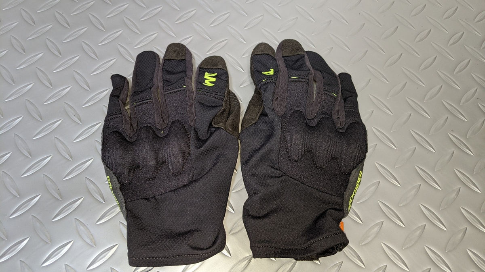
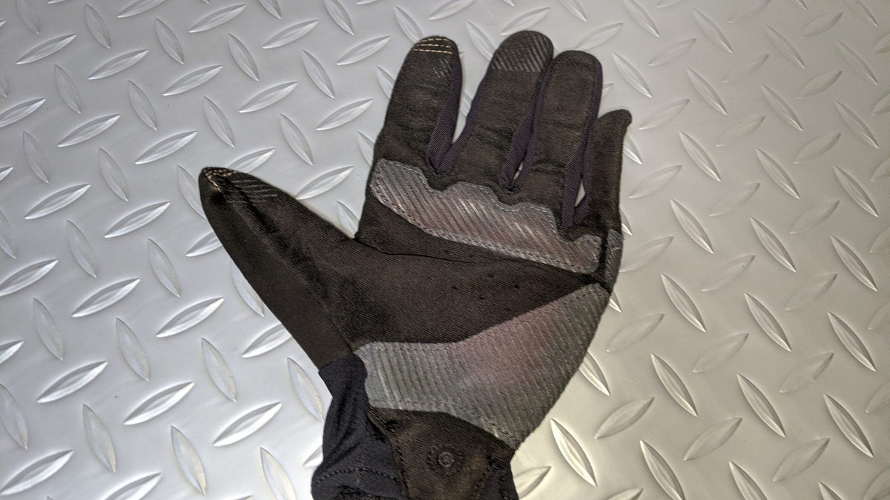
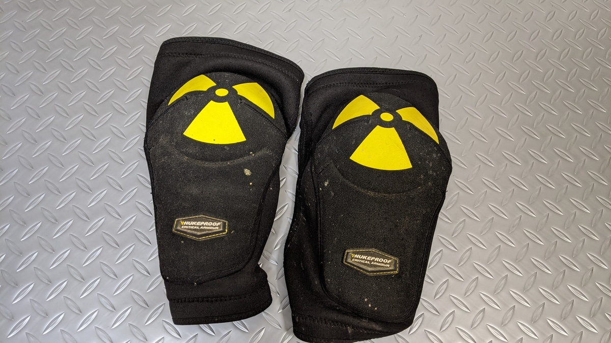
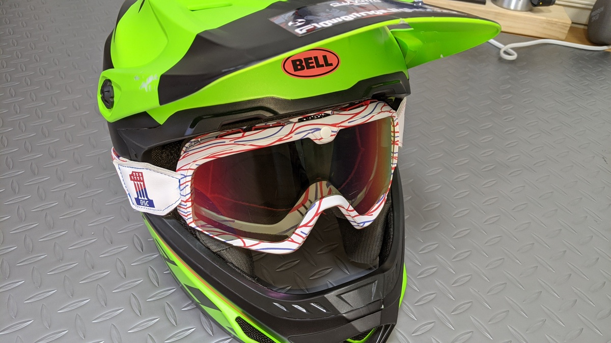
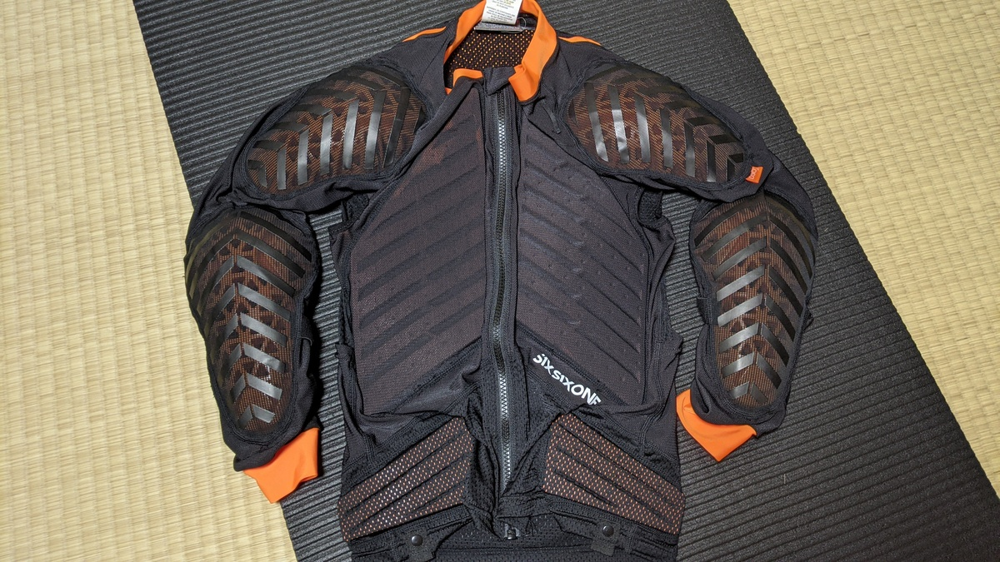
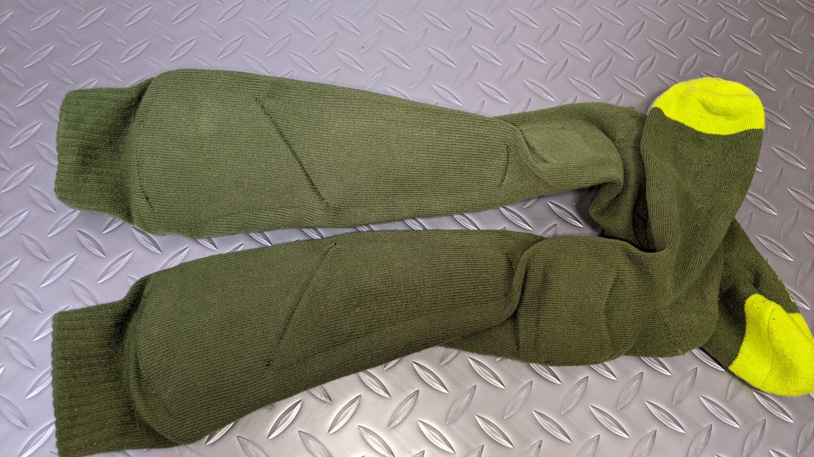

## プロテクターの役割

MTB を楽しむうえで、転倒は切っても切り離せない。

初心者のうちはスキル不足で転ぶだろうし、経験を詰んできても上達する過程で実力ギリギリを攻め、転倒することは日常茶飯事。トレイルでは周りにに気を使うものの逆に整備されていないコースならではの不確実要素が存在する。

木に激突したり、受け身に失敗しない限り骨折することは稀ではあるものの、経験上 2 ～ 3 回コースに出れば 1 回は前転したり派手な転倒をメイクする。

軽症で済んでも、痛みは残るしその後の走りに影響することは間違いない。しかし、プロテクターがあればちょっとした転倒・接触のダメージをほぼゼロにすることができる。

自分も、平日の仕事や当日のパフォーマンスを安心して維持するための装備と考えている。先日も岩岳でチャレンジ気味に走ったセクションで転倒したが、ボディアーマーのおかげで痛みもなく済んで、その後も楽しく走行できた。

## グローブ

フルフィンガーグローブは基本中の基本。

今回は主に MTB 専用コースを念頭に置いた記事だが、グローブだけは唯一確実にトレイルでも使う装備。

MTB 専用品には拳の外側にガードが付いたモデルもあり、自分はメインでデカスロン PB の D3O プロテクション付きのものを使用している。MTB のハンドルは広く、日本のコースやトレイルは狭い場所もあるのでうっかり木や斜面に手をぶつけることもあるため、万全を期すなら使っておきたい。

XC をはじめとする MTB 用のモデルはパッドの付いていないものが多い。これは操作性を高めるため。

<LinkBox
url="https://www.wiggle.jp/fox-racing-defend-d30-%E3%82%B5%E3%82%A4%E3%82%AF%E3%83%AB%E3%82%B0%E3%83%AD%E3%83%BC%E3%83%96"

/>

## ニーガード・エルボーガード

プロテクターと聞いて最初に思い浮かぶものがこれら。サマーゲレンデであればレンタルもやっていることが多い。

人体の突起部という圧倒的に傷つきやすい部分を防いでくれるものの、頻度としては膝よりも、ペダルを踏み外した際ピンの直撃を受ける脛（シン）ガードの方が必要な気もするが…膝の皿は割ったら悲惨なので付けておいた方が良いのは間違いない

<LinkBox
url="https://www.wiggle.jp/%E3%82%B5%E3%82%A4%E3%82%AF%E3%83%AB/%E8%82%98%E3%83%91%E3%83%83%E3%83%89"

/>

<LinkBox
url="https://www.wiggle.jp/%E3%82%B5%E3%82%A4%E3%82%AF%E3%83%AB/%E8%86%9D%E3%83%91%E3%83%83%E3%83%89"

/>

## フルフェイスヘルメット

安全安心の代名詞。

ただし、フィッティングが非常にシビアで頭の形によるメーカー相性が大きい。試着できる実店舗で購入することを強くお勧めする。

購入するときはゴーグルも忘れずに！（こっちは通販でもいい）

<LinkBox
url="https://www.wiggle.jp/%E3%82%B5%E3%82%A4%E3%82%AF%E3%83%AB/%E3%83%98%E3%83%AB%E3%83%A1%E3%83%83%E3%83%88/%E3%83%95%E3%83%AB%E3%83%95%E3%82%A7%E3%82%A4%E3%82%B9%E3%83%98%E3%83%AB%E3%83%A1%E3%83%83%E3%83%88"

/>

## ボディプロテクター

DH が趣味でない限り持っていない印象のあるギア。長袖・半袖・袖無しによって価格もガード面積も変わってくる。

個人的には、エルボーガードを兼用できる長袖モデルがおすすめ。また、肩は受け身の際真っ先に着地する場所なので袖無しは意義が薄いと考えている。

購入するポイントはハードタイプ・ソフトタイプの違いとプロテクションの交換可否。ハードタイプは防御力が高いが動きづらく脱ぎ着もしづらい。

中古で買ったハードタイプのモトクロス製品(SixSixOne 製)は、安全と安心はあったが着用時の不快感が高かったので、結局同じ[SixSixOne の MTB 用アーマー](https://www.chainreactioncycles.com/jp/en/sixsixone-evo-compression-jacket-long-sleeve/rp-prod129497)を買いなおしたという経緯がある。

<LinkBox
url="https://www.wiggle.jp/%E3%82%B5%E3%82%A4%E3%82%AF%E3%83%AB/%E3%83%9C%E3%83%87%E3%82%A3%E3%83%97%E3%83%AD%E3%83%86%E3%82%AF%E3%82%BF%E3%83%BC"

/>

## ネックブレース

首の可動域を制限することで、頸椎の捻挫とそれに伴う損傷を防ぐことが主な役割のパーツ。

頸椎をやってしまうと最悪下半身不随になる可能性も秘めているので、万一の重大事故を避けるために大きな役割を果たす。

一方で、高価であること・視野の制限につながることもあって敬遠されることも多い。

<LinkBox
url="https://www.wiggle.jp/%E3%82%B5%E3%82%A4%E3%82%AF%E3%83%AB/%E3%83%9C%E3%83%87%E3%82%A3%E3%83%97%E3%83%AD%E3%83%86%E3%82%AF%E3%82%BF%E3%83%BC"

/>

## My 装備

写真でお察しいただけると思うが、ふじてん・岩岳などのコースに行くときは

- デカスロン PB のガード付きグローブ
- [SixSixOne ロングスリーブボディアーマー](https://www.chainreactioncycles.com/jp/en/sixsixone-evo-compression-jacket-long-sleeve/rp-prod129497)
- [Nukeproof ニーガード](https://www.wiggle.jp/nukeproof-critical-enduro-%E3%83%8B%E3%83%BC%E3%82%B9%E3%83%AA%E3%83%BC%E3%83%96)
- [Endura シンガードソックス](https://www.wiggle.jp/endura-singletrack-%E3%82%B7%E3%83%B3%E3%82%AC%E3%83%BC%E3%83%89%E3%82%BD%E3%83%83%E3%82%AF%E3%82%B9)

というフル装備を今年からスタートしている。

昨年、軽症と思っていた木にぶつけた際の肩の痛みが中々引かずに 3 カ月ほど可動域にも影響してコース行きを遠慮している時期もあったことを反省して、より長い時間良いコンディションで楽しめるように今年は防具を付けることにした。

特にお気に入りは [Endura のシンガードソックス](https://www.wiggle.jp/endura-singletrack-%E3%82%B7%E3%83%B3%E3%82%AC%E3%83%BC%E3%83%89%E3%82%BD%E3%83%83%E3%82%AF%E3%82%B9)。

<LinkBox
url="https://www.wiggle.jp/endura-singletrack-%E3%82%B7%E3%83%B3%E3%82%AC%E3%83%BC%E3%83%89%E3%82%BD%E3%83%83%E3%82%AF%E3%82%B9"

/>

ニーガードの下に履くことで、**ずり落ちることもなく**脛の全面とくるぶしを保護してくれる優れもの。

ソックスなので毎回洗濯が必要になるが、洗濯乾燥機にポイして終わりとできないのが若干手間ではある。

## DH コースでの最低限

（特に初心者）DH コースでは最低限、ニーガードとエルボーガードは装着してほしい。

コースに足を運ぶ頻度が少ない場合、購入はコストが高く感じるだろうが、大抵のコースでレンタルをやっている。「スピードが出ないから…」といっても低速でも十分骨折するスピードは出ているし、『ビビってる方がコケる』というのも真なのだ。

DH コースであれば、運動しやすさが求められないのもあってハードタイプの防御力が高いものがレンタルでそろっている上に、サイズも揃っている（コースに行く頻度も考えると、大抵の人はレンタルの方がコスパが高い気がするのは秘密）。

その後はハマり具合や、予算と相談しつつフルフェイスヘルメット・ボディアーマーと増やしていくのがよい。

冒頭にも書いたが、痛みや怪我は我慢できても翌日以降のパフォーマンスが落ちて自転車 QOL が落ちてしまう。それを防いでくれるだけでも十分だし、温泉で傷が滲みずに済むことを考えれば買うだけの価値はある。

MTB 専用品はコストが高めだが、動きやすさは格別。どうしても高いと感じる場合、代替品としてモトクロスやスケート製品が使える。特にモトクロスブランドのプロテクターはコースでもよく見かけるので幅広くみて納得できる価格帯の製品を選べばよい。

MTB 系パーツについては Wiggle より CRC のほうが取り扱いブランドが若干多く、掘り出し物も狙いやすい。

当然プロテクター類もその例に漏れないため、特価品漁りはいつも CRC でやっている。
