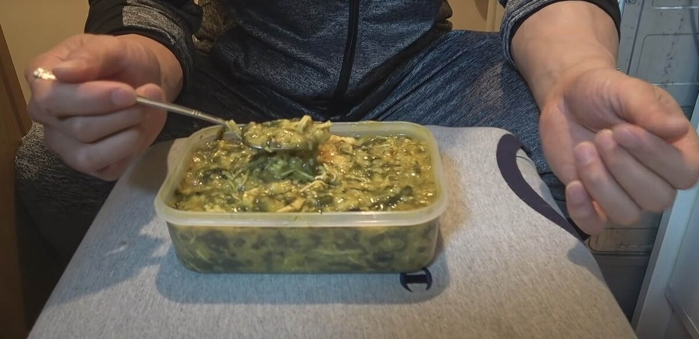
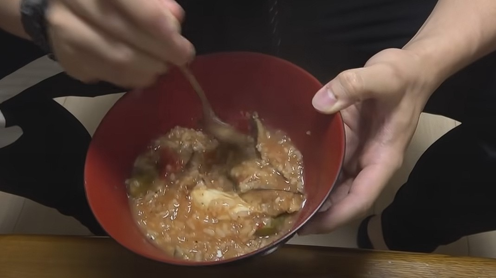
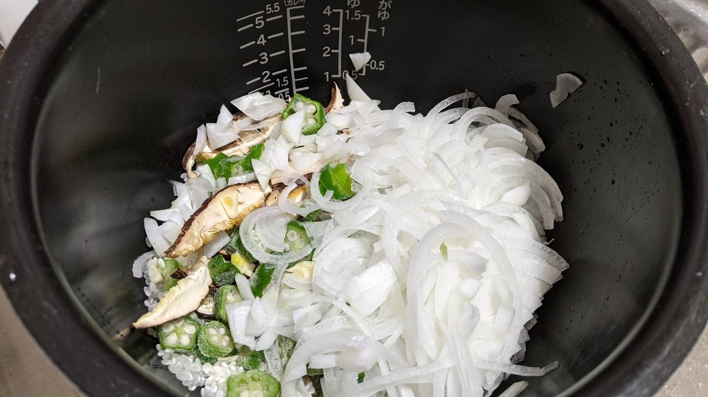
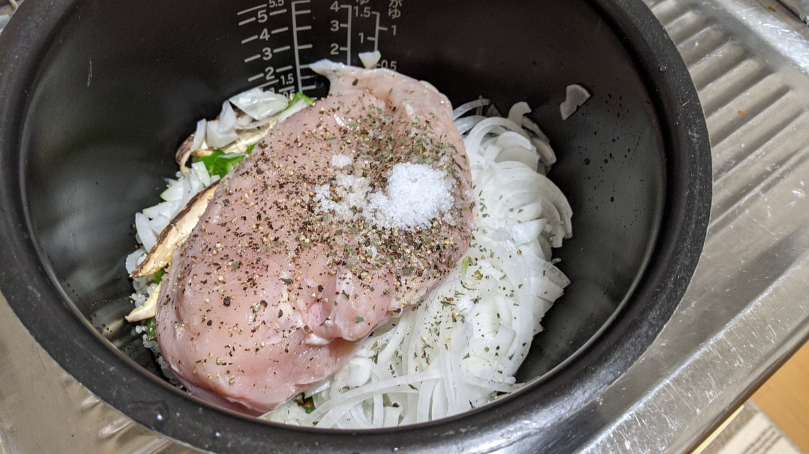
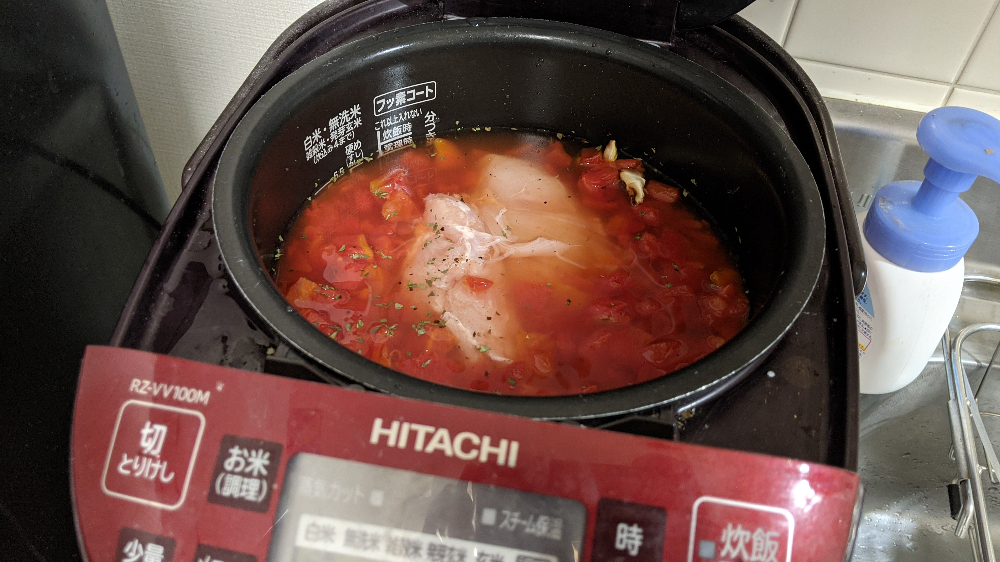
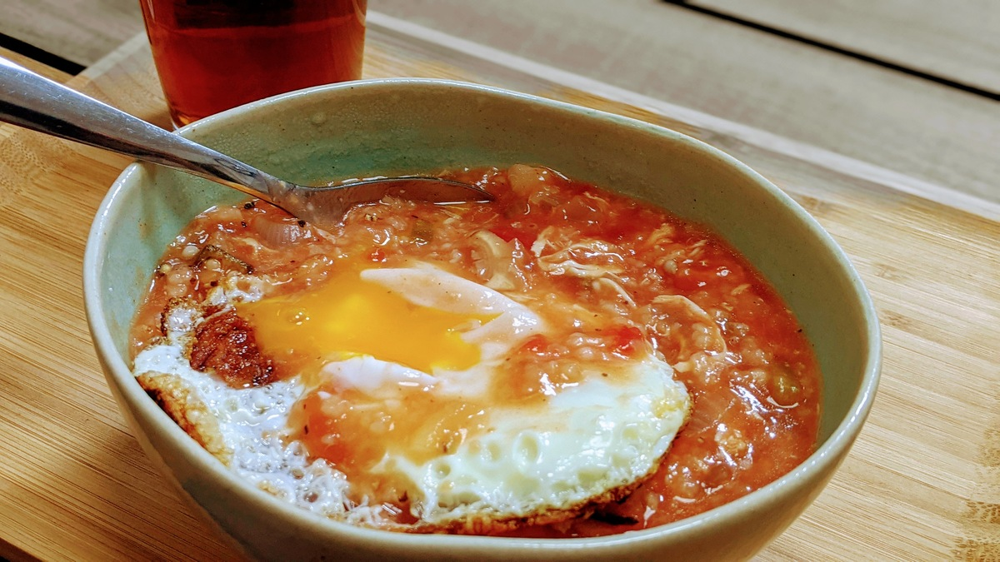

## マグマとは？

まず、マグマについて説明するには「沼」について説明する必要がある。

### 沼

Youtube チャンネル「[マッスルグリル](https://www.youtube.com/channel/UCHoOFVQAhK-QyoXgf0iaZIg)」を運営しているボディビルダーであるシャイニー薊氏が開発した究極の減量食が「沼」である。

ボリュームがあって、高たんぱくで、ローカロリー。という聞いただけでは完璧な減量食だ。

具体的にどんなものになるかどうかは、説明するより、動画を見ていただいた方が早い。

<iframe
  width="560"
  height="315"
  src="https://www.youtube.com/embed/NJtgQEXAjNI"
  title="YouTube video player"
  frameborder="0"
  allow="accelerometer; autoplay; clipboard-write; encrypted-media; gyroscope; picture-in-picture"
  allowfullscreen
></iframe>

完成形はこちら

なんとなくお分かりいただけると思うが、**とにかく見た目が悪い**。メインの調味料がカレー粉なのもあって家中と炊飯器がカレーの匂いになる（らしい）。

キモとなる材料は下記の通り。

- 米
- 鶏むね肉
- 干しシイタケ
- わかめ
- オクラ
- カレー粉

### マグマ

上記沼の派生形。メインの味付けがカレー粉からトマトに変更して、それに合わせて付け合わせを変更したものと考えてもらえればよい。派生形にはその他「[セメント](https://www.youtube.com/watch?v=mL7W2YrmXHs)」が存在する。ネーミングセンスよ…

マグマの動画はこちら

<iframe
  width="560"
  height="315"
  src="https://www.youtube.com/embed/ceqQmyQ-NXg"
  title="YouTube video player"
  frameborder="0"
  allow="accelerometer; autoplay; clipboard-write; encrypted-media; gyroscope; picture-in-picture"
  allowfullscreen
></iframe>

彩りがある分、沼よりかなりマシに見えている。

主材料は下記の通り。動画内でも言及されているが、ほぼトマトリゾット。

- 米
- 鶏むね肉
- 玉ねぎ
- ニンニク
- オクラ
- トマト缶

紹介はここまで。

## 1 カ月マグマを主食に生活してみた

転職やら自粛生活やらも重なって、ずいぶん体重が増えてしまったので真面目に減量に取り組むことに。

沼の存在は知っていたものの、見た目もさることながら、カレー味の食べ物を何日も食べられる気がしなかったので尻込みしていたこともあったが、マグマはその点をクリアしていたので採用することにした。

インターネット上では様々なアレンジもあり、オリジナルでは 10 合炊き炊飯器が前提の分量だったが、5 合炊きのレシピも散見される。

<Amzn asin="B01H10F2D6">

炊飯器を初期投資して失敗したらお荷物になりすぎることもあり、ひとまずは手元にある年季の入った 5 合炊き炊飯器で済む範囲で模索してみた。

### マグマ生活プラン

お気に入りの栄養管理アプリ [MyfitnessPal](https://www.myfitnesspal.com/ja/) を利用して、一日あたりの摂取カロリーを基礎代謝の 1500kcal に設定することが原則。

最低限の運動パフォーマンスと、仕事のパフォーマンスを確保するために炭水化物カットは絶対 NG（以前痛い目を見たことがある）。代わりに脂質をガッツリ減らして炭水化物とタンパク質をメインの栄養源とする。

PFC バランスは **P30%:F15%:C55%** を目標に設定。一日に摂取する脂質は 25g 程度。男性の標準目標量が総カロリー中 20~25% で重量に直すと 55~50g であることを考えると、標準より脂質半減といったところ。

この方針は、以下の記事の影響を多分に受けている。「糖質が不足すると筋肉から糖新生して補う」「余った糖質は脂肪にならない」など過激だが、経験的には頷ける部分がある。

<LinkBox url="https://tarzanweb.jp/post-188214" />

流石に余った糖質が全く脂肪にならないというのは言い過ぎのような気もするが、不足したエネルギーは基本的に炭水化物で補っていく方針。

下記のレシピでも記載するが、毎日 900~1000kcal のマグマを摂取して、不足した分は和菓子やパスタ、おにぎりで補いながらプロテインを 1 杯ほど飲むことで目標の摂取カロリーに合わせていく。

おかげで、戸棚の中には常に饅頭類が満載されているし、コンビニの 3 本団子なんかはお友達になった。

肝心の実績だが、今のところ、1 カ月あたり 2kg ～ 3kg の健康的ペースで計画通り減量できているので概ね順調に進んでいる。

#### 5 合炊き個人的レシピ

- 白米：0.5 合(269kcal)
- 皮無し鶏むね肉：350g(424kcal)
- カットトマト缶：1 缶 400g(120kcal)
- たまねぎ：小 1 個(56kcal)
- 冷凍オクラ：50g(15kcal)
- 干しシイタケ：おもむろ(27kcal)
- ニンニク：一片
- バジル：適量
- ローリエ：1 枚
- 胡椒：適量
- 塩：小さじ 1 杯
- コンソメキューブ：2 個

これで合計 910kcal。これを毎日食べる。

毎日食べるため、風味を重視してそこそこ美味しい味を維持することを重視。

ポイントは、**カットトマト缶をそこらで見かけたレシピの倍量**入れている点と、ローリエを必ず入れること、そして鶏皮を排除したことで減っている**旨味をコンソメキューブで補完**している点。

細かいことを言うと、胡椒はミル挽きしろとか仕上げに岩塩入れるとか輸入ニンニクだとまともに香りが付かないので国産を使うなどの拘りがないわけではないが、重要ではない。

1. 肉とトマト缶以外の材料を入れる。玉ねぎは刻むと面倒なので[スライサー](https://amzn.to/3prNsD5)を使ってササっと薄切り。
   
2. 鶏むね肉の皮を取り、流水で洗って投入。スパイス類を入れる
   
3. トマト缶を丸ごと入れ、限界まで水をいれて炊飯。翌朝まで保温
   
4. 翌朝しゃもじでかき混ぜたら完成

実作業時間は後片付けを含めても 15 分ほど。ただ、炊飯器はイタリアンな香りが染み着く上にしゃもじもトマトの赤が移るので注意。

適当に目玉焼きとか作って乗せても OK です。

また、夜間はキッチンの換気扇を回しっぱなしにしないと部屋がイタリア料理店になる。

### マグマ生活におけるサイクリスト向けの注意点

栄養成分を気にしている人はピンとくると思うが、この生活は「自転車に乗る」という一点を考えると圧倒的に炭水化物不足。なんなら冒頭の通り仕事や日常生活のための糖分すら怪しい。

体の中にほぼグリコーゲンを貯蔵していないので、減量序盤の週末に 100km 平地ゆるポタをやったら後半危うくハンガーノックになるところだった。

そこで、前述の方針を満たしつつ補給をすると、不足エネルギーは原則炭水化物**だけ**で摂取する必要がある。脂質は体から使いたいから摂らない。

<LinkBox url="https://www.rehabilimemo.com/entry/2021/04/24/083502" />

上記記事を参考に、運動時における糖質のエネルギー代謝割合は、有酸素運動している間はおおよそ 40~60%と仮定。つまりこれだけの量をサイコンの消費カロリー量と睨めっこしながら足りなくなりそうなら補給して走り続けている。

糖質オンリーの補給だと、概ね和菓子かジェル…コーヒーはアイスをブラックで。エナジードリンクも OK、コーラも OK。

#### 週末のライド DAY

当然、100km 程度のライドをこなした日は、走った日はよくても 1 日の摂取カロリーが大幅にマイナスになる。ここでも、運動時の消費カロリー割合を考慮して「運動消費のカロリーの半分」のカロリーは炭水化物で補給する。

これを下回ると筋肉から糖新生以下略。

とはいえ、昼食を外で食べて作ったマグマを完食するのは胃の容量から中々難しいので、ライドの日は脂質カットだけ守りつつ普通の食事をしていたりもする。

### 味変紹介

トマトという飽きづらい食材を使っているとはいえ、毎食マグマになるのでマンネリ感はぬぐえない。

そこでラーメンよろしく、このイタリアンな味付けの食事に合った味変グッズを使ってごまかしている

#### タバスコ

<Amzn asin="B003CJAIUI">

沼を食べ続けられる理由はカレーの刺激があるから満足感を得られるということもあるらしい。トマトリゾットならタバスコも合うでしょという発想。相性抜群。

#### 粉チーズ

<Amzn asin="B0084LA0J8">

これもイタリアン風料理なら合うでしょという安直な発想。味変調味料の中ではカロリー高めだがタンパク質なので OK。ドバドバかけてる。さらにタバスコをひとかけすると更に良い。

#### マキシマム

<Amzn asin="B07QVQV3PJ">

旨味補強と刺激の追加。かけすぎると辛くなるのでササっとかける程度でよい。

#### カレー粉

<Amzn asin="B001HZAHVY">

トマトカレー味のリゾットが美味しくないわけないという理由で採用。カレーは日本の国民食なので。

#### 番外編：中華風マグマ

残念ながら、1 カ月持たずに味に飽きてしまったので完全に中華粥を目指したアレンジをしてみた。別記事にするので乞うご期待。
