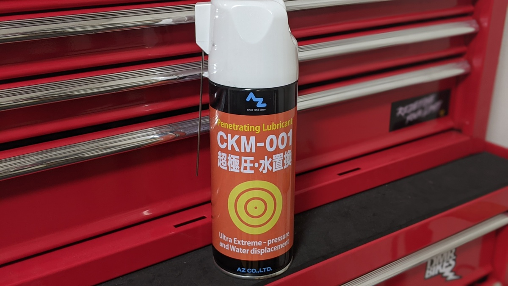

ここ数年間、ロード・CX・MTB と手持ちすべての自転車でチェーン潤滑を担いつつ、SPD ペダルや安プーリーの防錆にも使っている万能オイル。

安い、多い、汚れづらいという個人的な潤滑油の選定ポイントを全て満たしたオイルだ。

## 特徴

### コストパフォーマンス

<LinkBox url="https://www.amazon.co.jp/dp/B00J2I58EO/" isAmazonLink />

Amazon でいつでも購入できて、420ml のスプレーで 1500 円を切る圧倒的なコストパフォーマンス。ワコーズの[チェーンルブ](https://amzn.to/2XD2LyJ)が 180ml 1600 円ほどであることを考えると破格の値段だ。

AZ からはチェーンルブとしての性能に特化した[チェーンルブセミウェット](https://amzn.to/3sw5Mw4)も同価格帯で存在するが、自分は汚れを呼んだり飛び散ったりすることを嫌うのでドライタイプの CKM-001 を好んで使っている。

### 水置換性

MTB と CX では、頻繁に洗車と注油をする。

駆動系をチェーンマシンで洗う際に、[グゥーキンアルファ](https://amzn.to/2WaHImk)で汚れを落とした後に水洗いするのが定番の流れなのだが、水置換性のおかげで水分をさっと落とした後に乾燥の時間を設けることなく注油に入ることができる。

作業時間が短くなることで、洗車にかかわる面倒くささも低減でき、ものぐさな自分にとっては気軽に洗車できる一因となっている。

### 耐久性・汚れやすさ

いわゆるロングライフ系のオイルではなく、大体オンロードで 300km ～ 500km 程度走ったら再注油が必要だ。とはいえ、この距離だけ持てば短寿命というわけではない。

毎回綺麗に洗浄してから注油しているからなのか定かではないが、ドライ系のオイルにしては意外と持つ印象。

特に CX では、ほぼ毎回乗るたびに洗車と注油をするのであまりロングライフで高価なオイルを使ってしまうと落とすのがもったいなく感じてしまうので、自分のメンテナンス頻度や好みど真ん中の製品となっている。

## まとめ

景品や気の迷いで他のオイルを使うことはあるものの、CKM-001 はいつも手元にあって何かしらの潤滑に使っている。

安いことで遠慮なく洗浄して注油しなおせることもあり、貧乏性が発動せずに洗車で落として新しく注油できる。

良いオイルを使うより、綺麗な駆動系を保つことの方が走行抵抗の低減に寄与してくれることは自明。性能云々よりガンガン使って綺麗な状態を保つという観点で見ると手軽活効果的なオイルだと思う。
