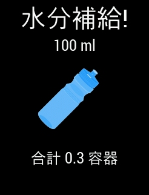
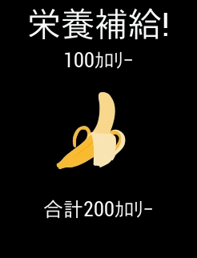

[Edge530](https://amzn.to/3khwtkq)に栄養補給アラート・水分補給アラートという機能があることを知ったので、ON にして走ってみた。

<LinkBox url="https://www.amazon.co.jp/dp/B08DD3LRH3/" isAmazonLink />

## 設定

栄養補給・水分補給のアラートは共に**設定 → アクティビティプロフィール →\{任意のアクティビティプロフィール\}→ アラート**から設定できる。

アクティビティプロフィールの設定なので、ロードで ON にしておき MTB や CX では使わない……といったこともできる。

種別としては、「距離」「タイム」「スマート」の三種類用意されている。後述するが、「スマート」モードではパワー・心拍・気温のいずれかもしくは全て利用しているようなので、**補給本来の意義を考えるとスマートに設定しておくのが無難だろう。**

王滝のように「30 分ごとに n kcal 接種する」と決めている場合だけマニュアルで設定したほうがよさそう。ちなみに初期値はタイムが 45 分、距離が 10km に設定されている。

## 使用感

夏の曇り、気温 30 度の昼間からスタートして 27 度に落ちていく中で利用してみた。走行距離は 60km ほど。

### 水分補給アラート

容器という曖昧な単位が登場しているが、Edge シリーズにおいてはボトル 1 本 650ml がデフォルト設定である（これはライド後の水分補給記録単位で出てくる）

気温 30 度、Garmin での気温計が 32 度ほどの中だと、水分補給はかなり頻繁に通知される。アラートに従って飲んでいると、20km を少し過ぎたあたりでボトルが 1 本空になった。

一方で、日が傾いて追い風になった**復路では明らかに通知間隔が広くなった。**このライドは当然パワーメーター・心拍計装着状態。そのため、運動状態を測っているのか気温だけで見ているのか分からないが、「スマート」というだけはあって何かしらのロジックに従って補給を促していることは間違いない。

自分の感覚で補給していた時よりも、かなり頻繁に水分補給させられて今までのダメさを反省させられた。

### 栄養補給アラート

補給は 100kcal 毎に、食べるべきタイミングで通知される。

**おおよそ総消費カロリーの 55%~60%ほどの補給を要求される。**これは、過去の記事でも書いたが自転車での有酸素運動における炭水化物の消費量とほぼ等しく、減量時に下調べしていた最低補給量と一致している。

人によってパワーあたりのエネルギー配分は変わるはずなのだが、このアラートが FTP 値を用いて出されているかどうかは定かではない。

<LinkBox url="https://blog.gensobunya.net/post/2021/06/magma_cyclist/" />

ちなみに残りの消費エネルギーは脂肪によって賄われている。

総消費カロリーの方は、パワーメーターさえあればほぼ正確な数値がはじき出せているはずなので、これはかなり信憑性のある数字になっていると思われる。

現実的にはアラートで通知される補給エネルギーより少ない補給でも完走できるが、その際はアラート量と実際の摂取量の差分がライド後に爆喰いしてよい食事量になると考えればよい。

## 総評

ライド中に考えなければならないことを 1 つ減らしてくれる機能として有能。

強度を上げたり、考え事をしたり、興奮しすぎたり、ライド中にうっかり補給を忘れる要素は数あるので、経験値や冷静な時の思考に頼っていることを外部化してくれることで更に走ることだけに集中できる…はず。

<LinkBox url="https://www.amazon.co.jp/dp/B08DD3LRH3/" isAmazonLink />
