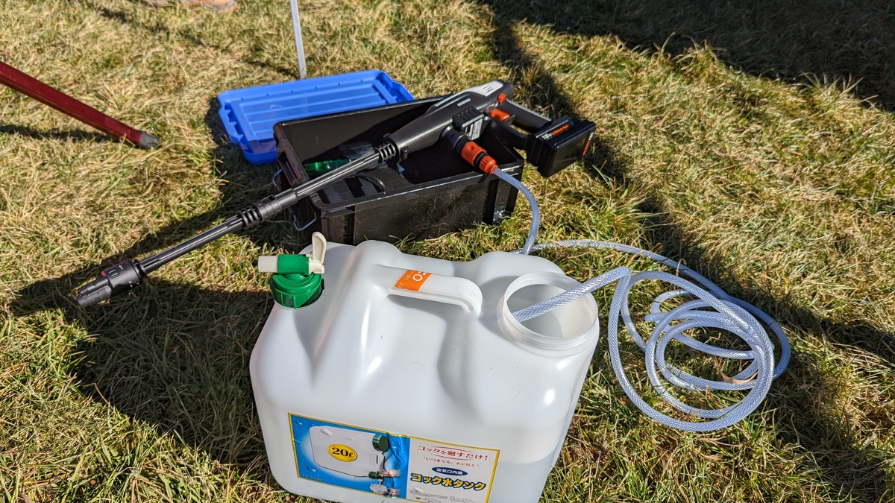
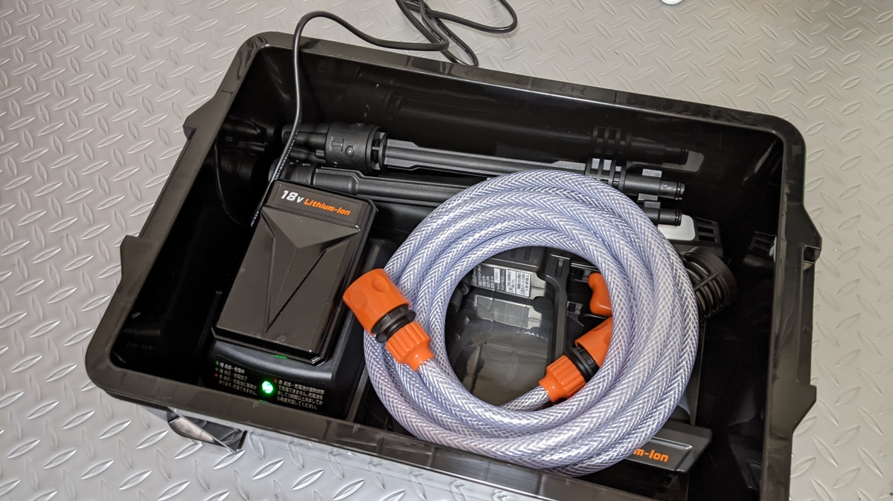
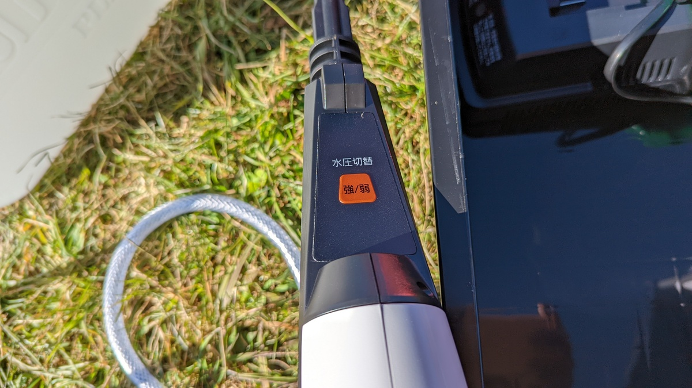
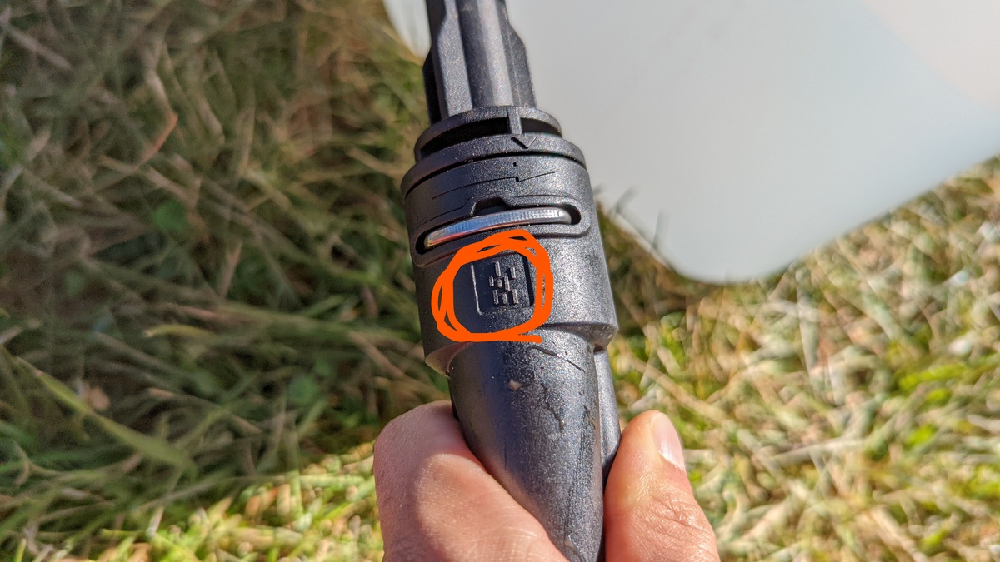
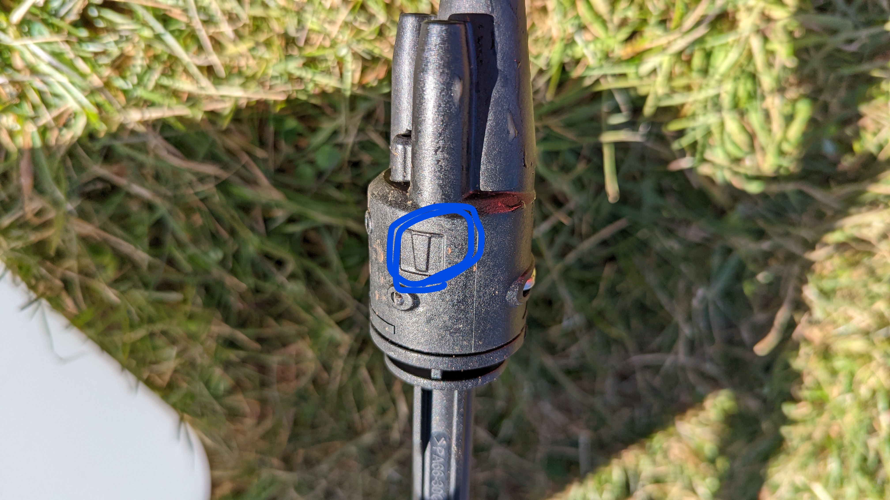
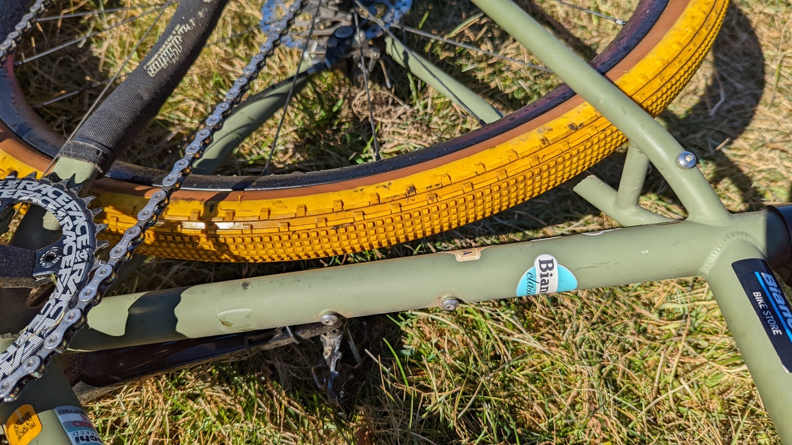

レースで使える自前の高圧洗浄機。なんと良い響きだろうか。

すくみずログで紹介されていた1万円台前半の[アイリスオーヤマ製高圧洗浄機(JHW-201)](https://amzn.to/3FpM7mR)。バッテリー式で分解可能、圧力はそこまででもないが、自転車相手には不足というわけでもない絶妙な製品だった。

<LinkCard url="https://skmzlog.com/10-17-2021-gojo-cx/" />

## 開封・収納

今回購入したのはコードレスモデルの[JHW-201](https://amzn.to/3FpM7mR)と、それを車載・運搬するためのコンテナボックス。

<LinkCard url="https://www.amazon.co.jp/gp/product/B08481Z7H1/" isAmazonLink />

<LinkCard url="https://www.amazon.co.jp/gp/product/B00IMR177S/" isAmazonLink />

記事内の収納があまりにもシンデレラフィットだったため、詳細を聞いて一緒にポチった。

コンテナのサイズは **W 約 29.5×D 約 44.3×H 約 15.9cm** と、聞き間違えたか？と思うコンパクトサイズ。

開封して、各パーツを投入してみると確かにピッタリだ。充電器を収納する必要があるかは悩みどころだが、とりあえずひとまとめにしておいた。

充電器か本体の端子が露出するので、**レース後に収納する際はホースから水を抜くことを忘れないように**する必要がある。

## 現地組み立て・使用インプレッション

野辺山CX Day1でレース後にちょっとこびりついた泥を落とすのに活用してみた。友人のバイクで。

<LinkCard url="https://blog.gensobunya.net/post/2021/11/2021_jcx_nobeyama/" />

まずは会場で展開してみる。

アップ用ローラー、タープ、そして洗車機。豪華シクロクロスセットだ。

一通り組み立て、ポリタンクの中に給水ホースを突っ込んで準備完了。

**給水用ホースの端はフィルター付きになっており**、簡単な異物や泥は入り込まないようになっているが、可能な限り綺麗な水を利用したい。

スペック上、満充電から30Lは利用できるらしいが、そこまでの水量は不要だろう（30Lあったら6回は洗車できる）

### 水圧設定

この洗浄機は水圧が高低の2種類、ノズルの種類が3種類用意されている。

トグルスイッチなので今の水圧設定がわからないのが玉に瑕だが、高圧設定固定でよかった。

ノズル側を回すことで、ストレート・やや拡散・拡散の三種類を切り替えることができる。上記のマークは拡散設定だ。

6種類の組み合わせ全てを試してみたが、**高圧＋やや拡散の組み合わせが自転車の洗車にはもっとも向いていそう。**

### 洗車結果

朝方は霜が溶けてコース内がかなりぬめっており、友人バイクのグラベルキングSKはかなり泥が詰まっていた。

こちらが、[JHW-201](https://amzn.to/3FpM7mR) で洗車した後のタイヤである。

もちろん、ガソリン発電機経由で給電したり、ケルヒャーの上位モデルの圧力には劣る…というか遥かに弱い。

しかし、その分自転車を吹っ飛ばしたり、高速でホイールを回転させることもないため、**周囲に泥水をまき散らさないというメリット**にもなる。

タイヤに入り込んだ泥を落とすには十分なパワーはあるため、**小回りの利く必要十分な洗浄機**だ。

## まとめ

オフロードレースをする自転車の洗車機としては、**必要十分なパワーを持った高圧洗浄機**。

ただし、自動車のホイールに付着したブレーキダストを落としたり、コンクリートの床の汚れを落としたりと、**強力な高圧洗浄機の代わりになるものではない**。

バッテリー式で、コンパクトにたためて持ち運びが簡単、という特性を生かして遠征用の装備にするのがいいだろう。

<PositiveBox>

- 自転車洗浄に必要十分な水圧と水量・稼働時間
- 1万円台半ばという絶妙に安い実勢価格

</PositiveBox>

<NegativeBox>

- ノズルの取り回しの悪さ
- ホースアダプタの精度の悪さ

</NegativeBox>

<LinkCard url="https://www.amazon.co.jp/gp/product/B08481Z7H1/" isAmazonLink />
