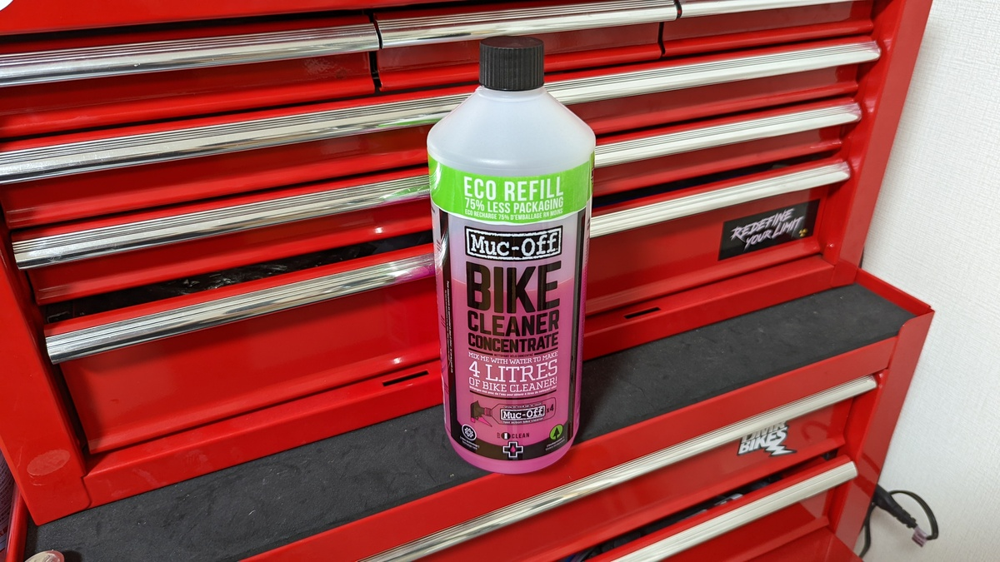
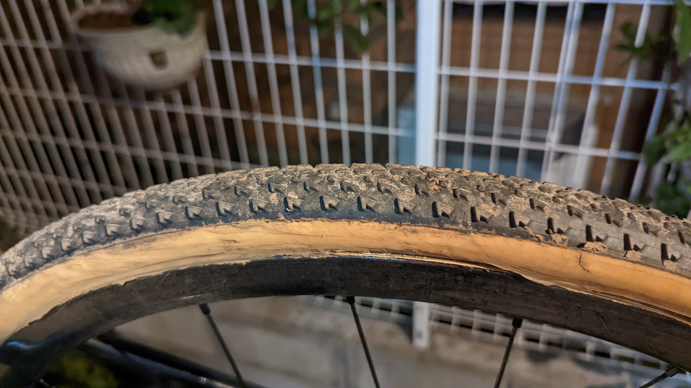
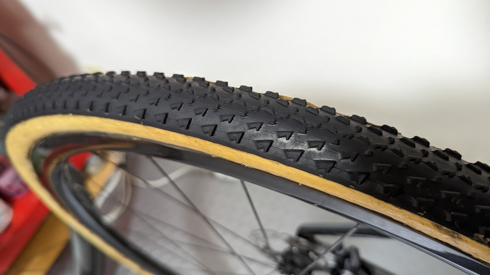
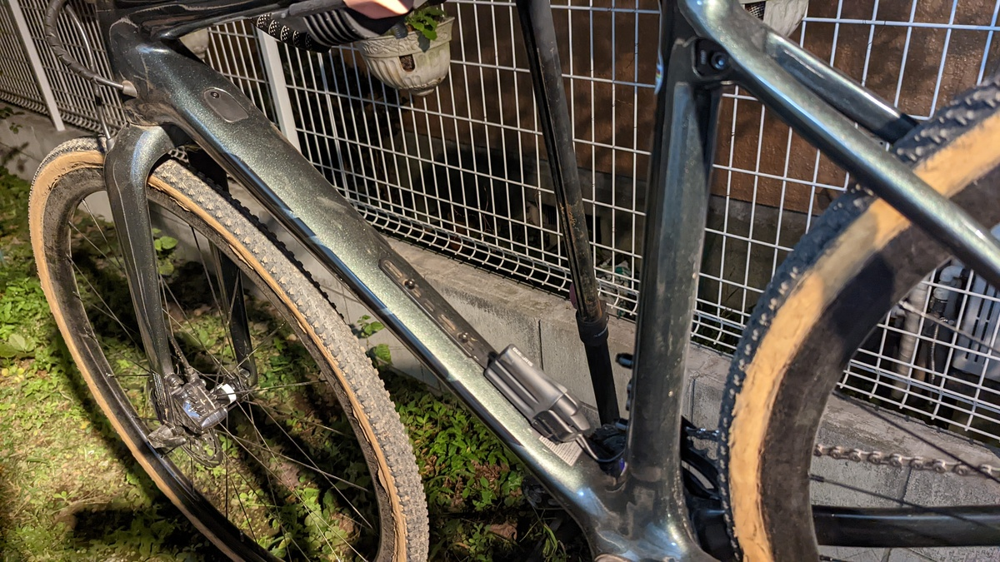
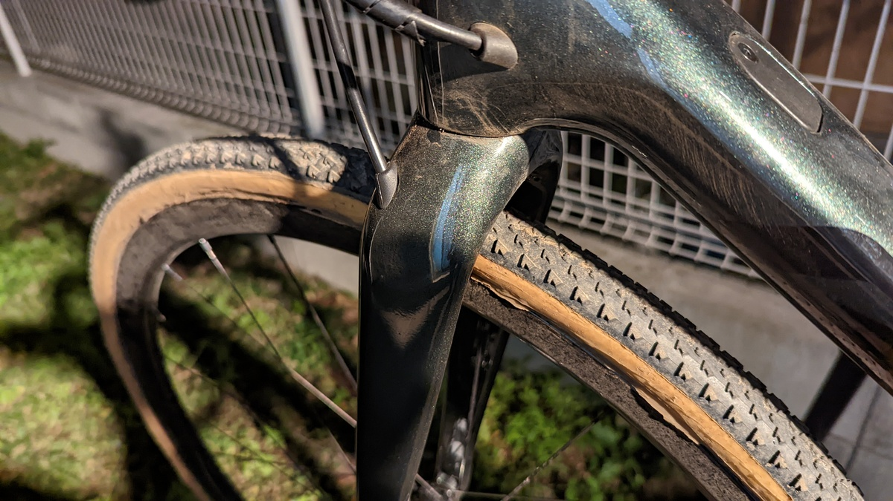
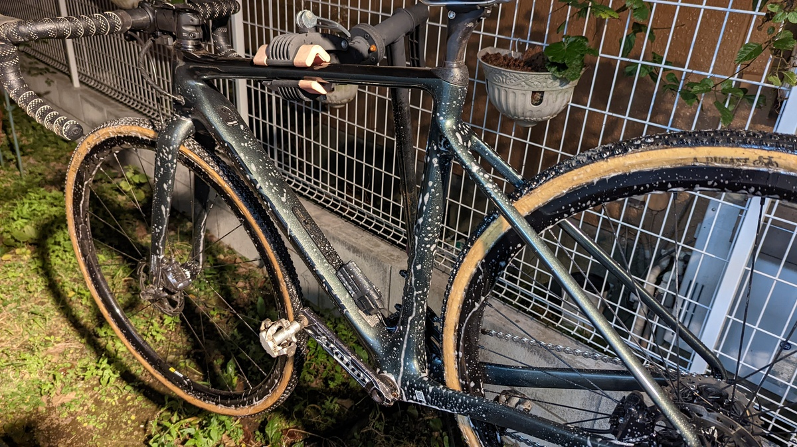
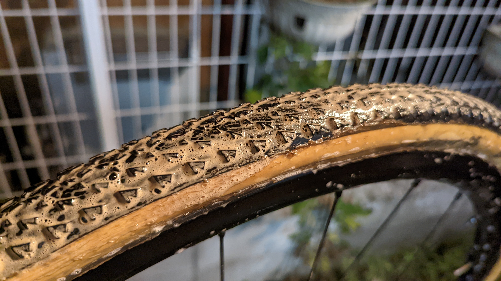
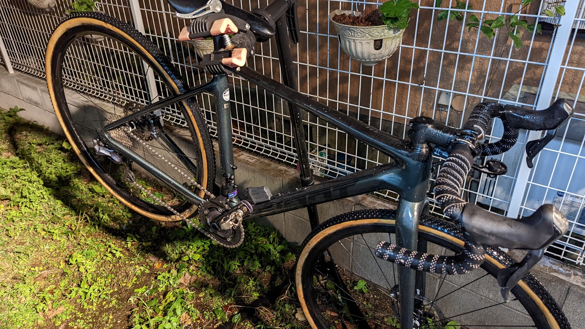
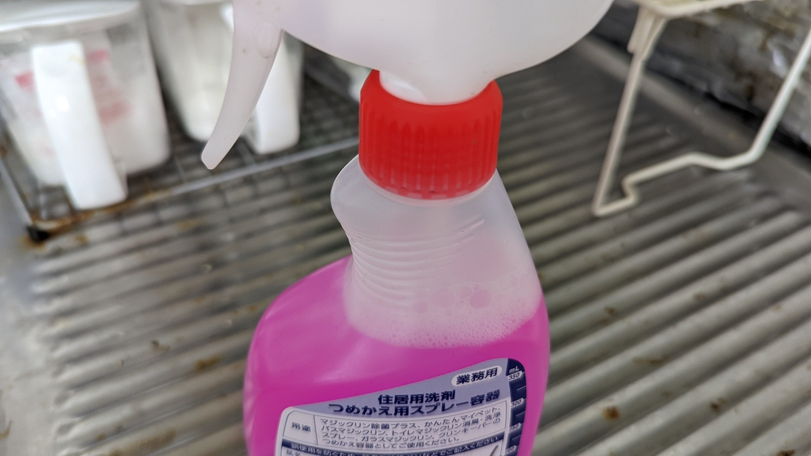

## 泥汚れもすっきり落としてタイヤの黒さも復活

普段は代用品ばかり推していることが多い筆者だが、専用品としてのメリットがある商品は積極的に使うことも多い

今回紹介する[Muc-Off ナノテックバイククリーナー](https://amzn.to/3GZvYpO)もそのうちの1つだ。

<LinkCard url="https://www.amazon.co.jp/gp/product/B07T1YW9BW/" isAmazonLink />

泥にまみれたタイヤなど、**単純な水洗いや高圧洗浄では泥の跡が落ち切らないことも多い**が、きれいさっぱり黒さを取り戻してくれる。

砂ほこりにまみれたJCX幕張後のタイヤもこの通り。

タイヤのトレッド部分が、新品と見まごうばかりの黒さを取り戻している。

CXやMTBなど、オフロードはもちろんのこと。ロードバイクも路上の埃や汚れ、排気ガスの細かい粒子など取りづらい汚れであふれているが、このクリーナーを使うことでスッキリ洗い落とすことができる。

> 汚れやホコリを顕微鏡レベルで分解するナノテクノロジーで作られ、強い洗浄力を発揮。
>
> また危険な酸や化学物質を含まず、バイクにも環境にもやさしい生分解性でアルカリ性。カーボンファイバーを含む、あらゆる自転車の部品と表面に安全です。 シール、ケーブル、ブレーキパッドやローターも傷つけません。

専用品だけあって、自転車での利用に配慮されているのもありがたい。

## 作業手順

1. 軽く自転車全体を濡らす
2. [ナノテッククリーナー](https://amzn.to/3GZvYpO)を全体に吹きかけ、**数分待つ**
3. タイヤを[亀の子たわし](https://amzn.to/30aQ93B)などの適度な硬さのブラシでこすって泥を浮かせる
4. 全体をしっかりゆすぐ
5. 水気を切って乾燥させる

### 1. 水で自転車全体を濡らす

ドライコンディションのレースで利用したバイクを洗車していく。

タイヤの細かい泥汚れはもちろん、フレームにも巻き上げた砂埃が付着していることがわかる。

特に、ヘッド周りは使用に応じて染み出してくるグリスが埃を拾って目立つ汚れになってきているのが分かってもらえるかと思う。

水でざっと流すだけでもいいのだが、グリップを重視したコンパウンドのタイヤは特に泥が落ちづらい**。異物の付着があるとタイヤ寿命にもかかわる**ので、なるべくきれいにしたいところ。

### 2. クリーナーを吹いて、待つ

最も重要なポイントがここ。

一度[ナノテッククリーナー](https://amzn.to/3GZvYpO)を全体に**吹きかけた後、分解のために数分待つ必要**がある。

自分の場合は後述するタイヤをブラッシングする手順があるので、ホイール前後 → フレームの準に吹きかけている。

### 3. タイヤをこすって泥を浮かせる

フレームのような元々汚れをはじくような部分はクリーナーと水洗いだけで十分なのだが、タイヤはそうもいかない。

綺麗な黒さを取り戻すには、軽くブラシでこすって泥を完全に浮かせる必要がある。

翌日もレースがあるような時は**ブラッシングしなくてもそれなりに綺麗にはなる**ので、ケースバイケース。

ブラシの硬さはダメージを与えすぎず泥は落とせるといういい塩梅が必要になってくるが、[亀の子束子の製品](https://amzn.to/3H1mEBS)が、毛も抜けずに硬さも実にいい感じなので愛用している。

<LinkCard url="https://www.amazon.co.jp/gp/product/B01LZ4WFNF/" isAmazonLink />

気が付いたらMuc-offから[洗車用のスクラブグローブ](https://amzn.to/3c6tZSB)も登場していたので、こちらを使ってもよさそう。

<LinkCard url="https://www.amazon.co.jp/gp/product/B09KL22CKH/" isAmazonLink />

<iframe
  width="560"
  height="315"
  src="https://www.youtube.com/embed/fEcIikdl6yE"
  title="YouTube video player"
  frameborder="0"
  allow="accelerometer; autoplay; clipboard-write; encrypted-media; gyroscope; picture-in-picture"
  allowfullscreen
></iframe>

このグローブ、謎のエロいPVまで用意されていた

### 4. ゆすぎ

タイヤのブラッシングが終わるころには数分経っているので、全体に水を流してクリーナーを落としていく。

泡が残ると、落とした泥の粒子も残ってしまうのでBB下やホイールの下になっているところに濯ぎ残しが無いようにする。

### 5. 乾燥

自転車をバウンドさせたり吊ったりして、水気をあらかた切ったあと拭き上げて完了。

15分ちょっとの作業で、室内に持ち込んでも全く問題ない状態にできた。

大抵この洗車作業はレース後になるので、チェーンの注油くらいはしておく。

## 購入・運用について

単品・ストレートの商品を買うと割高に感じる人もいると思うので、濃縮版の購入を推奨する。

<LinkCard url="https://www.amazon.co.jp/gp/product/B07T22FKHB/" isAmazonLink />

※画像は5Lパッケージだけど商品は500mlなので注意

<LinkCard url="https://www.wiggle.jp/muc-off-%E6%BF%83%E7%B8%AE%E3%83%90%E3%82%A4%E3%82%AF%E3%82%AF%E3%83%AA%E3%83%BC%E3%83%8A%E3%83%BC-1l-" />

濃縮版が1Lあれば、2バイク運用のCXerが2シーズンくらいは困ることなく利用できると思う。

自分は濃縮版だけを購入して、花王の詰め替え容器で薄めたものを利用している。

<LinkCard url="https://www.amazon.co.jp/gp/product/B0091FWSUA/" isAmazonLink />

濃縮版を原液で使えばディグリーザー代わりにすることもできるらしいが、コスト・使用感の面でおススメできるものではなかった。ディグリーザーであれば素直にグゥーキンアルファを使った方がいいという結論。

それぞれのインプレは過去記事を参照してもらいたい。

<LinkCard url="https://blog.gensobunya.net/post/2020/03/nanotech_degrease/" />

<LinkCard url="https://blog.gensobunya.net/post/2020/03/ghakinalpha/" />

このナノテッククリーナー、セールの時はそれなりに安く売られていることも多いのだが、昨今の品不足に伴いセールには期待できない状況が続いている。

代わりに、Muc-offから[Winter キット](https://www.wiggle.jp/muc-off-%E3%82%A6%E3%82%A3%E3%83%B3%E3%82%BF%E3%83%BC%E3%82%A8%E3%83%83%E3%82%BB%E3%83%B3%E3%82%B7%E3%83%A3%E3%83%AB%E3%82%AD%E3%83%83%E3%83%88)なるものが発売されている。

こちらは、濃縮1Lのパッケージとほぼ同価格でその他諸々ついてくるお得なパックとなっているので、これから購入する人はこちらを買うのがいいだろう。

<PositiveBox>

- タイヤについた細かい泥汚れまで綺麗に落とせる強力な洗浄力
- 濃縮版でコスト圧縮が可能
- ディグリーザーとしても利用可能（ただし専用品には劣る）

</PositiveBox>

<NegativeBox>

- 水洗い前提

</NegativeBox>

<LinkCard url="https://www.wiggle.jp/muc-off-%E3%82%A6%E3%82%A3%E3%83%B3%E3%82%BF%E3%83%BC%E3%82%A8%E3%83%83%E3%82%BB%E3%83%B3%E3%82%B7%E3%83%A3%E3%83%AB%E3%82%AD%E3%83%83%E3%83%88" />
