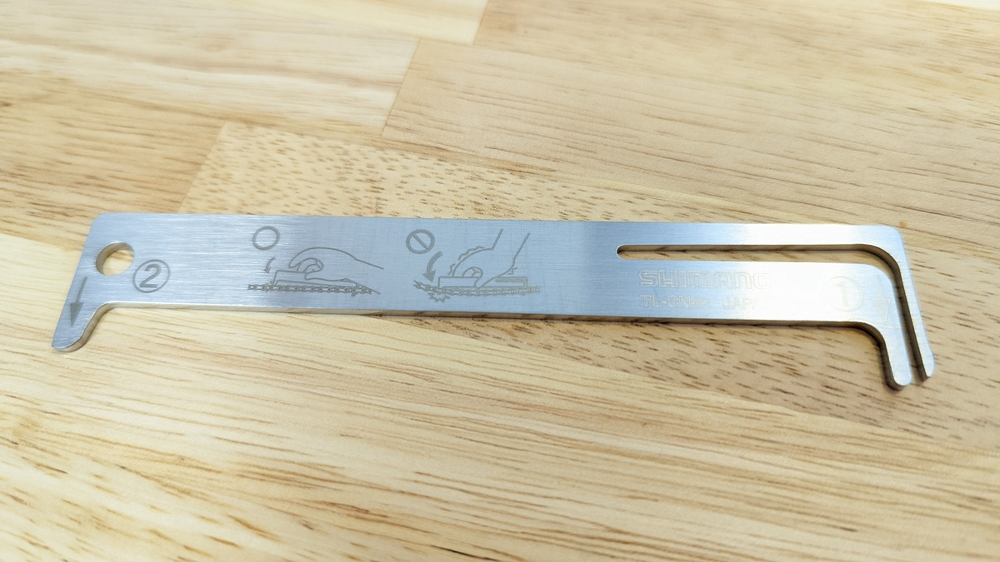
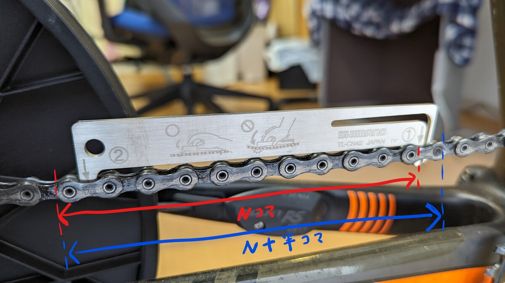
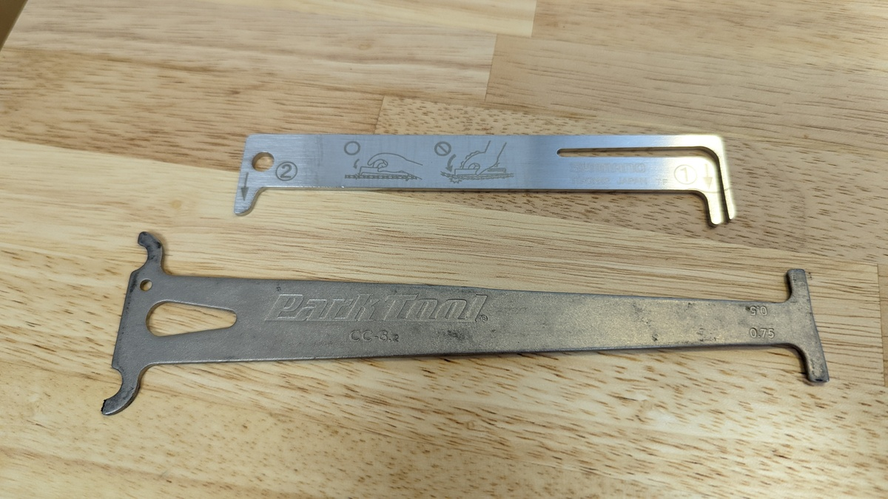
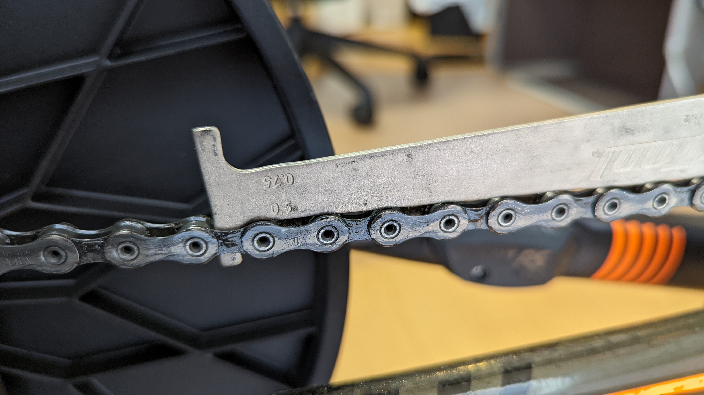
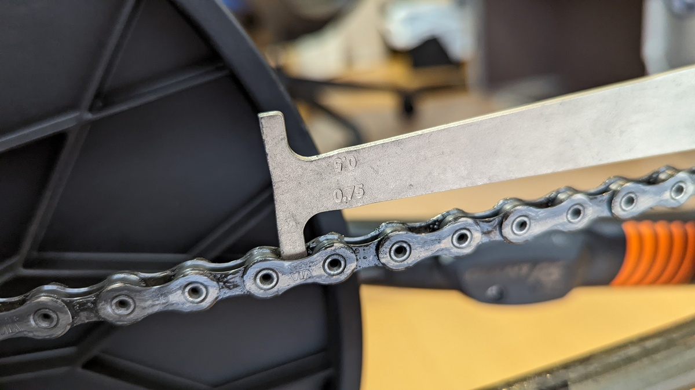
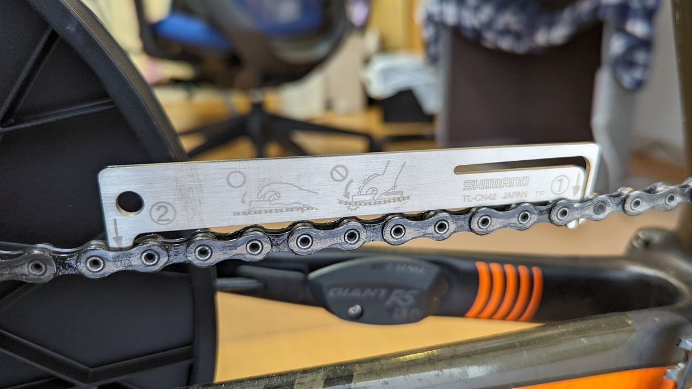

しばらくチェーン交換してないなぁ…と思ったので、一時期自分のタイムラインで話題になった正確な（本来の）チェーン伸びを測ることのできるシマノのチェーンチェッカー [TK-C42](https://amzn.to/3k8t34w)を購入してみた。

<LinkBox url="https://www.amazon.co.jp/dp/B00DT01OBC/" isAmazonLink />

一般的なチェーンチェッカーと違い、先にセットする側がバネ状に働くことで、内側のリンクを押して **N+半コマではなく、N コマの伸びを計測**できるようになっている。

実効上の交換頻度に影響があるかどうかはとにかく、正しく計測できるというのは気分がいい。

細かい点については下記の記事を参照。

<LinkBox url="https://cannonball24.com/review-shimano-tl-cn42-chain-checker/" />

<LinkBox url="https://chan-bike.com/simano-tl-cn42" />

## これまでのパークツール製チェッカーと比較してみる

これまで利用していたチェーンチェッカーは、[Parktool CC-3.2](https://amzn.to/3GVJ9bn)。

ロゴを揃える方向にしたら、最大の違いである固定部分が互い違いになってしまった…

シマノのチェッカーが右（先に入れる）：内側、左（判定）：外側で計測するのに対して、右：外側、左：外側で判定する仕組みとなっている

<LinkBox url="https://www.amazon.co.jp/dp/B00D6AI0IK/" isAmazonLink />

チェーンの伸び率0.5%か0.75%を計測できるようになっている。ちなみに[TK-C42](https://amzn.to/3k8t34w)は**特に伸び率の明記はなく、刺さり切ったら交換時期判定**をするだけと、使い方に違いがある。

### 同一の古いチェーンを計測してみる

まずは[Parktool CC-3.2](https://amzn.to/3GVJ9bn)で計測してみる。

0.5%の面でチェッカーが刺さり、0.75は刺さり切らない。最低でも0.5%は伸びている。

[TK-C42](https://amzn.to/3k8t34w)での結果は…

刺さり切らず。まだ交換タイミングではないらしい。

ここで見たいのは**計測区間のチェーンテンション**。シマノはしっかりチェッカーを装着すると、右側のコマを引き延ばすようにしてテンションをかけ、一定の結果が出るようになっている。

**パークツール方式だと、正直に言えば「載せているだけ」 **と言っても過言ではなく、チェーンの隙間の異物や取り付け時に力を入れてチェーンが伸びる方向にテンションがかかるかによって結果に誤差が出る。

正確性については、シマノの方がコマ数の考え方も含め信頼できそう。

## まとめ

工具界ではトップブランドのパークツールのチェーンチェッカーからさらに2倍以上するシマノのチェーンチェッカー。正確さに対するこだわりが出ている。

**そもそも論として、チェーンチェッカーについては伸び率の判定数値が 0.5/0.75/0.1 など各社まちまちだ。**

紹介した記事に載っている[バイクハンドのチェッカー](https://amzn.to/3BNk7ax)は0.75%/0.1%計測。じゃあパークツールの0.75%で引っかかってもまだ交換しなくていいのでは？本当の交換タイミングとは？と考える羽目になる。

そこでメーカーの見解を調べるとと、参考記事と同じく、[シマノの公式見解](https://bike.shimano.com/ja-JP/information/jp-news/upgrade-with-sil-tec-chains.html)を引用することになる。 シマノとしてのアナウンスは、**伸び率計測の場合、0.5%を越えたら交換**ということになっている。

> 0.5 から 0.75 の間にある場合はチェーンの交換が必要です。
>
> もし 0.75 を超えているようでしたらチェーンの交換と合わせてカセットスプロケットやチェーンリングに大きな摩耗が無いかチェックし、必要に応じてそれらも交換してください。

<LinkBox url="https://bike.shimano.com/ja-JP/information/jp-news/upgrade-with-sil-tec-chains.html" />

計測数値が2つあると、貧乏性が顔を出してしまい、小さい数値でチェッカーに引っかかっても「まだもう少しいける」と考えがち。

[TK-C42](https://amzn.to/3k8t34w)は、交換時期をシンプルに判断するという意味でも、正確に一定の値で交換を推奨してくれるツールになってくれる。

**数字を測って意味を考えるより、チェッカーが交換と言ったら交換する基準の方が運用しやすい。 ** 「チェッカー」として本来の役割を果たしているのではないだろうか。

<PositiveBox>

- 本来計測すべきチェーンの伸びを正確に計測可能
- 迷いのないチェーン交換基準を作ることができる

</PositiveBox>

<NegativeBox>

- チェーンチェッカーとしてはかなりの高価格帯

</NegativeBox>

<LinkBox url="https://www.amazon.co.jp/dp/B00DT01OBC/" isAmazonLink />
