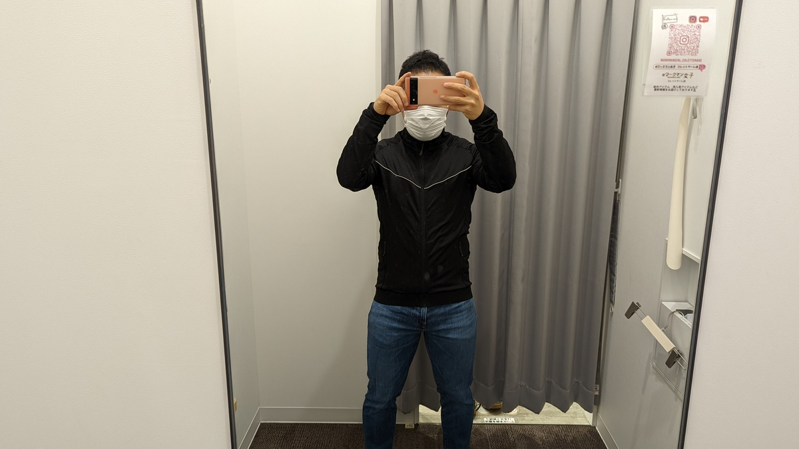

## ワークマンジャージに S サイズ爆誕！

ワークマンの激安サイクルジャージは自分も気になっていた。

<LinkCard url="https://skmzlog.com/workman-move-active-cycle-jersey/" />

なんせ税込1500円だ。安さのレベルが違う。

残念ながらこの製品では下のサイズがMサイズ（身長下限目安165cm)までしか存在していないため、緩めのカットということもあり身長160cmの自分には合わないことは明らかだった。

しかし、このウィンタージャージにはSサイズ（155-165cn)がある！というわけで早速近場で漁って試着してみた。

参考記事はこちら

<LinkCard url="https://skmzlog.com/workman-move-active-warm-jersey/" />

## まとめ

- **S サイズ、大きすぎ**る…
- ポケットが沢山ある。ジッパー付きポケットは少しだけうれしい
- **防寒はかなり怪しい**
- 肌触りやストレッチ性はよい
- ゆるすぎるカットが幸いして前傾姿勢でなくても使える
- ロードサイクルウェアとしては価格を加味しても ★2
  - CXウォームアップウェアとしてなら ★4

## ファーストインプレッション

**どうみてもでかい**というか長い

身長160cmに**短足であって、なお着丈が余っている**。というか普段着によくあうフィット感でサイクリングウェアという感じはあまりしないというのが第一印象。

サイクルウェアだとこんな感じ。自分はがっしり体形のはずなんだが色々布が余っている…

ビブショーツを履いたうえでこのジャージの裾を延ばすと、ウィッチさながらの見た目になる。

とはいえ、ここまでは予想済みだったので、腹案を試すために一旦購入

## 防寒性

2021年の野辺山シクロクロス会場という、関東近郊で寒さを先取りできる会場でお試し。

当日の気温は最高10度、**シクロクロス試走という高強度**と、**周辺サイクリングの低強度**で利用してみた。

### 高強度(シクロクロス試走)

非常にGood。かいた汗を排出しつつ、必要な分だけ保温してくれる。

シクロクロスという特殊な環境下でいえば、**長い着丈も下に着たメインウェアを泥から守る点で役に立っている**。

ポケットが多い点も、車のカギやちょっとした物（[空気圧計](https://amzn.to/3ng7yke)とか）を持ち運びたい試走の時に良い。詳細は省くが、実に8箇所ものポケットが装備されている点はワークマンらしい。

### 低強度(ポタリング)

端的に言って**快晴とはいえ一桁の気温で使うには寒い**

防風性がないので、当たり前といえば当たり前でなのだが、**一桁気温ではウィンドブレーカー込みでもちょっとつらい**

というのも、このジャージは**首元のガードがかなり甘い**。

胴体部分がゆるいのはそういうものとして捉えることもできる。

しかし、**首元も緩くなっており容赦なく風が吹き込んでくる**ので**気温は 15 度程度は欲しい**。これくらいの気温ならむしろ首周りは放熱してくれた方が助かるはず

## 結論

**平野部の冬の入り口や、春の初めの時期**に町中ポタリングをする分にはちょうどよさそうな出来。一方で**シリアスなロードライディングにはちょっと使いたくない**。

安い、長い、ジッパーポケット有り、防寒そこそこ防風無しという特性を生かして**シクロクロスの試走に使うのが最適な使い方**と自分も結論づけた。

ただSサイズの対応身長・対応胸囲の範囲は完全に嘘乙。もうちょっとサイクルウェアっぽいカットというか、サイズに応じたものを作ってほしい。
