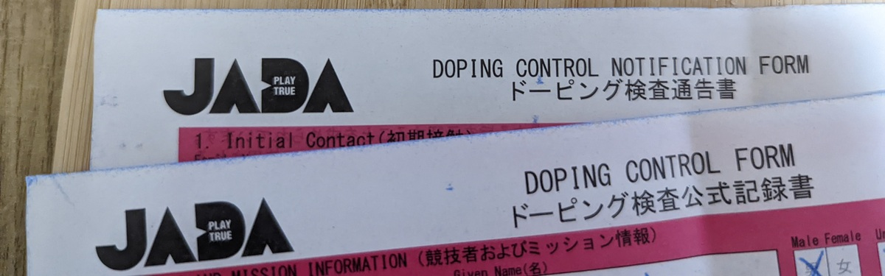
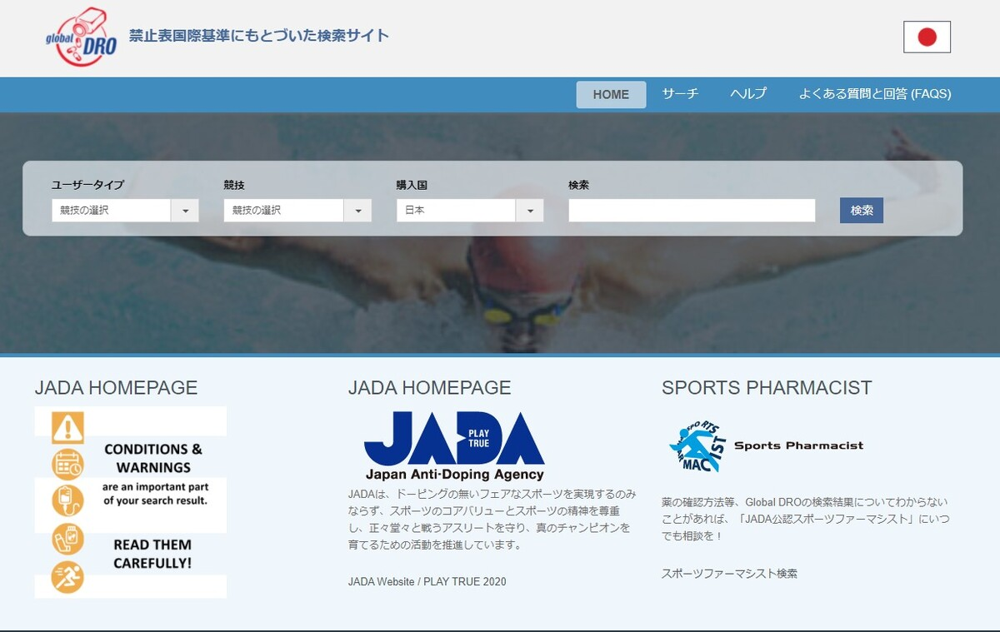

## このコンテンツについて

**この記事は、コミックマーケット 99 で頒布した「[Cyclocross Deep Dive](https://amzn.to/3qJo6l8)」の一部を抜粋・編集したものです。**

フルバージョンが読みたい方は、[メロンブックス](https://www.melonbooks.co.jp/detail/detail.php?product_id=1163552)での物理本の委託購入もしくは、[Kindle での電子版](https://amzn.to/3qJo6l8)の購入をご検討ください。

<Amzn asin="B09NWBGVJD">

<LinkCard url="https://www.melonbooks.co.jp/detail/detail.php?product_id=1163552" />

[Cyclocross Deep Dive](https://amzn.to/3qJo6l8)では、[すくみずろぐ](https://skmzlog.com/)の[すくみずさん](https://twitter.com/skmzmw)を共著者に迎え、このような体験談のほか、国内におけるAJOCCレースへ参加するためのTIPSとシクロクロスにおける機材・テクニックの知識を中心に、下記のようなメニューを100ページでお送りしています。

- レースに参加するための基礎的な知識
- コース紹介
- レース会場で戸惑わないための運営知識
- レースを楽しむために
- シクロクロス・テクニック
- シクロクロスアンサイクロペディア

> シクロクロスでは、毎年・毎レース異なるコースに対して選手が持ち前の反応とテクニックを駆使して、時に華麗に時に失敗しながら、乗り手のセンスで自転車を操り、ゴールまでたどり着いているように見えます。しかし、膨大に見えるパターンに対応している中で、大事にしている基礎があり、守られている原則が存在しています。本書では、カテゴリー 1 で 10 年以上レースをしている「すくみず」さんをゲストに迎え、同じく 5 年ほどカテゴリー 1 レースを走っているゲンと共に、レース内外で行われているそのような原則を分解し、解説しています。日本国内のルール・機材運用・練習方法・観戦のコツ・レース当日の流れ・ちょっとしたおふざけの付録が詰め込まれた一冊です。

## UCI レースにおけるドーピング対応

シクロクロスでは、UCIレースに出場する責任として、ドーピングコントロールへの参加がある。市民レーサーでも（むしろ市民レーサーほど）うっかり禁止成分のある処方薬・市販薬でドーピングにひっかかってしまうことがありうる。

検査対象は、入賞者および**ランダムで選定された数名**となるため、エリートクラス下位でも抽選に当たると検査対象となる。

筆者は今年ランダム抽選の対象となったので、その経験を活かして書いていく。これを読んでいる各位も、プロセスに対する理解と協力をして、スムーズな検査や、うっかりドーピングの防止に協力してほしい。

**なお、この文書は公式なプロセスや用語ではなく、あくまで筆者の体験をもとにまとめたものである点に留意してほしい**

### プロセス

1. 検査対象決定
2. シャペロンの同伴
3. 検査エリアでの検査
4. 書類受け取り

ドーピング検査における流れは、おおまかに分けると上記の4ステップだ。

レースでのアナウンスは「ドーピングコントロール対象をコミュニケに掲示するので、必ず確認すること」の一言のみだが、実際はコントロール対象になるとシャペロン（検査員）がレース直後から張り付くため、よほどイレギュラーな動き（コース途中でDNFして駐車場直行など）をしない限りは否が応でも、この流れに組み込まれることとなるだろう。

### 完走（or 80% Cut）後の対応

レース終了後、シャペロンの人に声をかけられ、ゼッケンナンバーおよび氏名の確認が入る。

レース直後は大抵の場合頭が働かないので、ドーピングコントロールの存在を知らない人は、ここで少しパニックになるかもしれない。兎にも角にも対象になった以上、協力するしかないので、シャペロンさんに説明されることをよく聞いておこう。

シャペロンの方は、非常に紳士的な対応をしてくださるので、分からない点はどんどん質問してよい（というか、そう推奨される）。この後、**すぐに検査エリアへ向かうわけではなく、シャペロンの同伴の下で一定の行動の自由はある。**

クールダウンや後片付けをしたのち、検査エリアへ向かうことになる。飲食しても問題ないが、変なものを食べたい気分でもないだろうし、検査エリアでは**水とスポーツドリンクが飲み放題**なのであまり飲み食いする必然性もない。

上着などを着こんで防寒した後、貴重品などを持って検査エリアへ赴くことになる。なお、身分証明書が後から必要になるため財布は持ち込んでおきたい。

### 検査エリアでの対応

1. 検査に関する説明・申告
2. 検体採取・確認
3. 封印
4. 書類の確認・受領

検査エリアでは上記4つの手続きを実施する。

#### 検査に関する説明・申告

これからの検査プロセスおよび、直近で摂取したサプリメント類・医薬品類を申告できる。

申告したからといって検出結果と処分が免除されるものではないが、万一違反物質検出後に処分の軽重（もしくは情状酌量）を決定する際に、根拠となりうるので、可能な限り記載したほうがいいとの説明であった。

処方薬がある場合は、それも記載することをおすすめされるので、お薬手帳は電子型を利用してスマホから常に参照できるようにしておきたい。

#### 検体採取

一定量の尿を採取する必要がある。運動直後に出す量としては多めかと思われるので、**無料の水とスポドリはガンガン飲んでおきたい。**自分は1.5Lくらいその場で飲んだ。

当然だが、出すまで帰ることはできない。また、尿成分が一定を越えていないと検体として使えないそうなので、比重の検査もその場で行うことになる。一定の比重を越えていないと出し直しになる。

#### 検体封印

検体はコンタミしないように選手自身の手でカップに取った後、**自分で検査キットを選択し、開封し、検体を封印用の瓶にそそぐことになる**。すり替えや取り違えが起きないよう、かなり厳重に手順が設定されているようだ。

### その後

色々サインした後に、冒頭の赤紙を受け取って終了。出すものさえ出れば、時間はかかるものの割と難しいことはない。

### うっかりドーピングを避けるには

さて、ここからが本題。ドーピングの禁止成分には、麻黄（エフェドリン）やステロイドなど、市販薬や花粉症の処方薬に含まれるものも存在していて、知らないといつの間にか摂取していることもありうる。

使っている薬に禁止薬物が含まれているかどうか、一発で検索できる [Global DRO](https://www.globaldro.com/JP/search)というサイトがあるので、知らない薬が処方された場合は飲む前に確認しておくことをおすすめする。そもそもドーピングに理解のあるドクターや薬剤師が身近にいればいいが、そうではないことも多いだろう。

<LinkCard url="https://www.globaldro.com/JP/search" />

JADA提供となっており、信頼性も高い。スポーツファーマシストの検索も可能となっている便利なサイトだ。

ステロイド系の成分を含む薬でも、内服しなければOKといった細かい内容もわかるようになっている。

## 宣伝

この記事は、一部自分の感想や、シャペロンから伺った興味深い五輪の体験談など一部を省略して、要点のみ記載しました

フルバージョンはKindleの電子版か、メロンブックスの委託通販を使ったC99新刊に掲載しております。

<Amzn asin="B09NWBGVJD">

<LinkCard url="https://www.melonbooks.co.jp/detail/detail.php?product_id=1163552" />
