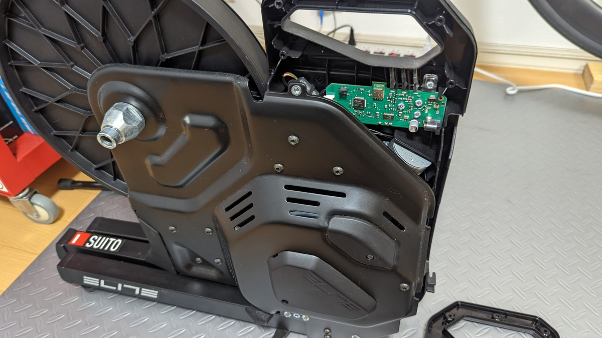
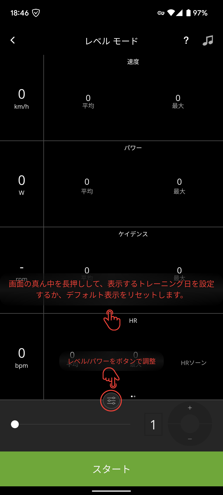
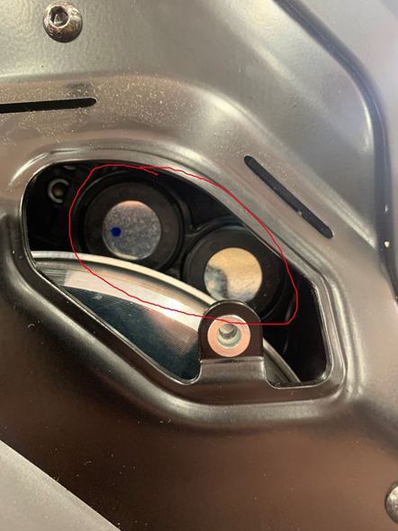
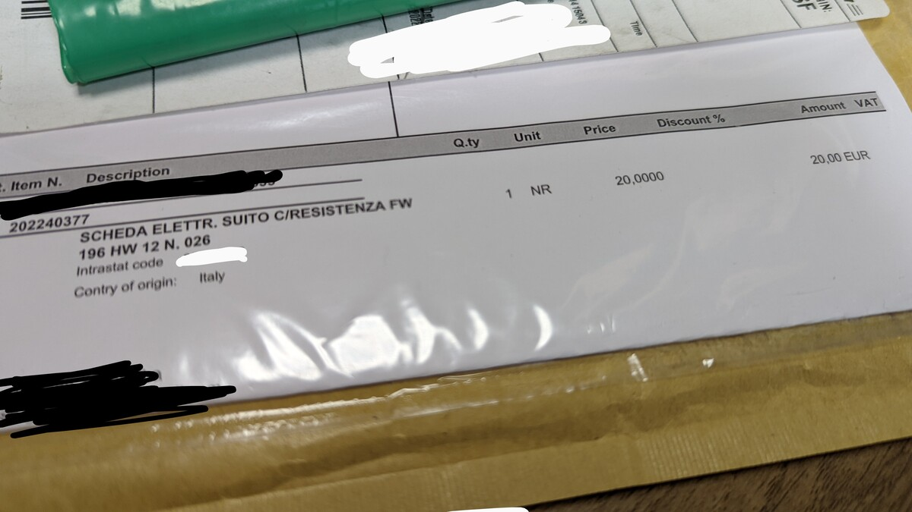
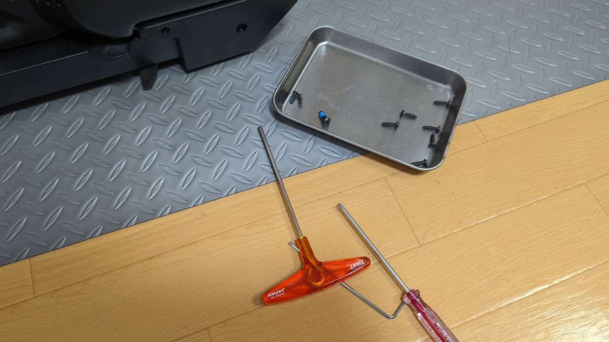
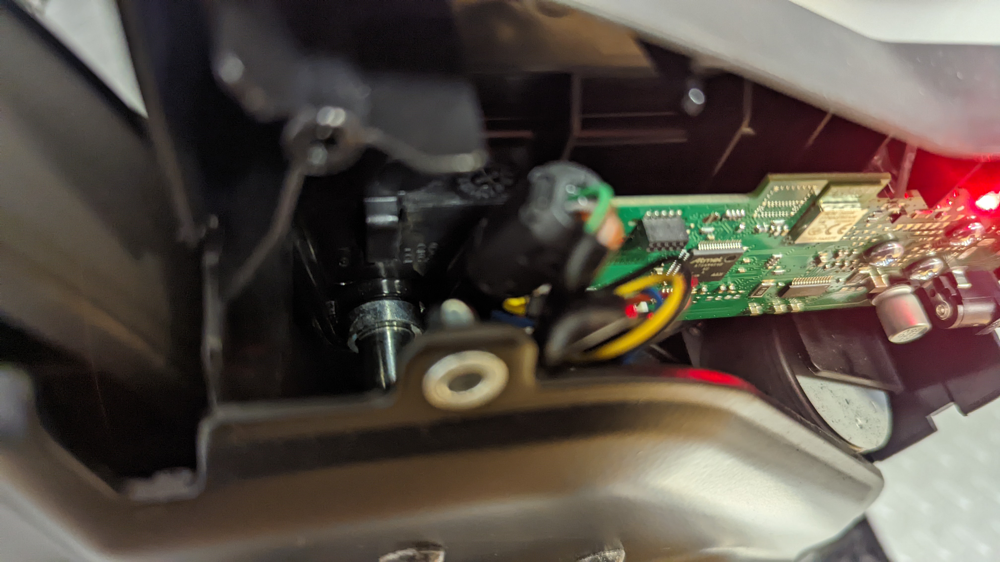
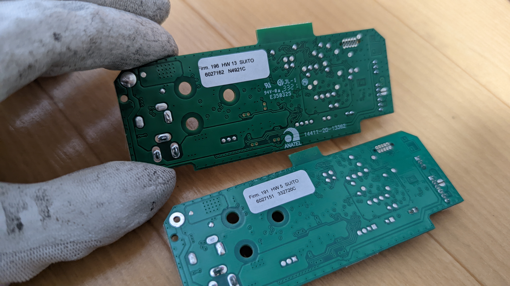
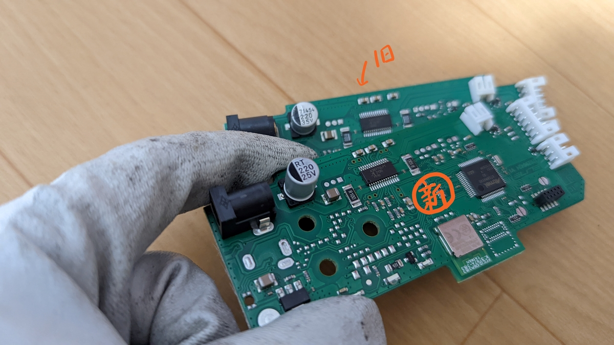
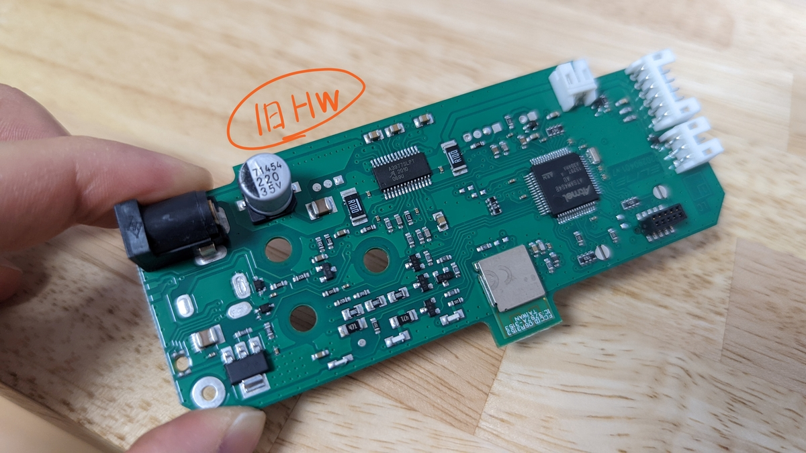

## 海外通販で買った製品が壊れた！

海外通販における大きなリスク、保証と修理。

ProBikekitで買ったSUITOがついに故障、Elite本社のサポートに連絡して保証修理できたので、レポートする。

## TL;DR

<PositiveBox>

- Eliteのグローバルサポートは対応が速い
- イタリアからの補修部品も1週間前後で日本に届く
- 「修理する権利」を重要視するEU圏メーカーだけあり、修理しやすい構造になっていた
- 有名ブランドはサポートもしっかりしていると再確認

</PositiveBox>

## 症状の特定と診断

今回の症状はトレーナーの負荷が全く変動しないというもの。まず分かっている症状としてZwiftでERGモード、坂道での負荷変動がない。

### Zwift かトレーナーか？

Eliteのトレーナーには設定変更とトレーニングプログラムの役割を持つ、[my e-training アプリ](https://www.riogrande.co.jp/news/node/74013)というものがある。

**負荷変動は、「レベルモード」なる手動で負荷を変更する機能（これだけは月額課金不要）を使ってエミュレートが可能**。

<LinkCard url="https://www.riogrande.co.jp/news/node/74013" />

ここで負荷が変動すれば、本体は問題なくZwift側の問題になるのだが…負荷は変わらず。本体側の問題と断定。

直近でZwiftのメジャーアップデートがあったので、そちらも疑っていたがどうやら違ったようだ。

### ソフトかハードか？

Eliteのトレーナーには[Upgrado](https://www.elite-it.com/en/products/app-software/upgrado) というファームウェアアップデートアプリもある。

最新のファームウェアをインストールしてみたが、その後も回復せず。問題はハード側にあるようだ。

## サポートとのやりとり

ここまでやって回復しなければ、[本国のサポート](https://support.elite-it.com/)に頼るしかない。

まずは公式トラブルシューティングを実施していく。SUITOのサポートページからナレッジベースを探すと「Resistance Check On Interactive Trainers」というピッタリの項目があった。

<LinkCard url="https://support.elite-it.com/ja/articles/360014596239" />

要約すると、確認用の窓を開け、電源をONにして内部の電磁石が移動するか見ろ。とのこと。

診断用の工夫がされている点は非常に好感が持てる。沢山ネジがついていると思ったがそういうことだったのか…

確認したところ、トレーナーを起動しても、動こうとする音はするものの囲んだ部分は全く動かない。

> Once you have removed the panel, please take a video of the internal magnets clearly recording their movement and send it over to our Customer Care at support.elite-it.com

動画を取ってサポートに連絡しろとのことだ。多分本格的に故障なのだろう。

### サポートチケット

上記の動画と共にサポートチケットを起票する。動画はYoutubeに上げてもいいし、GoogleDrive経由の共有でも見てくれるようだ。添付サイズに収まればいいが現代のスマホでは厳しいだろう（Zendeskで管理しているので、メールを送れば自動的にチケット起票される）

1回目の返信は **「シリアルナンバーと住所を教えてくれ、交換用の基盤を送る」** というもの。話が早くて助かる。

2回目の返信で **「基盤を送った、DHL の追跡番号は xxxxxxxx だ」** とサクサクと交換品の入手に成功した。

おおよそ現地時間の朝、1日1回しか返信がこないが2営業日でサポートとのやり取りが完了。ここからはDIYで基盤を交換することとなる。

日本に到着するまでは5日かかった。このご時世ながらDHLがいい仕事をしてくれた。

課税判断用の伝票によると基盤は1つ当たり20ユーロらしい。実際は**保証期間内なのでユーザー負担は 0 円で送付されている**。

## 修理手順

電子基板の交換は、Youtubeに映像付きで手順がアップロードされているので、悩むことは何もない。

コネクタ接続なので、難易度としては自作PCのマザーボード（CPUとメモリ以外）を組み立てる程度のものだった。

サイクリストならまず間違いないなく手元に持っている工具だけで作業可能だ。

<iframe
  width="560"
  height="315"
  src="https://www.youtube.com/embed/6F1l7PaO82U"
  title="YouTube video player"
  frameborder="0"
  allow="accelerometer; autoplay; clipboard-write; encrypted-media; gyroscope; picture-in-picture"
  allowfullscreen
></iframe>

EUは、スマートフォンやら家電やらで「修理する権利」に対してひどくうるさい地域なのだが、サイクルトレーナーでも部品交換や修理を個人でもできるように **ネジ留めが一般的な規格だったり、内部基盤の固定もスペースをもたせていたりと修理しやすいように工夫されている** ことがわかる。

コネクタを外して基盤を交換、最後に電源を入れて症状が改善しているか（電磁石が動くか）を確認して完了。**20 分もかからない程度の作業だった**。

注意点は、内部のベルトにケーブルが当たらないようにする程度だ。

その後、故障判定時に使ったレベルモードでの負荷変動と、Zwiftでも動作することを確認して修理完了！おもっていたより遥かに早く修理できた。

### 基盤比較

せっかくなので旧基盤と新基盤を比較してみた。HW:5が旧、HW:13が新基盤だ。

プリインストールされているファームウェアは違うが、Upgradoアプリで最新ファームウェアを旧ハードにもインストールできていた。

新しいハードウェアはコンデンサの表記電圧が下がっている(手前、表示は25V)

古い方の基盤は、かなり多くの部品が基板上に実装されているように見える。

新しい方は明らかに基板上のパーツが少ない。意図は推測するしかないが、製品初期は多めに持っていたマージンを減らしつつコストダウンといったところか？

## まとめ

海外通販で買ったものが故障すると絶望的な気持ちになったが、自分で動いてみると意外にもスピーディーに事が運び、解決するに至った。

即新品交換の中華製品と趣は変わるが、**有名ブランドだけあってグローバルサポートもしっかりしている** とわかったことも大きな収穫だ。

**もちろん英語は必要だが、義務教育レベルで十分だ**。 サポートを受けるには大して難しい表現を要求されるわけでもなく、相手も母国語ではない可能性があるし、そもそも簡単な文章構成の方が状況説明に向いている。

現代では、**海外で買うかどうかではなく怪しいブランドをつかまないかという点の方が重要なのかもしれない**。

<LinkCard
  url="https://shopping.yahoo.co.jp/products/z79dtn4n2v"
  linkUrl="https://ck.jp.ap.valuecommerce.com/servlet/referral?sid=3171302&pid=887657037&vc_url=https%3A%2F%2Fshopping.yahoo.co.jp%2Fproducts%2Fz79dtn4n2v"
/>
