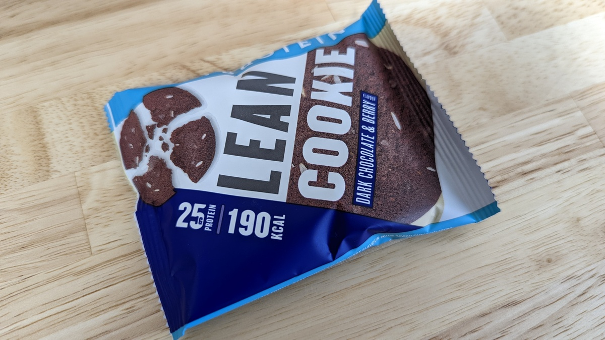
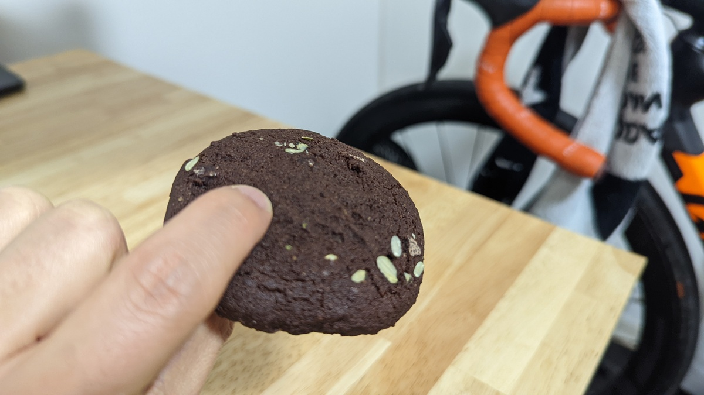
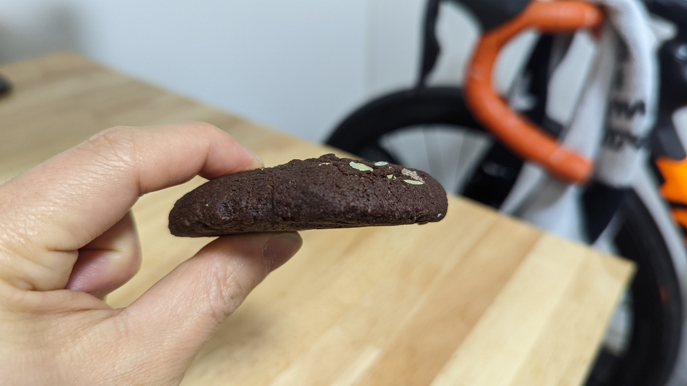
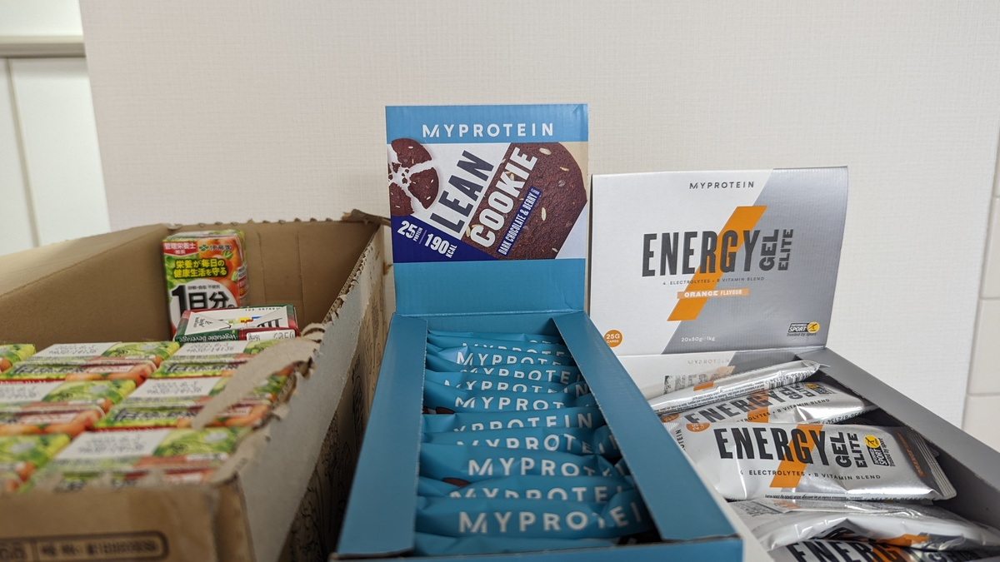

プロテイン購入に興味を持っている人で、もはや知らない人はいないであろう[マイプロテイン](https://px.a8.net/svt/ejp?a8mat=3N3PXV+GF7GHE+45DI+5YJRM)。

名前に反して商品ラインナップは非常に豊富で、定番の[Impact Whey Protein](https://px.a8.net/svt/ejp?a8mat=3N3PXV+GF7GHE+45DI+BW0YB&a8ejpredirect=https%3A%2F%2Fwww.myprotein.jp%2Fsports-nutrition%2Fimpact-whey-protein%2F10530943.html)だけでなく、様々なサプリメント・プロテイン食品を販売している。

今回は、自宅に常備していると言っても過言ではない[リーン クッキー](https://px.a8.net/svt/ejp?a8mat=3N3PXV+GF7GHE+45DI+BW0YB&a8ejpredirect=https%3A%2F%2Fwww.myprotein.jp%2Fsports-nutrition%2Flean-cookie%2F11200865.html)を紹介していく。

<LinkCard
  url="https://www.myprotein.jp/sports-nutrition/lean-cookie/11200865.html"
  linkUrl="https://px.a8.net/svt/ejp?a8mat=3N3PXV+GF7GHE+45DI+BW0YB&a8ejpredirect=https%3A%2F%2Fwww.myprotein.jp%2Fsports-nutrition%2Flean-cookie%2F11200865.html"
/>

## Overview

[リーン クッキー](https://px.a8.net/svt/ejp?a8mat=3N3PXV+GF7GHE+45DI+BW0YB&a8ejpredirect=https%3A%2F%2Fwww.myprotein.jp%2Fsports-nutrition%2Flean-cookie%2F11200865.html)はいわゆるソフトクッキーに似せたプロテイン食品。

製品写真ではホワイトチョコ系の味のパッケージが表示されているが、**現在はダークチョコ&ベリー味だけ**が販売されている。

## 日本で見かけるプロテインバーとの成分比較

自分がリーンクッキーで**一番いいと思っている点が栄養成分。**

ドラッグストアで見かける中で、プライベートブランドのおそらく最もコスパの良い[一本満足プロテインバー チョコ味](https://amzn.to/3rXD34Y)と比較してみよう。

<Amzn asin="B07J2YF1DM">

| 1 本あたり | リーンクッキー | 一本満足プロテインバー |
| ---------- | -------------- | ---------------------- |
| カロリー量 | 190kcal        | 183kcal                |
| 炭水化物   | 14g            | 12.1g                  |
| タンパク質 | 25g            | 15g                    |
| 脂質       | 3.6g           | 8.5g                   |

両者ほぼ同じカロリー量でありながら、**リーンクッキーは、脂肪の少なさとタンパク質の多さが特徴であることがわかる。**

今回は一本満足プロテインバーと比較したが、**国産でドラッグストアで入手しやすいプロテインバーは、脂質で 4 割から 5 割のカロリーを構成**しているものがほとんどで、残りをタンパク質と炭水化物で分け合う形。

一方で、**リーンクッキーは潔くタンパク質に特化しているほか、脂質も少ない。**

減脂肪を体重管理の軸に据えている身としては、まさに理想のプロテインおやつだ。

1g あたりエネルギー量の多い脂質が少ないため、1 個当たりの総重量が多いことも食後の満足感につながるため、脳を満足させやすいという副次的な効果もある。

## 味

本来のソフトクッキーのような**強烈な甘みはなく、あくまでビターめのチョコ味。**ベリーの酸味は若干入っている程度だが、甘さがそこまででもないのでアクセントとしては適切なように思える。

後述するが、厚みがありかなり咀嚼を必要とする食感なので、甘さ一辺倒で飽きの来ないよう工夫が感じられる。

## ローファットながら食感はよし

通常、この手の減脂肪を謳ったお菓子はモソモソとした食感になりやすい。ウエハースタイプのプロテインバーなどで顕著だ。

しかし、リーンクッキーはいかなる魔法を使っているのか、**一般的なソフトクッキーにかなり頑張って食感を寄せている。**

とても脂肪 3.6g とは思えない食感だ。お菓子作りを一度でもしたことがあれば、凄さがわかるだろう。モソモソとしているようでしていない。

そして、**密度がある。**

よく噛まずに飲み込むことはほぼないと思われる。重量と相まって満腹感が出る。

最終的に、ものすご～く美味しいというわけではないが、手が伸びないというわけでもない絶妙なレベルの味と食感に落ち着けている。

甘いものが食べたいときにファーストチョイスになるほどではないので、我が家では小腹が空いたときにコンビニに行かなくて済むようにフィードゾーンを作って、強制的に手が伸びるようにしている

朝から自転車に乗るときなど、ここから適当に[エナジージェル](https://px.a8.net/svt/ejp?a8mat=3N3PXV+GF7GHE+45DI+BW0YB&a8ejpredirect=https%3A%2F%2Fwww.myprotein.jp%2Fsports-nutrition%2Fenergy-gel-elite%2F11271257.html)を持って行ったり、仕事中に口が寂しくなったらここから何か取っていく。

## まとめ

間食としての満足感を抑えつつ、栄養バランスのいいプロテインおやつ。

定価では 12 個 3890 円と中々のお値段なので、[マイプロテイン](https://px.a8.net/svt/ejp?a8mat=3N3PXV+GF7GHE+45DI+5YJRM)おなじみの**ゾロ目セールや給料日セールを狙って**半額で手に入れたいところ。

<PositiveBox>

- 1 つあたりタンパク質 25g というタンパク質含有量の多さ
- 1 つ当たり脂肪 3.6g という少なさ

</PositiveBox>

<NegativeBox>

- 定価ベースでは 1 個約 324 円と高価、ただし定価で買う人はほぼいないと思われる

</NegativeBox>

<LinkCard
  url="https://www.myprotein.jp/sports-nutrition/lean-cookie/11200865.html"
  linkUrl="https://px.a8.net/svt/ejp?a8mat=3N3PXV+GF7GHE+45DI+BW0YB&a8ejpredirect=https%3A%2F%2Fwww.myprotein.jp%2Fsports-nutrition%2Flean-cookie%2F11200865.html"
/>
