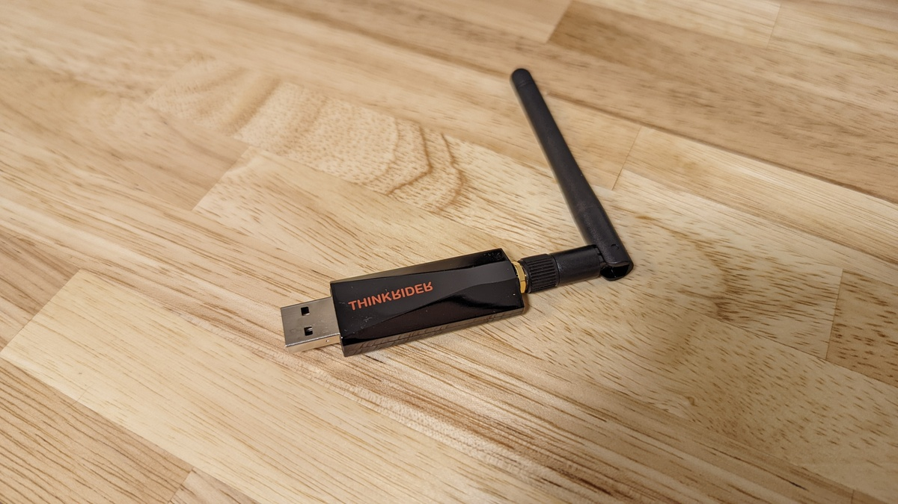
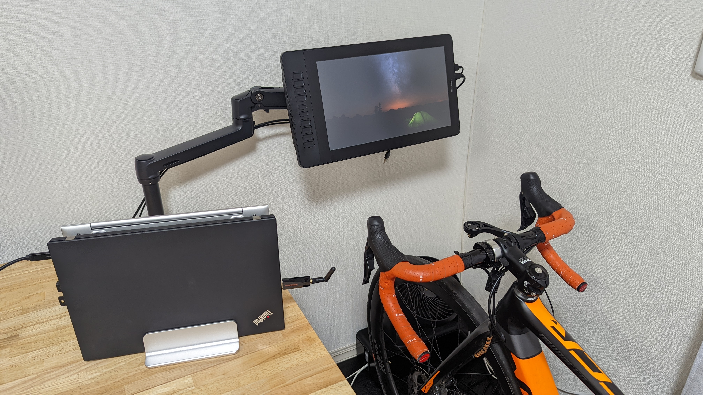
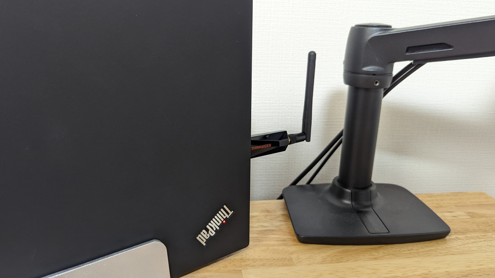

スマートトレーナーを[Saris H3](https://amzn.to/3saGAM8)に乗り換えて、数日は安定して使えていたのだが、ある日突然腕の心拍計・スマートトレーナー含めANT+の通信が乱れはじめ、心拍データやパワーデータがZwiftで取れない時間が頻発するようになってしまった。

なにも珍しいことではなく、2.4GHz帯の通信は現代では大混雑しており、いつこうしたことが起きても不思議ではないのだが……運良くこれまで出会わなかったので、中々書く機会が無かった。

誰でも明日に遭遇する可能性があるので、せっかくならとブログネタにすべく色々トラブルシューティングを行ってみた。

## 通信落車（無線通信が不安定になること）の原因

仲間内ではパワー値を拾わなくなり、Zwift上で止まってしまうことを「通信落車」と呼んでいる。

通信不良や切断と呼ぶよりも、何が起きているのかわかりやすいしバーチャルライドっぽさがあるので気に入っている。以後この呼称で押し通す。

### 1. 無線通信帯域の混雑

全世界で免許無しに無線通信を行える帯域は事実上2.4GHzしかない。

そしてここにBluetooth, Wifi(IEEE 802.11b/g), ANT+, その他独自プロトコルなどほぼすべてがこの帯域に詰め込まれている。

室内Wifiが5GHz帯を使うと安定するように、2.4GHz帯というのはとにかく混んでいる。ついでに電子レンジも2.4GHz帯と干渉する（これは有名）

信号が弱くなるほど混雑の影響を受けやすくなるので、**対処法としてはなるべく送受信を近い場所で行う**。という点に尽きる

PCの置き場所を変えるとか、延長コードを使ってドングルをローラーに近い場所に移動するなどが具体的な例。

<Amzn asin="B00NH11R3I" />

何故この商品リンクがUSB2.0なのかは次項で解説する。

### 2. USB3.x と 2.4GHz 帯の干渉

あまり知られていないが、USB3.xのポートは2.4GHzと干渉する。

これはUSB3.xの通信が2.5GHzを利用していることで、近隣のバンドが影響を受けるから。

自分も知人に教えてもらって初めて知ったポイントで、場合によってはあっさり改善したりする。Bluetoothドングルなどで顕著。

<LinkCard url="https://www.asus.com/jp/support/FAQ/1004004/" />

Zwiftでできる対処法としては、**PC の USB2.0 ポートを利用**したり、**メス側が USB2.0 の延長コード**などを使ってポートから離してやることが必要。

<Amzn asin="B00NH11R3I" />

### 3. ちょっとした反射条件

2.4GHz帯は比較的障害物の裏に回り込んでくれるという特性もあるのだが、電波を通すもの通さないもの、周囲の家具やら人間の状況があげられる。

同じ室内でこれが原因になって通信落車が起こることは少ないと思うが、一応挙げておく。

アルミ製品などの電波を通さないものがあったりすると影響が大きいと思われる。

**部屋の模様替えをすることで改善する可能性はある**が、そもそも**いい方向に転ぶとは限らない**のであまりアテにしない方がいい。

## トラブルシューティング

ここまでの知識を元にトラブルシューティングしていく。

### ドングルとセンサーを近づける

まずは物理的な距離から…

これはドングルを変更した後に撮った写真なので、落車していた時と環境は違うがアンテナと自転車の距離は似たようなもの。

しかし、今回はこれでは改善しなかった。そもそも**ドングルから数センチの距離にある [Garmin Foreathlete](https://amzn.to/3sejofR) の心拍すら安定して受信できていない**

### 干渉要因を減らす

次に最近導入した無線デバイスをオフにしてみる。

一番怪しいのは、[スマートスピーカー](https://amzn.to/3un5eLX)経由でサーキュレーターとローラーの電源を入れられるように購入した[スマートプラグ](https://amzn.to/3s6S7Mk)だ。

サーキュレーターの下にある電源ボックスの中で稼働しており、いかにも関係ありそう。

<Amzn asin="B07TVSGJT4" />

**「OK Google, ローラーを ON にして」で何もかもセットアップできる**のは近未来的で好きだったのだけど仕方ない…

取り外してZwiftで走り出してみる……**しかし何も変わらない**。

同系統の電源に接続していることもあり、かなり可能性の高い原因だと思っていたのだが、ハズレだった。

### USB 規格の変更

**これに関してはあきらめた**。そもそも数センチの距離で受信できないのならば大した効果があるとは思えない……ローラー側を優先するにしても、床にドングルを垂らしているとルンバの餌食になってしまう。

## 物理で解決

そもそも現状で受信感度を上げることはできないことがわかった。ならばどうするか……送信側の出力を上げることはできないので、受信側をパワーアップするしかない。

小型USBドングルの中に納まるレベルではなく、**でっかいアンテナをつけよう**となって購入したのがこちらの製品。

<LinkCard url="https://s.click.aliexpress.com/e/_DDL0twp" />

中華ローラーで有名な[Thinkrider](https://s.click.aliexpress.com/e/_DDL0twp)のアンテナ付きANT+ドングル。親切にもAliexpressとAmazon.co.jpとも同価格で販売してくれている。

取り付けたところ結果はバッチリ、**1 時間走っても 1 秒すら取りこぼすことなく心拍もパワーも拾うようになってくれた**。

欠点としてはUSB端子に対する精度が甘く、軽く触るだけでグラグラ揺れることだろうか…クラムシェル運用しているPCということもあり、あまり動かさないのでなんとかなっている。

結果だけを見ると、**そもそもドングルが不調だっただけでは？？ということも考えられる**が、大した出費ではないのでより安定できるドングルに交換できたと言い聞かせている。

### Thinkrider ANT+ ドングル

<PositiveBox>

- 物理アンテナによる受信感度の劇的改善
- 安く購入するためにAliexpressの配送を待つ必要がない

</PositiveBox>

<NegativeBox>

- USB端子とのかみ合わせの悪さ

</NegativeBox>

<LinkCard url="https://s.click.aliexpress.com/e/_DDL0twp" />
