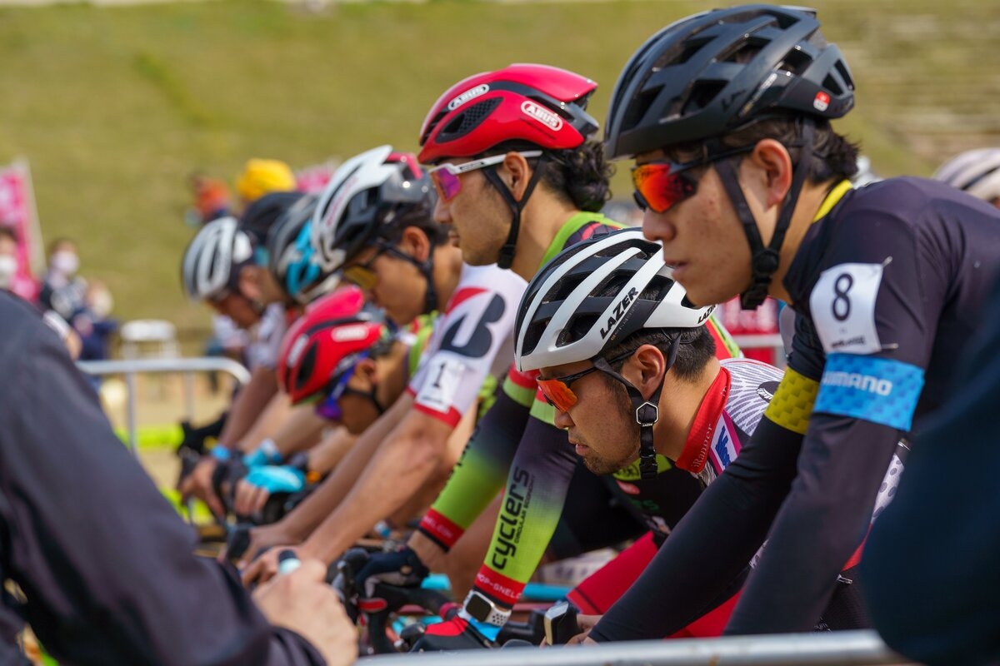
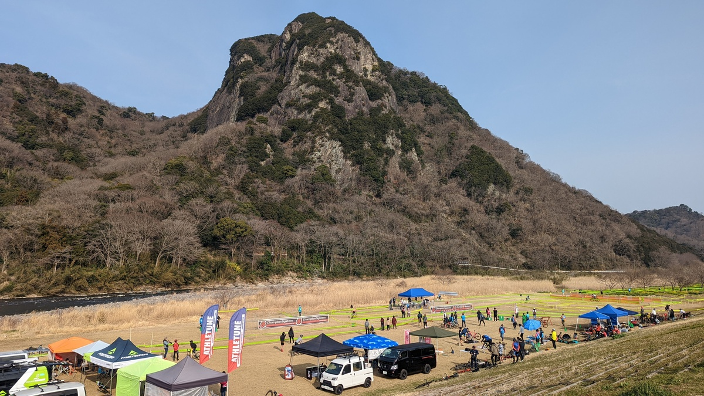

## Summary

今期のしめくくりレース。

CX千葉を終えた2月以降、まともなトレーニングを積めていなかったが、ランキングを活かして序盤前方展開できて、結果もそこまで大崩れせず締めることができた。

## リザルト

17/32位（-1 lap)

### 機材

- メインバイク
  - GIANT TCX ADVANCED PRO
  - Farsports CX TU + A.Dugast Smallbird 33mm (F: 1.65bar, R: 1.55Bar)

## 試走レビュー

河川敷特有のほとんど高低差のないレイアウトながら、一部激登りが設定されているコース。

路面がどこもかしこも硬く、非常に弾かれやすい仕上がりとなっている。

超ドライコンディションゆえに、コーナーの一部が削れて柔らかくなったり、硬い溝のできたりしている箇所が若干難易度を高めているものの、全体としては超高速でクリアできる。

## レース

<iframe width="560" height="315" src="https://www.youtube.com/embed/xpXSsP4ewVQ" title="YouTube video player" frameborder="0" allow="accelerometer; autoplay; clipboard-write; encrypted-media; gyroscope; picture-in-picture" allowfullscreen></iframe>

朝こそ無風で春の陽気といった風情であったが、時間がたつにつれて強風が吹き荒れるハードな一日になった。

スタートからコース奥（下流）側に向けては追い風、バックストレートの直線部は向かい風となっており、天気予報ベースで6m/sほどの強風に加えて突風が吹き荒れるというC1のレース時間。

JCXポイントが考慮された並び順となり、C1で珍しいファーストグリッドをゲット。

ワンチャン、ホールショットを狙えるかと思ったものの、沢田時という現実を前にして夢は儚く散ってしまった。

この日のような強風では、追い風区間で脚を休めながら、向かい風区間で踏み倒すというシンプルな行為が要求される一方、向かい風区間でのドラフティング効果は計り知れない。

スタート直後から、脚が持つ間は一桁順位のパックで粘ってみるものの、途中であえなく脱落。その後は何があったかほぼ覚えていないが、すごく辛い時間を過ごし続けたことだけは間違いない。

最終周回で沢田時にラップされるものの、実は残留が危ないAJOCCランキングのために1人でも前でフィニッシュするべく最後まで可能な限りプッシュし続けゴール。

とてつもなくハードなレースだった。

## 2021-22 シーズンを振り返って

今シーズンのシクロクロスレースは今回をもって終了。関東では茨城CX涸沼ステージが残っているが、所用で参加不可能。

夏ごろから徐々にトレーニングを開始した成果が分かりやすく出ていたため、昨シーズンまでと比べて顕著にいい成績を残すことができた。

一方で、JCX参戦だけでは残留が心もとない他、コロナ禍で仕方ないとは言えレース期間が空いてしまい、モチベーションの維持が難しい期間がったことも事実。

来年も可能な限りレースに出てコンディション・ランキングを維持していきたい。

## Photo

Cover photo by [おくやす](https://twitter.com/okuyasu777)
