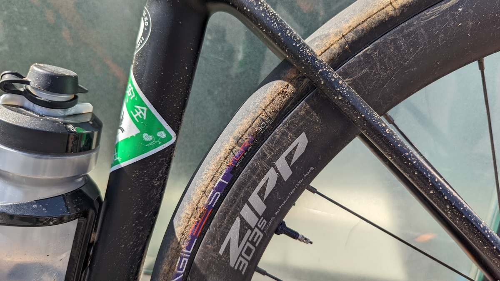
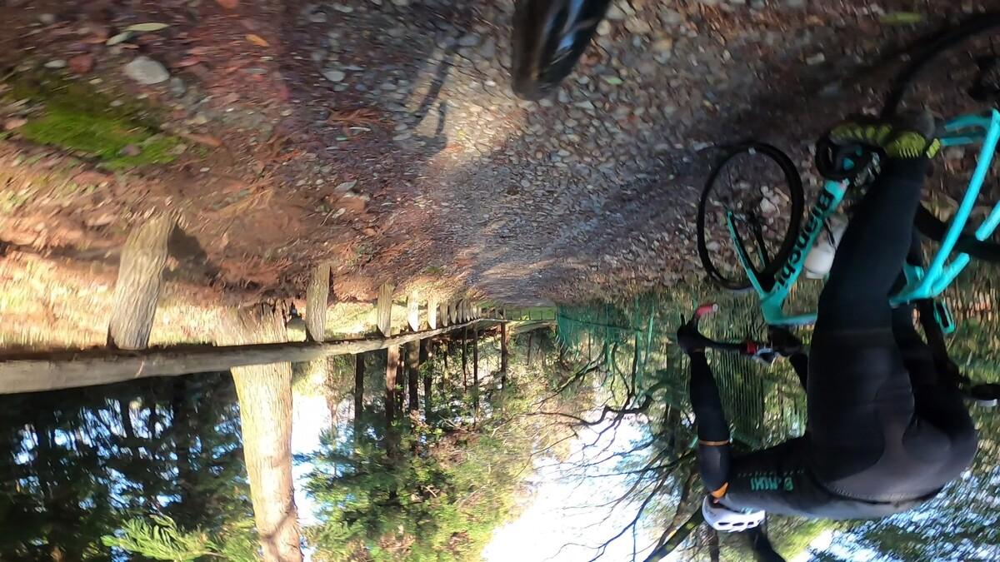
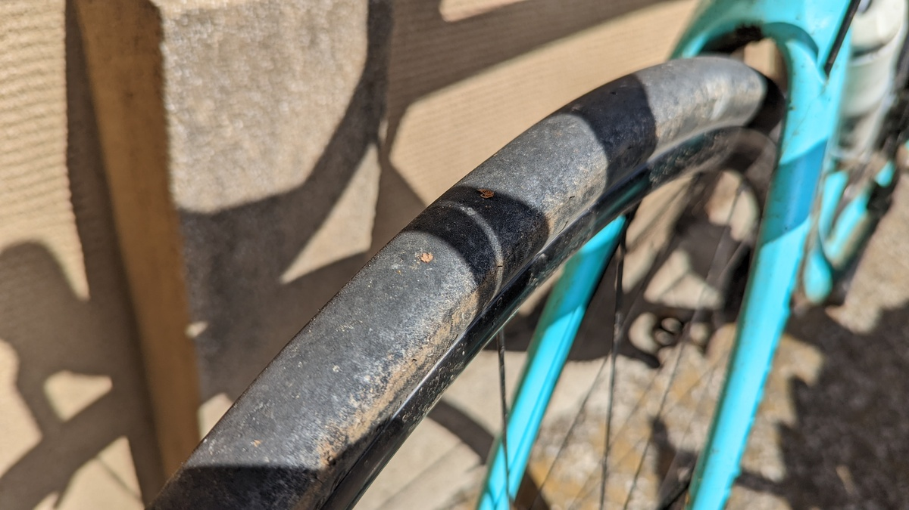
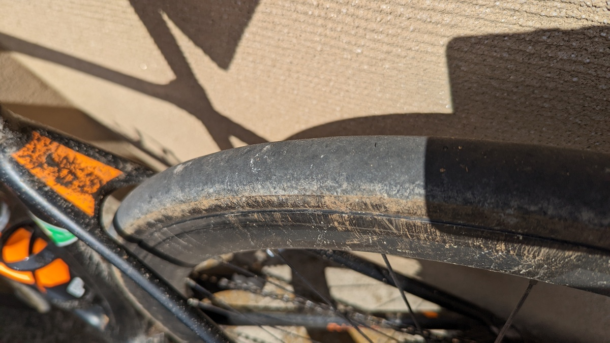

## AGILEST TLR はロードタイヤか？オールロードタイヤか？

当初のレビューでは、オンロードでの所感と、タイヤ構造を見て、**[AGILEST TLR](https://store.shopping.yahoo.co.jp/worldcycle/PAN-Q-F730TR-AG-B.html) は純オンロードタイヤなのではないか？**という仮説を立てた。

しかし、30c の太さとなると**オールロード的局面を走行したくなるのが人の性**。

何より、日本ではともかくとして、今日のプロツアーレベルのロードレースでは、**クラシックレース以外でも未舗装路が組み込まれることも多くなっており**、決して無視できる要素ではない。

オフロードでのタイヤ性能は、グリップ・タイヤのしなやかさによる転がりの良さや衝撃吸収性など、定量化できない面が多く実際に走ってみないと分からないことが多い。ならば走ってしまえと埼玉県某所に赴いてグラベルロードで [AGILEST TLR](https://store.shopping.yahoo.co.jp/worldcycle/PAN-Q-F730TR-AG-B.html) のレビューを執り行った。

<LinkBox
  url="https://paypaymall.yahoo.co.jp/store/cycle-yoshida/item/00656140/"
  linkUrl="https://ck.jp.ap.valuecommerce.com/servlet/referral?sid=3171302&pid=887657037&vc_url=https%3A%2F%2Fpaypaymall.yahoo.co.jp%2Fstore%2Fcycle-yoshida%2Fitem%2F00656140%2F"
/>

## Youtube 動画

コメンタリーや雑談付き走行映像が見たい方は、是非 Youtube にアップロードした動画を見てほしい。

<iframe
  width="560"
  height="315"
  src="https://www.youtube.com/embed/q7i3IhoKfHA"
  title="YouTube video player"
  frameborder="0"
  allow="accelerometer; autoplay; clipboard-write; encrypted-media; gyroscope; picture-in-picture"
  allowfullscreen
></iframe>

レビュー結果だけ知りたい方はこの記事を読めばヨシ！

## レビュー

オンロードでのインプレッションは前回の記事を参照

<LinkBox url="https://blog.gensobunya.net/post/2022/04/agilest_tlr/" />

### コンディション

テストコースは水はけがいいが、予報に反して前日夜まで雨が降り続いたこともあり全体的にウェット気味だった。

コースは全体的にしまった砂利道。沈み込むような土の路面だったら走行すら不可能だっただろうが、流石は実績のあるライドコースだけあって少々のバッドコンディションでも問題なく走れる。

ほとんどの路面ではパンクや、強い突き上げのない路面だったが、極一部の区間で石が大き目の（と言っても握りこぶしに満たないレベルの大きさ）路面も走行した。

動画からのキャプチャになるので、画質が悪いがご愛嬌。

そもそも歩行者も通る道で、高速走行できる環境でもないので、確認してからジャンプして十分間に合う速度……下りでも 30km/h 程度のスピードで走る感じ。

路面の問題もあるが、そもそもがレーシングロードバイクなので、無茶は禁物と心がけた。

### 空気圧

渋滞に巻き込まれてエアを追加せずに走行し始めたが、**ライド終了時点の計測では F: 2.8 Bar, R: 3.4 Bar とかなりの低圧走行**となった。

### 走行レビュー

早々に [AGILEST TLR 30c](https://store.shopping.yahoo.co.jp/worldcycle/PAN-Q-F730TR-AG-B.html) を入手しているロードバイクに乗った 2 名と、グラベルロード 1 名で埼玉県某所のグラベルコースへ。

シクロワイヤードのオフロードバイクレビューでも使われている定評のあるコース……といえば分かる人には分かるだろう。集合場所の駐車場から 100m ほど走ると早くもグラベルロードの周回がスタートする良い環境。

各人のセットアップは下記の通り、カッコ内は装着タイヤ。

- GIANT TCR ADVANCED PRO DISC (**[Panaracer AGILEST TLR 30c](https://paypaymall.yahoo.co.jp/store/cycle-yoshida/item/00656140/)**)
- BIANCHI Infinito CV (**[Panaracer AGILEST TLR 30c](https://paypaymall.yahoo.co.jp/store/cycle-yoshida/item/00656140/)**)
- JAMIS RENEGADE Expert (IRC Formula Pro S-Light 28c)

全員ディスクブレーキで集合したものの、タイヤは 28mm ～ 30mm のチューブレスレディタイヤを使用している。**実測でも全員タイヤ幅 28 ～ 29mm 台**だ。

自分の TCR も、1 世代前のモデルだが[30c までは装着できることを確認済み](https://blog.gensobunya.net/post/2020/06/proonetle/)。Infinito は 32c まで飲み込むクリアランス持ち。

<LinkBox url="https://blog.gensobunya.net/post/2020/06/proonetle/" />

さて、事前の予想は **[Pro One TLE](https://www.wiggle.jp/schwalbe-%e3%82%b7%e3%83%a5%e3%83%af%e3%83%ab%e3%83%99-pro-one-evo-%e3%83%81%e3%83%a5%e3%83%bc%e3%83%96%e3%83%ac%e3%82%b9%e3%83%95%e3%82%a9%e3%83%bc%e3%83%ab%e3%83%87%e3%82%a3%e3%83%b3%e3%82%b0%e3%82%bf%e3%82%a4%e3%83%a4) より劣るしなやかさ**と、**耐パンクベルトを排した構造**からオフロード走行は不向きでは？というもの。つまり、今回注目すべき点は**下りの安定感**と、ライドを通じて**タイヤ周りをノートラブル**で終えられるか否か、といった 2 点だ。

結論から言うと、1 回空気圧低下したものの、事前の空気圧調整を怠ったせいでビードが一瞬ズレた……という事象だったため、**耐パンクベルト無しという構造由来のトラブルは今回発生しなかった**。

<blockquote class="twitter-tweet">
  

    <a href="https://t.co/8tYHfHu6AW">pic.twitter.com/8tYHfHu6AW</a>
  

  &mdash; ゲン (@gen_sobunya) <a href="https://twitter.com/gen_sobunya/status/1505328327833550850?ref_src=twsrc%5Etfw">March 19, 2022</a>
</blockquote>

ライドが始まって早々にエア抜けしたが、渋滞に巻き込まれて遅れそうに結果、フロアポンプを出すのを渋った自分が全面的に悪い。

前述の通り、**ライド終了時点の計測では F: 2.8 Bar, R: 3.4 Bar** だったので、恐らく走り出しでは 3 気圧も入っていなかったと思われる……ちゃんと空気圧は管理しよう。

もう一つの課題であるところの下りの安定性はというと、**ウェット気味のコンディションだったにもかかわらず下りでは全く心配がいらないほどのグリップ**だった。

タイヤが硬いので跳ねてしまって設置感が無くなるかと思いきや、そんなことはなく**拍子抜けするほど安心して下れる**。もちろんスリックパターンなので登りのトラクションはある程度あきらめが必要。

それにしても、オンロードではタイヤ剛性を高く感じたにも関わらず、接地感が非常に良い。

グリップしているのか、抜けそうなのか、滑っているのか、こうした情報がとても良く伝わってくる。

それでいて、**空気圧が低いにも関わらず登りでタイヤが腰砕けになる感覚はゼロ**。この特性について [AGILEST TLR](https://store.shopping.yahoo.co.jp/worldcycle/PAN-Q-F730TR-AG-B.html) は非常に優秀で、効率よく登ることができている感覚がある。

耐久性については、走行後のタイヤを見ても、大きな傷は見当たらず。洗車後の再確認では小さい切り傷が 1 箇所ついていた。まぁ仕方ない。

柔らかいコンパウンドのタイヤは切り傷が入りやすいものもあるが、AGILEST は耐久性という面でもある程度は安心できそうだ。

## まとめ

AGILEST TLR は、**ライトなグラベル走行にも対応できる**能力を示してくれた。

オンロードでの印象に反して、下りでもしっかりとグリップしてくれるし、トレッド面の強度も（グラベルキングほどではないだろうが）あった。

**河川敷グラベルやちょっと気になった小道程度は気にせず突っ込める**タイヤという印象を持ったので、ツーリング志向の乗り手であれば、**AGILEST シリーズではこの [TLR 30c](https://store.shopping.yahoo.co.jp/worldcycle/PAN-Q-F730TR-AG-B.html) を選んだ方が楽しみの幅を増やすことができる。**

28c 以上のタイヤは、**ワイドリムカーボンホイールでは、リムとツライチになることも多いのでエアロ効果も期待できる**し、もはやワイドタイヤは**軽さを求める一部以外の全員にお勧めできる**と言ってもいいのではないだろうか。

対抗馬のタイヤに比べて全てが最上の性能とは言い難いが、そのぶん 1 本あたりのコストが安く使い倒すにはもってこいだ。

<LinkBox
  url="https://store.shopping.yahoo.co.jp/worldcycle/PAN-Q-F730TR-AG-B.html"
  linkUrl="https://dalr.valuecommerce.com/dck/de0604908a?pid=886313738&sid=3171302&aid=2821580&mid=2201292&ub=Yk2CBAACI79qSQSBCoIBiQqCAF10hw%3D%3D&rid=Yk2CJgAIO5RqSQSBCoICMAqCACpY7Q&isec=624d8226&vcurl=https%3A%2F%2Fstore.shopping.yahoo.co.jp%2Fworldcycle%2FPAN-Q-F730TR-AG-B.html&ckref=https%3A%2F%2Fblog.gensobunya.net%2Fpost%2F2022%2F04%2Fagilest_tlr%2F&ih=QUdJTEVTVCBUTFI&vo__ih=QUdJTEVTVCBUTFI&vo__uri=https%3A%2F%2Fstore.shopping.yahoo.co.jp%2Fworldcycle%2FPAN-Q-F730TR-AG-B.html"
/>
