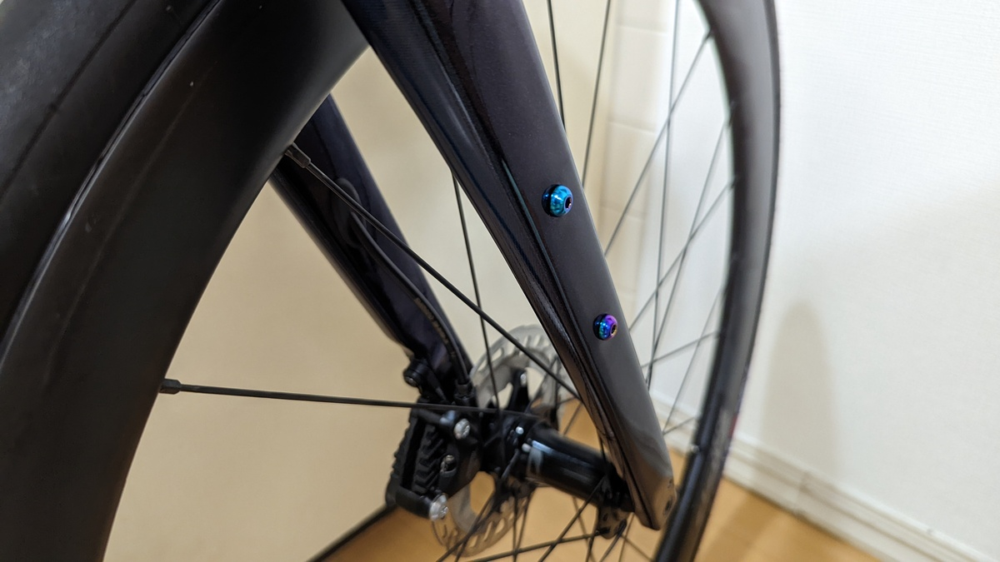
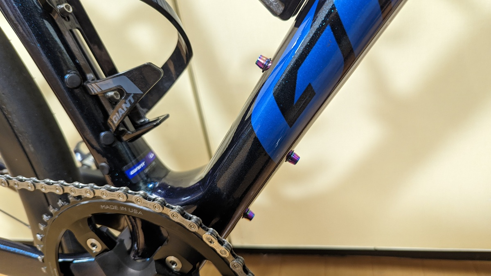
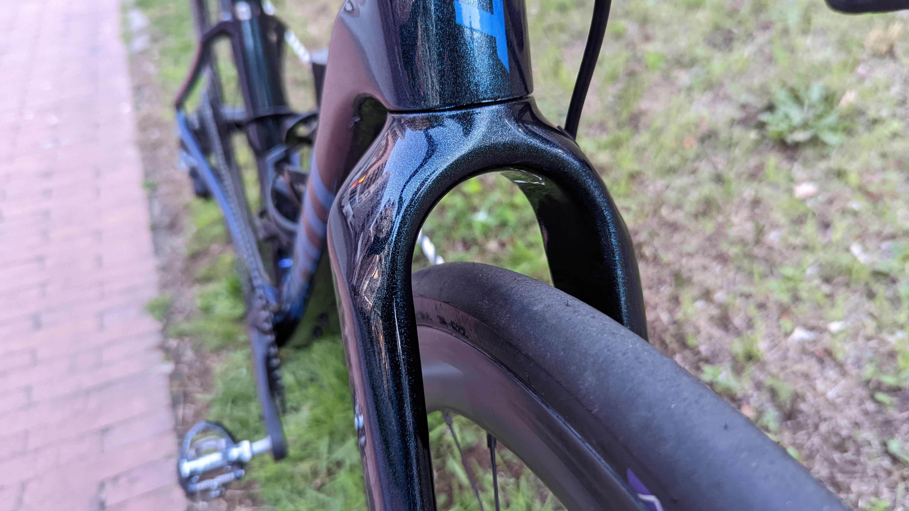
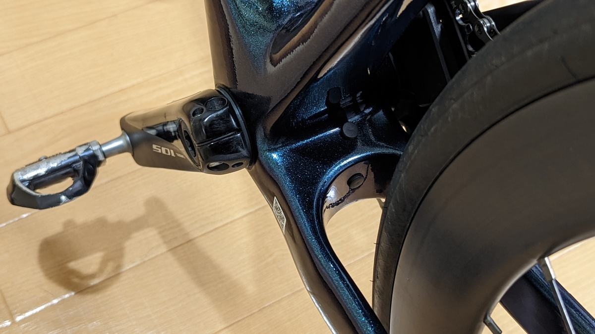
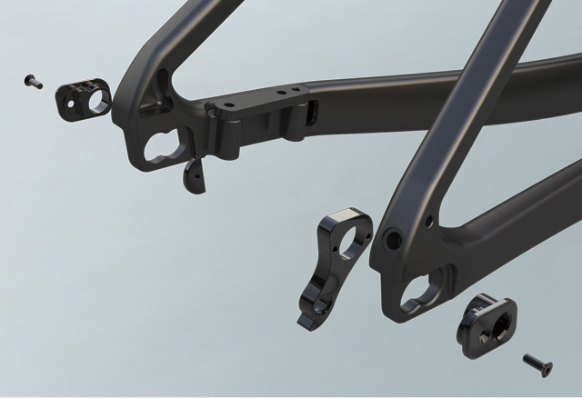
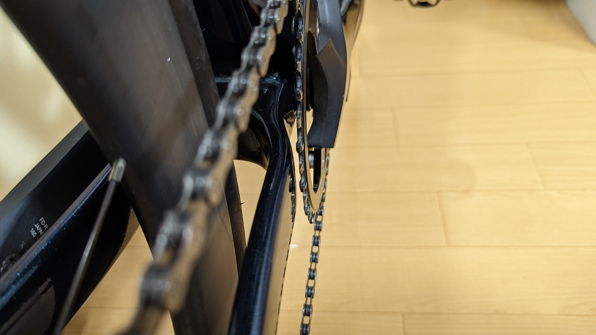
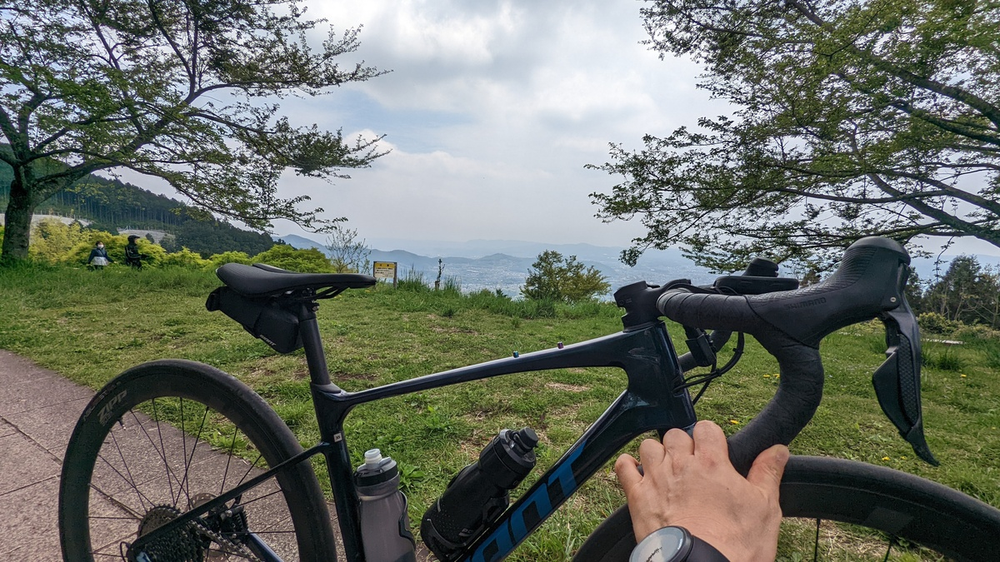

これまで、メインバイクとして長い間 TCR 初のディスクモデル(2017 TCR ADVANCED PRO DISC)に乗り続けていたが、ついに乗り換えを決意した。

New Bike は同じく GIANT のグラベルロード、REVOLT ADVANCED2。

関西から関東へ戻り、馴染みのある環境になったものの、オンロードは勝手知ったる場所ばかり。

遊びの幅を増やすために……というのがメインだが、もう一つ理由があり、**今年モデルチェンジしたこの REVOLT ADVANCED、中々攻めた設計となっており** そこに興味をひかれたということもある。

CX 以外のレース活動に手を伸ばす余裕もなく、「これ 1 台で様々な遊び方に対応できるように…」という気持ちもあって拡張性が高く、それでいてレースユース（グラベルの、だが）にも対応できる剛性の高そうなモデルをチョイスした。

<LinkBox url="https://www.giant.co.jp/giant22/bike_datail.php?p_id=00000077" />

ちなみに組み上げは、**TCR からコンポ類を移植し、46T のフロントシングルチェーンリングに GRX Di2 RD を組み合わせてアルテグラレバー** で動作させている。

ただ、後述する特殊なジオメトリが気になったので、ハンドル周りは付属品をそのまま利用した。

## ジオメトリ

フリップチップを用いたタイヤクリアランス設定、増加したボトルケージダボ、ドロッパーシートポスト対応……様々な特徴のあるこのバイクだが、**最も特徴的な点はそのジオメトリ**。

ロードバイクにおける最新トレンドの大半は MTB からの輸入であることは周知の事実だが、REVOLT もまた MTB から輸入されたと思しき**フォワードジオメトリ**で設計されている。

### フォワードジオメトリとは

MTB ブランドの Mondraker が始めたジオメトリ設計で、それまでのジオメトリから **長くしたトップチューブに比較的短いステムを組み合わせ** 、ヘッドアングルを寝かせることで **ロングホイールベースを実現** するというもの。

フロントでホイールベースを稼いでおり、**短いリアセンターによる反応性と両立** することができる。

<LinkBox url="http://www.mamapapa.co.jp/mondraker/technology/forward-geometry/" />

> フォワードジオメトリーの主な利点は、高速であっても急勾配のランプを安全かつ自信を持って走れるようになること、反応の良い正確でダイレクトなハンドリングが可能になること、上り坂での効率が向上すること、テクニカルで荒れた路面での安定性が向上すること、グリップ力が向上し全体的なコントロール性が向上することなどが挙げられます。

### グラベルロードにおけるメリット考察

もはや現代 MTB では当たり前となっている設計ではあるものの、これをグラベルロードに適用したのはかなり先鋭的な取り組みに思える。（[CANYON Grizl](https://www.canyon.com/ja-jp/gravel-bikes/bike-packing/grizl/) も採用している）

ロードバイクに比べて**不安定な路面**を走ることを前提として、グラベル**レースに使える運動性能は維持**するため、ロングホイールベースとショートチェーンステーを両立させる必要があったのではないだろうか。

フォークオフセットをそのままにヘッドを寝かせると、トレール値が増えるので直進安定性が増す。代わりにクイックなハンドリングではなくなる。

ホイールベースの長さだけでなく、あまりクイックなコーナリングを必要としない(北米の)グラベルレースという主戦場を考えると、この設計でいく理由も頷ける。

ちなみに**ステムがロードバイク・グラベルロードの常識からは極端に短いので、ステムへのアクセサリー類はほぼ装着不可能**に……

### シクロクロスとグラベルロードの違い

シクロクロスとグラベルロードは、使えるタイヤ幅に共通性があるものの、上述のフロント周りのジオメトリが大幅に異なり、それが **「シクロクロスをグラベルロードで代替することはできない」** 大きな違いとなっている。

グラベルロードは BB が低く、フロントフォークを寝かせて安定したハンドリング志向になっていることに対し、**シクロクロスは真逆に BB が高くフロントフォークを立ててクイックなハンドリングと障害物回避性能を上げている**。

話題が逸れるが、勘違いしてほしくない点として **「グラベルロードでシクロクロスに出場してもいいか？」は YES である** 、むしろみんな出てくれ。

## 拡張性

さて、**アグレッシブなグラベルライドを**と製品ページで題されている REVOLT ADVANCED2。プロモーションはガチガチのレーサーが出てきているが、ボトルケージダボ穴は合計 6 セット（前三角\*2, ダウンチューブ下, フォーク左右, トップチューブ上）装着可能と、一般ライダーにもかなり配慮されている。

<iframe
  width="560"
  height="315"
  src="https://www.youtube.com/embed/FQah2l1kRIY"
  title="YouTube video player"
  frameborder="0"
  allow="accelerometer; autoplay; clipboard-write; encrypted-media; gyroscope; picture-in-picture"
  allowfullscreen
></iframe>

特にトップチューブ・フォークのボルトオンシステムはうれしいところ。

標準で黒いボルトが付属するが、穴埋めのためにオイルスリックのチタンボルトを用意した。フレームカラーに対してちょっとしたアクセントになっており、お気に入り。特にトップチューブは汗が入るところなので、錆びや塩は避けたかった。

### タイヤクリアランス

**標準の状態では、42㎜ までのタイヤ** が、そしてリアのフリップチップシステムを使ってロングホイールベースに設定すると、**最大 53mm のタイヤに対応** する。

当面は[AGILEST TLR](https://store.shopping.yahoo.co.jp/worldcycle/PAN-Q-F730TR-AG-B.html)を利用するため、30c での運用となるが、見ての通りガバガバである。

リアエンドのパーツの前後を入れ替えることで、ホイールベースを長くでき、より大きいタイヤサイズを利用することができる仕組み（画像は GIANT JAPAN 公式より）

53mm だと 2 インチ（余裕をなくせば 2.1 インチ）のタイヤが入る計算になるが、シングルトラックでも遊ぼうと思えば遊べる設計と読める。

### チェーンリングクリアランス

今回、46T というグラベルロードにしては大きいチェーンリングを使用して組み上げた。

干渉するかも……ということは組み上げを依頼したショップに伝えさせていただいていたのだが、案の定接触するとのことで、**オリジナルスペーサーを作成してもらい事なきを得た**。

アメリカで販売されているモデルを見ても、限界は 42T ほどで、シングル運用を想定したクランクでないと接触しそうなほど。タイヤ幅のキャパシティーをかなり大きく取っているため、こちらは犠牲になっているようだ。

<LinkBox url="https://blog.gensobunya.net/post/2021/10/single_road_longterm/" />

<LinkBox url="https://blog.gensobunya.net/post/2020/08/wt_nw/" />

今回は、チェーンラインを補正するために加工されている内側オフセットが仇になってしまい、長めのスペーサーを入れることとなった。

シマノコンポーネントのフロントシングルは、ギア比に十分な幅を持たせることが難しいので、**ロードとグラベル両方の使い方をするのなら素直にフロントダブルにした方がよい**。

### ドロッパーポスト

ついにロードバイクでもドロッパーポストが！使われた！ありがとうモホリッチ……おかげで俺のバイクは世界の最先端に（2022 ミラノ〜サンレモ）

REVOLT ADVANCED は標準で D-Fuse という GIANT 独自の衝撃吸収性を高めたシートポストが使われているが、**30.9mm の丸ポストを使うことも可能**になっている。

主な用途はシングルトラックのような荒れた場所でのコントロール性を高めるための設計だが、オンロードのダウンヒルを攻めるにも使えることが証明された。MTB 乗りなら大体みんなやってたとは思うが、重量でメリットを負ってでもやるプロ選手が出てきたことが大きい。

## ライドインプレッション

機能的な説明が多くなってしまったが、ライドのレビューも。

コースはヤビツ峠から裏ヤビツに下り、中津川と相模川沿いの河川敷グラベルを通る 約 100km のコースを設定した。

ホイールは [ZIPP 303S](https://store.shopping.yahoo.co.jp/qbei/pc-810594.html), タイヤは[AGILEST TLR 30c](https://store.shopping.yahoo.co.jp/worldcycle/PAN-Q-F730TR-AG-B.html)だ。グラベルで本領発揮してもらうには 40c 以上のタイヤで楽しみたいところだが、オンロードが 8 割なので、いいとこ 38c までが普段使いの範囲になると想定している。

<LinkBox
  url="https://store.shopping.yahoo.co.jp/worldcycle/PAN-Q-F730TR-AG-B.html"
  linkUrl="https://dalr.valuecommerce.com/dck/de0604908a?pid=886313738&sid=3171302&aid=2821580&mid=2201292&ub=Yk2CBAACI79qSQSBCoIBiQqCAF10hw%3D%3D&rid=Yk2CJgAIO5RqSQSBCoICMAqCACpY7Q&isec=624d8226&vcurl=https%3A%2F%2Fstore.shopping.yahoo.co.jp%2Fworldcycle%2FPAN-Q-F730TR-AG-B.html&ckref=https%3A%2F%2Fblog.gensobunya.net%2Fpost%2F2022%2F04%2Fagilest_tlr%2F&ih=QUdJTEVTVCBUTFI&vo__ih=QUdJTEVTVCBUTFI&vo__uri=https%3A%2F%2Fstore.shopping.yahoo.co.jp%2Fworldcycle%2FPAN-Q-F730TR-AG-B.html"
/>

せっかくのグラベルロードをスポイルしないためにも、AGILIST でもグラベル走行に問題がないことは確認済みだ。

<LinkBox url="https://blog.gensobunya.net/post/2022/04/agilest_gravel_review/" />

### 乗り心地

シートポストの出ししろを長く取れるよう、強烈にスローピングさせているおかげか、**尻の座りがものすごくよい**。

どんな荒れ地でも衝撃をしっかりいなしてくれ、ペダリングの邪魔にならない程度に変形してくれる感覚がある。30c タイヤの性能と相まって、**荒れていることで定評のある裏ヤビツのダウンヒルも安心……どころか綺麗な路面に思えてくる** ほど。

グラベルにおいても、路面ギャップを気にせずペダリングを続けられ、跳ねさせないという設計者の意地を感じるかのような体験だった。

### 剛性

レースユースを想定しているだけあり、**ペダリング効率はかなり良い………のだがシッティング限定**となる。

ダンシングでバイクが斜めになると、フォークやリアエンド部分が撓む感覚は大きい。この辺りは全てが剛体といった風情の TCR と最大の違いだった。

**淡々とシッティングで回す分には非常に気持ちよく進んでくれる** ので、ダンシングしない乗り方がいいのだろう。

### ポジション

フォワードジオメトリの影響で強制的に後ろ乗りになる。その分、登りでは前方に体重移動した方が登りやすく感じた。

そして、**ダウンヒルの安定性は圧巻**の一言。

元々 BB の低いグラベルロード特有の設計と、フォワードジオメトリによるフロントの安定性が相まって、地面を舐めるように下ることができる。

腰高感は一切なく、ギャップの吸収力もあるので、軽快かつ安心安定といった具合。ドロッパーポストで空気抵抗を低減したら、とんでもなく速く下ることも可能なのでは…？

### 総括

**マルチに使える 1 台として、運動性能の高さも求めるという目論見はほぼ達成されそう** だ。

酸いも甘いも知る人には分かるかと思うのだが、マルチに使えるということは器用貧乏ということなので、特定の使い方に特化したバイクには敵わないという点も考慮する必要がある。

追加バッグを使う、ロングなグラベルレースならば完璧にマッチするのだが日本にそういうのは、（ほぼ）ないので……

## 入手性

発表日に注文したんだけど、発表会当日完売済みだったらしい。

いくらインプレを読んでいただいても店頭在庫か来年モデルしか買えないと思われる……ロードバイクと違いグラベルロードは欧米との取り合いになるので日本の在庫数はどうしても少なくなってしまうのだろう。辛い。

<LinkBox url="https://www.giant.co.jp/giant22/bike_datail.php?p_id=00000077" />
