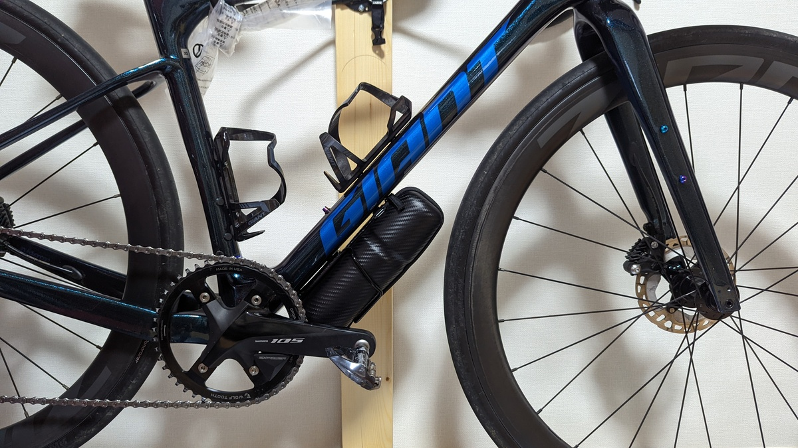

グラベルロードを買って、やってみたかったことが積載力の向上。

特に、**利用頻度は低いが場所を取る輪行袋**の効率的な保管場所にはいつも頭を悩ませていた。

背面ポケットに入れるには利用頻度が低いし、サドルバッグに入れるには大きく嵩張るし、ハンドル周りは空気抵抗への影響が大きく平坦での爽快感に欠ける。

そうなると、自然と**ダウンチューブ下や前三角の空きスペースなど、自転車におけるデッドスペースの活用**に絞られる。

しかし、GIANT愛好家で背も低い自分にとって、前三角のスペースは雀の涙。自然とダウンチューブ下が唯一の候補となる。

今回は、[DAVOS グラベルケージ](https://px.a8.net/svt/ejp?a8mat=3N3PXW+IGGJ6+4JDO+BW8O2&a8ejpredirect=https%3A%2F%2Fonline.ysroad.co.jp%2Fshop%2Fg%2Fg4580395938943%2F)と[R250 ロングツールケース](https://amzn.to/3KQ3QpZ)を組み合わせて、[Peko さんの超軽量輪行袋・ホイールバッグ・ホイールバッグ・ショートパンツ・ダミーアクスル](https://peraichi.com/landing_pages/view/peko/)のセットを全て積載することに成功した。

<Amzn asin="B07G8STFNQ" />

<Amzn asin="B01LEBZHJ2" />

## ダウンチューブ下スペースの課題

スローピングフレームでは低身長最後のフロンティアに思えるダウンチューブ下だが、ここも色々と課題がある。

具体的には、各所とのクリアランスが厳しい。

1. タイヤとのクリアランス
2. チェーンリングとのクリアランス
3. (装着方法の安定性)

最も発生しやすいのはタイヤとのクリアランス。

ロードバイクでは、ホイールベースの関係でフロントホイールがこともあって、**通常、あまり長いツールケースは装着できない**。

そもそも、ボトルケージのダボ穴増設も[ELITE VIP](https://amzn.to/381ZMFP)などを使うか、そもそもバンドなどで装着してしまうなどイマイチ信頼性に欠けるものが多い。

APIDURAなどから、ダボ穴がないフレームでも装着できるバッグも発売されているが、かなりいいお値段がする。

<LinkCard url="https://www.alternative-bikes.com/item/item.php?goods_code=B062" />

### グラベルロードでは？

新車のREVOLT ADVANCEDは**フロントホイールが前に出ている設計**で、もちろんボトルケージのダボ穴もしっかりダウンチューブ下に用意されている。

結果的にこれらの問題は完全に解決された状態で装着できた。

## DAVOS グラベルケージ

グラベルケージは「オフロード専用設計」のボトルケージ。

専用というのは大仰な気もするが、要するに**上下方向への振動に強く、すっぽ抜ける可能性が低い設計**になっている。

<LinkCard url="http://blog.fukaya-nagoya.co.jp/2019/06/gravelcage20190619.html" />

100kmに及ぶオフロードイベントのSDA王滝で、なおかつ上下方向への影響が大きいサドル後ろのポジションでも利用できるという記事がある。

ダウンチューブ下の装着では、抜けそうになってから走行中になんとかする……ということもしづらいし、状況も見づらいのでこういった**保持力の強いボトルケージが欲しい**と思っていたところ。

デザインもシンプルでよい。

<LinkCard
  url="https://paypaymall.yahoo.co.jp/store/cycle-yoshida/item/00641690/"
  linkUrl="https://ck.jp.ap.valuecommerce.com/servlet/referral?sid=3171302&pid=887657037&vc_url=https%3A%2F%2Fpaypaymall.yahoo.co.jp%2Fstore%2Fcycle-yoshida%2Fitem%2F00641690%2F"
/>

## R250 ロングツールケース

ワールドサイクル（ベックオン）のプライベートブランドR250。

低身長向けのフレームバッグなど、日本人向けにうれしい製品を作ってくれている。

今回はシンプルに積載量と安さの兼ね合いでチョイス。

<Amzn asin="B01LEBZHJ2" />

## PEKO さんの超軽量輪行袋シリーズ

<LinkCard url="https://peraichi.com/landing_pages/view/peko/" />

安くて小さい、知る人ぞ知る輪行袋のセット。

**ツールボトルや背中ポケットに余裕を持って入るコンパクトさ**、そして数千円という安さ。

写真ではわかりにくくて恐縮だが、右のものが外袋。青いものが輪行袋で、左が29erのホイールセットが入るホイールバッグとなっている。

これらに**加えて、輪行用のダミーアクスルと輪行時のためのショートパンツ**も含めて全てが[R250 ロングツールケース](https://amzn.to/3KQ3QpZ)に入っている。

コンパクトさと耐久性がトレードオフになっているようだが、市販の輪行袋は耐久性が高すぎるきらいもあるので（10年以上使えるものばかり）、良いトレードオフになっていると思う。

今回の装備は、この輪行袋を使ってワンウェイライドをしたいという欲求から来たものが大きい。フェリー・新幹線・在来線・飛行機を活用したライドで渋滞とおさらばしたいところ。

<LinkCard
  url="https://paypaymall.yahoo.co.jp/store/cycle-yoshida/item/00641690/"
  linkUrl="https://ck.jp.ap.valuecommerce.com/servlet/referral?sid=3171302&pid=887657037&vc_url=https%3A%2F%2Fpaypaymall.yahoo.co.jp%2Fstore%2Fcycle-yoshida%2Fitem%2F00641690%2F"
/>
