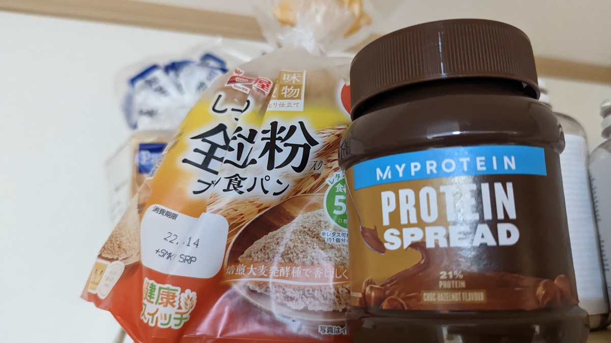

家庭持ちになってしまい、マグマのような減量食を3食分作り置き、食べきるというストイックで徹底した食生活を送ることは難しくなってしまった。

<LinkBox url="https://blog.gensobunya.net/post/2021/06/magma_cyclist/" />

一応社会人アスリートに分類される競技生活をしているので、一般人を巻き込むのは少々気が引けるし、食の楽しみを奪ってしまうのは気が引ける（し、自分がやられたらキレる）

そんな状況下でも、夏の**減量のお供となるよう、基本的な食事スタイルを変えず、高たんぱく食を維持する食品**に興味が出てきた。

我らが[マイプロテイン](https://px.a8.net/svt/ejp?a8mat=3N3PXV+GF7GHE+45DI+60WN6)様のFoodカテゴリから、セールで買い込んだものを1つづつ紹介していく

小腹が空いたときに食べる[リーン クッキー](https://px.a8.net/svt/ejp?a8mat=3N3PXV+GF7GHE+45DI+BW0YB&a8ejpredirect=https%3A%2F%2Fwww.myprotein.jp%2Fsports-nutrition%2Flean-cookie%2F11200865.html)も再注文した。

<LinkBox url="https://blog.gensobunya.net/post/2022/02/mp_lean_cookie/" />

## MYPROTEIN Protein Spread

最初の候補はこれ、[プロテイン スプレッド](https://px.a8.net/svt/ejp?a8mat=3N3PXV+GF7GHE+45DI+BW0YB&a8ejpredirect=https%3A%2F%2Fwww.myprotein.jp%2Fsports-nutrition%2Fprotein-spreads%2F11691950.html)だ

フレーバーは「ミルクチョコレート」「ホワイトチョコレート」「チョコレートヘーゼルナッツ」の3つ。『ヌテラに似ている！』とレビューされていた「チョコレートヘーゼルナッツ」味を注文した。

<PositiveBox>

- ほぼ違和感のない味
- 常温保存可能

</PositiveBox>

<NegativeBox>

- 低脂質ではない（が、そもそも摂取量は少ない）

</NegativeBox>

### 栄養成分

| ---        | 100g あたり      | 1 食あたり     |
| ---------- | ---------------- | -------------- |
| エネルギー | 2239 kJ/540 kcal | 336 kJ/81 kcal |
| 脂質       | 40 g             | 6.0 g          |
| 炭水化物   | 33 g             | 5.0 g          |
| タンパク質 | 22 g             | 3.2 g          |

**重量当たり 22%がタンパク質**だ。やや脂質が多いが、1食辺り15g中6gが脂肪であれば、総量は少ないので脂質に目くじらを立てることもないだろう。

### 味

糖質は精製されていないほうがゆっくり吸収されて空腹感を抑えることができるというところで、全粒粉パンと組み合わせて減量期にも食べられる組み合わせを目指した。

**味は素晴らしい**のひとこと

ほぼ完全な**ジェネリックヌテラと言っても過言ではない**。プロテイン食品特有の粉っぽさもかなり抑えられており、優秀な部類。

おそらく脂質がそれほどカットされていないせいだろう。

## まとめ

非常に自然な味で、既存の食品からの置き換えに違和感なく使うことができる。

そもそも、パンに塗る量が少ないのだから、マクロ栄養に対する影響がそこまで多くない……という指摘もできるか、1食でタンパク質6グラムを甘味から得られるという点は大きい

<LinkBox
  url="https://www.myprotein.jp/sports-nutrition/protein-spreads/11691950.html"
  linkUrl="https://px.a8.net/svt/ejp?a8mat=3N3PXV+GF7GHE+45DI+BW0YB&a8ejpredirect=https%3A%2F%2Fwww.myprotein.jp%2Fsports-nutrition%2Fprotein-spreads%2F11691950.html"
/>
