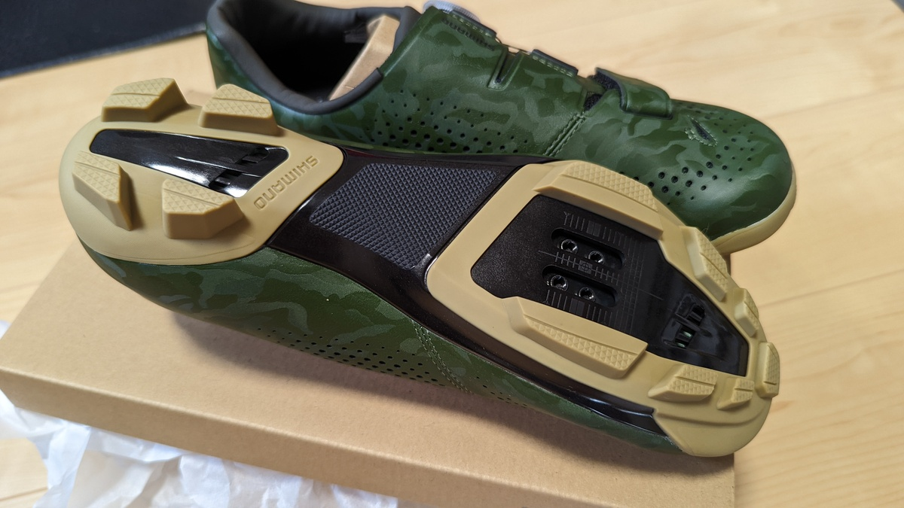
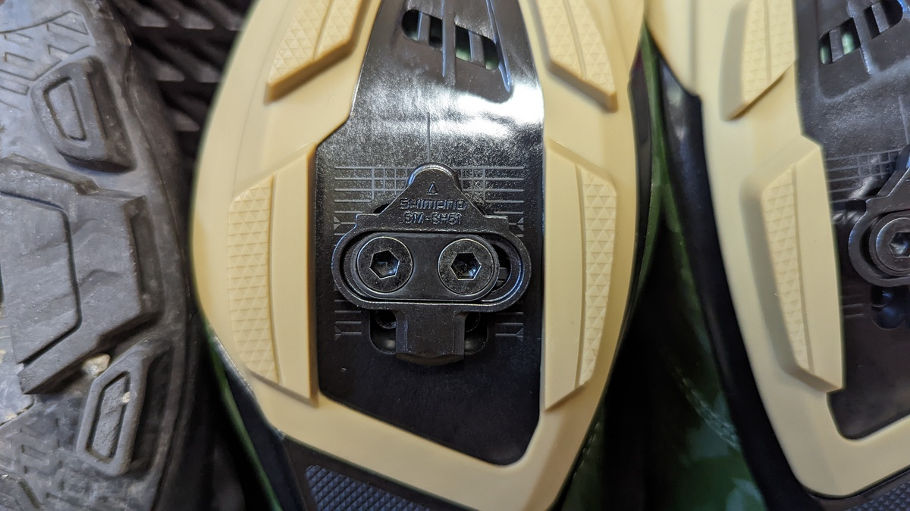
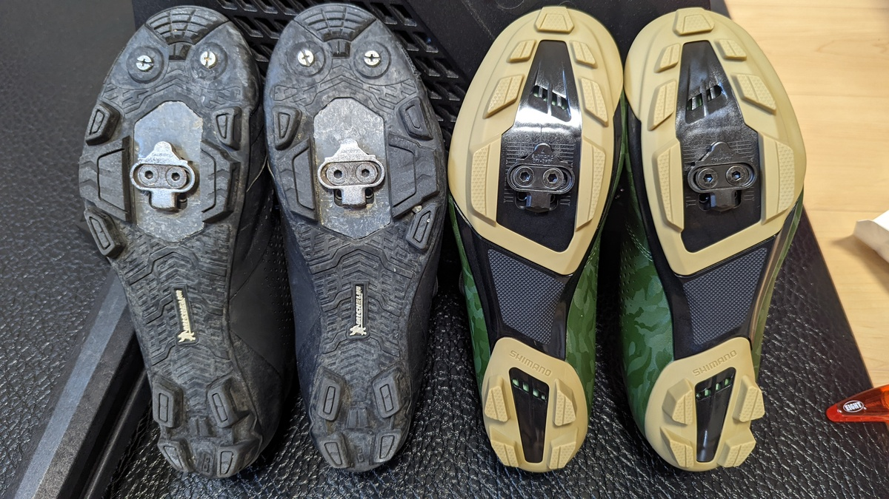
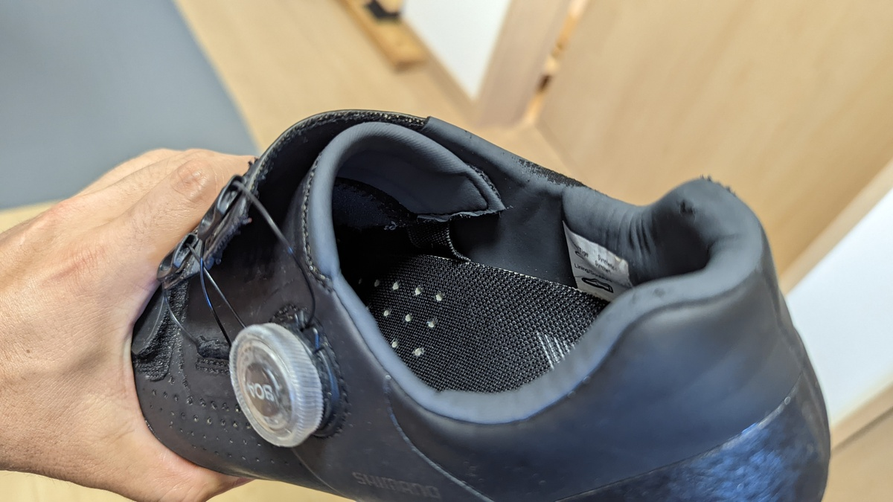
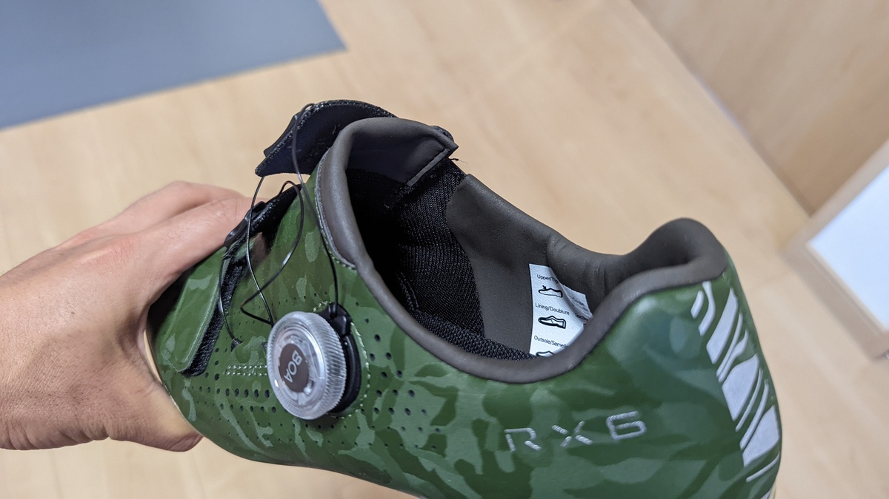
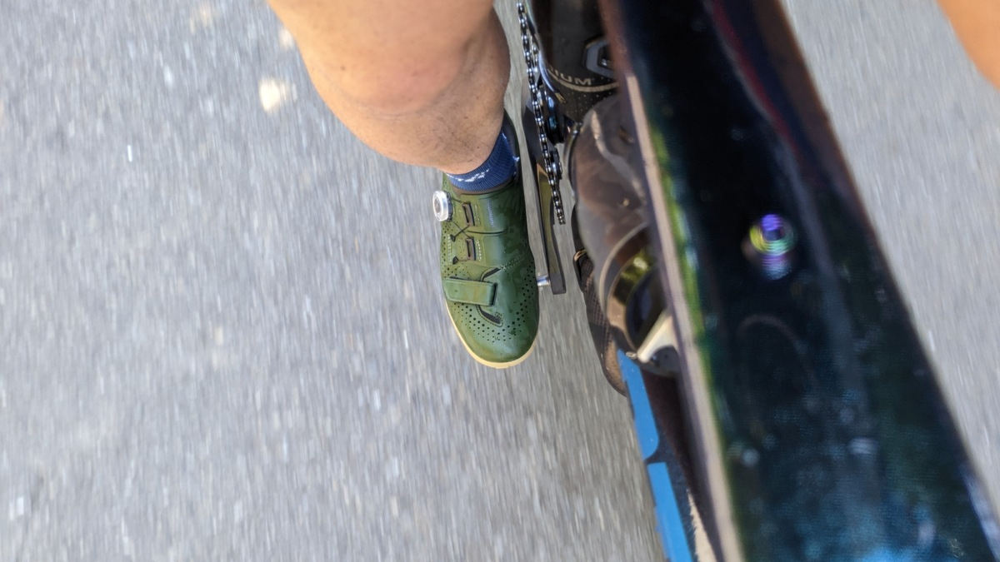
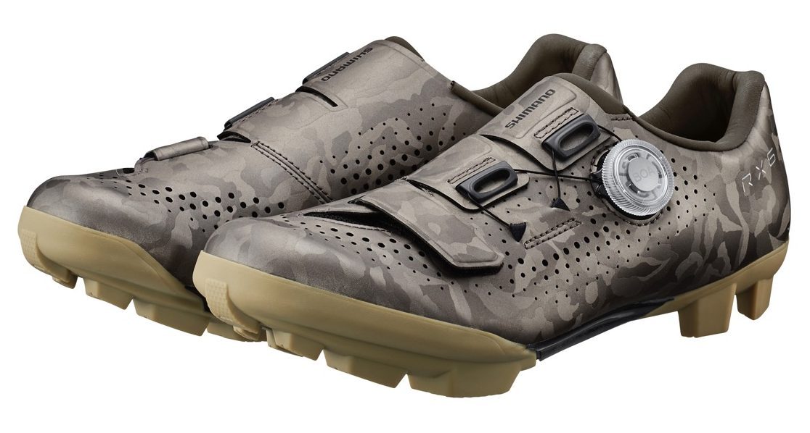

## ペダリング効率を追求したSPDシューズ RXシリーズ

ロードシューズの軽量性を備えたSPDシューズは、ロングライダーやグラベルレーサーに取って長年の希望だった。

グラベルライドの隆盛に伴い、フラッグシップモデルとしてリリースした**[SH-RX800（RX8）シューズ](https://amzn.to/3BbdH8x)は、ロードシューズ最上級レベルの剛性を持ちつつ、SPDクリートに対応して、軽量なモデル**として話題になった。愛用者も多いだろう。

唯一の欠点はフラッグシップモデルならではの価格だったが、2022年にミドルグレードの[SH-RX600（RX6）](https://ck.jp.ap.valuecommerce.com/servlet/referral?sid=3171302&pid=887657037&vc_url=https%3A%2F%2Fpaypaymall.yahoo.co.jp%2Fstore%2Fkt-gigaweb%2Fitem%2F299-smn-sh-rx600%2F)シューズが登場。コストパフォーマンスを求めていた自分は好みのカラーがあったこともあり即購入してしまった。

<LinkCard url="https://paypaymall.yahoo.co.jp/store/kt-gigaweb/item/299-smn-sh-rx600/" />

## スペック

<LinkCard url="https://www.cyclowired.jp/news/node/372229" />

製品ページがまだ存在しないので、シクロワイアードの記事から引用させてもらう。

> - カーボン強化ナイロンソールを採用**。剛性指数も8**(RX8は10)
> - **ウォークパッドも幅広**かつ耐久性に優れたポリウレタン素材を採用。ソールを覆う面積も増加
> - **重量は274g**とRX8比で9gの差

[RX8](https://amzn.to/3BbdH8x)ほどではないが、オンロードやグラベルなどの下車が少ないシチュエーションで使うシューズとしての要点は抑えている。

ロードシューズと違って歩行を考慮していることがRXシリーズを欲しがる人のポイントだろう。

### 実物確認

実物は確かに軽い。オンロードとシクロクロスでXCシリーズを使い倒していた身としては久々の軽量感だ。

クリート位置のマークが細かくなっているのも若干うれしい。

## XCシリーズとの比較

XCシリーズとの違いは、ソールの素材とスパイクピンの有無。

軽量なのでシクロクロスにいいのでは？と思われるかもしれないが、シクロクロスでは泥レースでピンが必須になるのでRXシリーズは向かないだろう。

[XC5](https://amzn.to/3omr7Hl)とソール面を比較すると、ソールのグリップ感や高さなどが異なることがわかるだろう。

**[RX6](https://ck.jp.ap.valuecommerce.com/servlet/referral?sid=3171302&pid=887657037&vc_url=https%3A%2F%2Fpaypaymall.yahoo.co.jp%2Fstore%2Fkt-gigaweb%2Fitem%2F299-smn-sh-rx600%2F)の方が細く高いグリップ面**になっており、泥はけもあまり考えらえていない（そもそも通気性を高めるための穴もある）

[XC5](https://amzn.to/3omr7Hl)は1世代前のMichelinソール採用モデルで、降りて走ってもソールが剥がれたりすることはない頑丈なものになっている。

### サラウンドラップ構造の変化

シマノシューズの特徴である、Boaダイヤルで締め付ける非対称アッパー。正式名称はサラウンドラッピング構造というのだが、ここの構造に変化があった。

これまで、[XC5](https://amzn.to/3omr7Hl)を初めとするベルクロ＋Boaシステムのアッパーには、固定なのか型作りのためなのか、内部にゴム紐が縫い付けられていた。

**[RX6](https://ck.jp.ap.valuecommerce.com/servlet/referral?sid=3171302&pid=887657037&vc_url=https%3A%2F%2Fpaypaymall.yahoo.co.jp%2Fstore%2Fkt-gigaweb%2Fitem%2F299-smn-sh-rx600%2F)ではこのゴム紐が取り払われている**。

正直、履くときに面倒だったのでありがたい。というか、薄々不要ではないかと思っていたところだったので、これに気が付いた後[XC5](https://amzn.to/3omr7Hl)のゴム紐も切り取ってしまった。

## ライドレビュー

早速、クリートを調整してグラベルを含む峠ライド100kmを行った。

シマノらしくない、いかにもオフロードで使いますというカラーリングも履いてみると悪くない。

残念ながらシューズの剛性を感じられるほど、感度が高くないのでペダリング効率については分からない。ただ、[XC5](https://amzn.to/3omr7Hl)と同じようなアッパー構造とソール構造をしているだけあって、**違和感なく履き替えられた**点は非常に良かった。

クリート位置もほぼ同じ設定で違和感なし**。シマノはモデルごとに若干の足型の差が**あり、試着しないことにはフィット感が分からないことも多いが前世代XC5とは概ね同じ足形だったのだろう。

一番良かったのは、サイドのソールが高いのか**クリート歩行時のガリガリ音が小さい**こと。地味にストレスなので助かる。

## 「買い」か？

実は、Amazonで上位モデルの[RX8](https://amzn.to/3BbdH8x)は安売り常連。

<Amzn asin="B07XXDMWVG" />

カラーはホワイト（ほぼシルバー）とブラックの二択。

個人的にはホワイトシューズは好みなのだが、[RX8](https://amzn.to/3BbdH8x)のホワイトはシルバー気味で、自分の好みと若干異なることから見送っていた。

RX6はブラック・グリーンの2色。ソールとのツートンも良い感じなのでグリーンを今回はチョイスした。

海外にはブラウンカラーもあり、なかなか好みだったのだが無いものは仕方がない。

最大のペダリング効率にこだわりがあるなら[RX8](https://amzn.to/3BbdH8x)、コストパフォーマンスとカラーリングでは[RX6](https://ck.jp.ap.valuecommerce.com/servlet/referral?sid=3171302&pid=887657037&vc_url=https%3A%2F%2Fpaypaymall.yahoo.co.jp%2Fstore%2Fkt-gigaweb%2Fitem%2F299-smn-sh-rx600%2F)に分があるといったところか。

<LinkCard url="https://paypaymall.yahoo.co.jp/store/kt-gigaweb/item/299-smn-sh-rx600/" />
